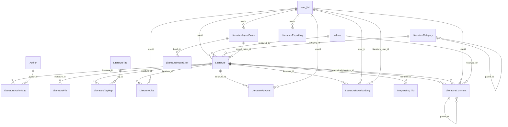
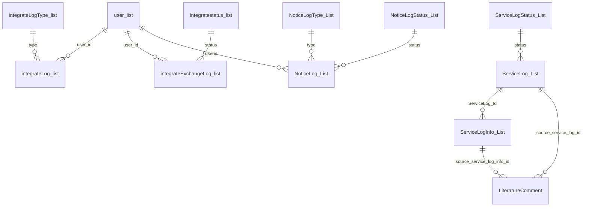

# 学术文献管理系统说明

本项目为学术文献管理系统源码交付包，目录为 `数据库pj完整源码_最终交付版`。系统主体采用 ASP.NET Web Forms + C# + SQL Server，支持文献检索、文献详情、PDF 上传与下载、评论审核、点赞收藏、用户中心、积分充值兑换和后台管理等功能。

## 目录结构

| 路径 | 说明 |
|---|---|
| `web.sln` | Visual Studio 解决方案入口。 |
| `Web/` | ASP.NET Web Forms 网站目录，IIS 站点物理路径应指向此目录。 |
| `Model/` | 数据库实体类。 |
| `BLL/` | 业务逻辑层，包含通用 `BLLBase<T>`。 |
| `DAL/` | 数据访问层，包含 `DALCommon<T>`、`DBHelper`。 |
| `LiteratureManager.Common/` | 用户登录、短信、积分、评论、上传解析等公共业务逻辑。 |
| `Common/` | 通用工具类。 |
| `COSSTS/` | 腾讯云 COS STS 相关代码。 |
| `database/` | 数据库备份、基础结构清单、字段清单、索引清单、外键清单。 |
| `sql/` | 当前版本数据库初始化、评论数据导入、回滚和结构参考脚本。 |
| `docs/` | 项目说明、测试清单和依赖说明文档。 |
| `maintenance/` | 文献元数据维护脚本。 |
| `app.py` | PDF 解析服务入口，默认端口 `5050`。 |
| `pdf_parser.py` | PDF 元数据解析脚本。 |
| `requirements.txt` | Python 依赖列表。 |

## 技术环境

| 类型 | 内容 |
|---|---|
| Web 框架 | ASP.NET Web Forms |
| 后端语言 | C# |
| .NET 版本 | .NET Framework 4.6 及以上 |
| 数据库 | SQL Server / SQL Server Express |
| 数据访问 | `BLLBase<T>` + `DALCommon<T>` + `DBHelper` |
| PDF 解析 | Python 3.9+，Flask 服务 |
| 可选组件 | Redis、腾讯云 COS、微信支付、短信服务 |
| 前端依赖 | jQuery、Layui、项目内 CSS/JS |

## 当前功能

- 用户注册、登录、退出。
- 短信验证码发送与校验。
- 用户中心。
- 文献检索、分类浏览、文献详情。
- 单篇 PDF 上传。
- 批量 PDF 上传。
- PDF 附件保存和下载。
- 文献点赞、收藏。
- 文献评论提交、展示、删除、后台审核。
- 文献分类、作者、标签、PDF 附件、期刊会议信息维护。
- 积分流水、充值、兑换。
- 后台管理员登录。
- 后台文献审核。
- 后台日志和通知管理。

## 数据库部署

推荐将当前交付版部署到独立数据库，例如：

```text
manage_db_final
```

部署顺序：

1. 在 SQL Server 中创建空数据库 `manage_db_final`。
2. 将 `database/manage_db_full.bak` 还原到 `manage_db_final`。
3. 如果还原时提示 `maiya3d_db.mdf` 或日志文件被其他数据库占用，需要在 SSMS 的还原窗口进入 `Files / 文件` 页面，勾选重新定位文件，并将数据文件、日志文件改成独立文件名，例如：

```text
manage_db_final.mdf
manage_db_final_log.ldf
```

4. 在 `manage_db_final` 数据库中执行：

```text
sql/upgrade_add_literature_comment.sql
```

5. 如需导入已有评论数据，再执行：

```text
sql/migrate_literature_comments_from_servicelog.sql
```

6. 执行完成后刷新数据库表，确认存在 `LiteratureComment` 表。

## SQL 脚本说明

| 文件 | 用途 | 是否部署需要 |
|---|---|---|
| `database/manage_db_full.bak` | 基础数据库备份 | 是 |
| `database/table_columns.csv` | 数据库字段清单 | 参考 |
| `database/table_indexes.csv` | 索引清单 | 参考 |
| `database/table_foreign_keys.csv` | 外键清单 | 参考 |
| `sql/upgrade_add_literature_comment.sql` | 创建文献评论表和索引 | 是 |
| `sql/migrate_literature_comments_from_servicelog.sql` | 导入已有评论数据 | 按需 |
| `sql/rollback_literature_comment.sql` | 评论表回滚脚本 | 仅回滚或测试使用 |
| `sql/final_schema.sql` | 当前版本表结构参考 | 参考 |

## Web.config 关键配置

当前数据库连接配置位于 `Web/Web.config`：

```xml
<connectionStrings>
  <add name="SQLCONNECTIONSTRING"
       connectionString="data source=(local)\SQLEXPRESS; Initial Catalog=manage_db_final;User ID=sa;Password=123456;"
       providerName="System.Data.SqlClient"/>
</connectionStrings>
```

正式部署时需要根据实际 SQL Server 地址、数据库名、账号和密码调整。

站点地址配置：

```xml
<add key="website_url" value="http://localhost:8080/"/>
```

正式部署时建议改为实际访问地址，例如：

```xml
<add key="website_url" value="http://localhost:8081/"/>
```

Redis 默认配置：

```xml
<add key="RedisEnabled" value="true"/>
<add key="RedisHost" value="127.0.0.1"/>
<add key="RedisPort" value="6379"/>
<add key="RedisDatabase" value="0"/>
<add key="RedisPassword" value=""/>
<add key="RedisKeyPrefix" value="manage"/>
```

如当前站点与其他站点共用同一个 Redis 服务，建议使用独立库号和独立前缀，避免验证码、登录状态、上传解析锁互相影响：

```xml
<add key="RedisDatabase" value="1"/>
<add key="RedisKeyPrefix" value="manage_final"/>
```

## IIS 部署

推荐 IIS 新建独立站点和独立应用程序池。

应用程序池建议：

| 配置项 | 建议值 |
|---|---|
| 名称 | `LiteratureFinalPool` |
| .NET CLR 版本 | `.NET CLR Version v4.0` |
| 托管管道模式 | `Integrated` |
| 启用 32 位应用程序 | 默认 `False`，如依赖 32 位组件再改为 `True` |

站点建议：

| 配置项 | 建议值 |
|---|---|
| 站点名称 | `LiteratureFinal` |
| 物理路径 | `E:\数据库pj完整源码_最终交付版\Web` |
| 端口 | 建议使用未被占用端口，例如 `8081` |
| 应用程序池 | `LiteratureFinalPool` |

需要给应用程序池账号授予写入权限的目录：

```text
E:\数据库pj完整源码_最终交付版\Web\A_UpLoad
E:\数据库pj完整源码_最终交付版\Web\Log
C:\Windows\Temp
C:\Windows\Microsoft.NET\Framework64\v4.0.30319\Temporary ASP.NET Files
```

如果页面提示 ASP.NET 临时编译目录拒绝访问，需要给 `IIS AppPool\LiteratureFinalPool` 和 `IIS_IUSRS` 授予以上临时目录的修改权限，然后回收应用程序池。

## PDF 解析服务

PDF 解析服务使用 Python 启动，默认监听 `5050` 端口。

安装依赖：

```powershell
cd E:\数据库pj完整源码_最终交付版
pip install -r requirements.txt
```

启动服务：

```powershell
python app.py
```

网站中上传 PDF 后，会调用解析服务读取题名、作者、摘要、关键词等元数据。部署时需保证 IIS 服务器可以访问该 Python 服务。

## 数据库表结构概览

当前数据库主要包含文献、用户、积分、评论、通知、日志、上传文件、站点配置等数据表。完整字段结构已在下方“全部表结构”中列出。

基础结构文件：

```text
database/table_columns.csv
database/indexes.csv
database/foreign_keys.csv
sql/final_schema.sql
```
## 表关系和 ER 图

以下关系基于数据库外键清单和当前业务字段整理。数据库中已定义的外键以“外键约束”标注；当前表字段存在明确业务指向但未设置外键约束的，以“业务关系”标注。

### 文献业务 ER 图



### 用户、积分、通知和服务记录 ER 图



### 表关系清单

| 类型 | 子表字段 | 关联主表字段 | 级联删除 | 级联更新 |
|---|---|---|---|---|
| 外键约束 | `integrateExchangeLog_list.status` | `integratestatus_list.id` | NO_ACTION | NO_ACTION |
| 外键约束 | `integrateExchangeLog_list.user_id` | `user_list.id` | NO_ACTION | NO_ACTION |
| 外键约束 | `integrateLog_list.type` | `integrateLogType_list.id` | NO_ACTION | NO_ACTION |
| 外键约束 | `integrateLog_list.literature_id` | `Literature.id` | NO_ACTION | NO_ACTION |
| 外键约束 | `integrateLog_list.user_id` | `user_list.id` | NO_ACTION | NO_ACTION |
| 外键约束 | `Literature.category_id` | `LiteratureCategory.id` | NO_ACTION | NO_ACTION |
| 外键约束 | `Literature.import_batch_id` | `LiteratureImportBatch.id` | NO_ACTION | NO_ACTION |
| 外键约束 | `Literature.reviewed_by` | `admin.id` | NO_ACTION | NO_ACTION |
| 外键约束 | `Literature.userid` | `user_list.id` | NO_ACTION | NO_ACTION |
| 外键约束 | `LiteratureAuthorMap.author_id` | `Author.id` | NO_ACTION | NO_ACTION |
| 外键约束 | `LiteratureAuthorMap.literature_id` | `Literature.id` | NO_ACTION | NO_ACTION |
| 外键约束 | `LiteratureCategory.parent_id` | `LiteratureCategory.id` | NO_ACTION | NO_ACTION |
| 外键约束 | `LiteratureDownloadLog.literature_id` | `Literature.id` | NO_ACTION | NO_ACTION |
| 外键约束 | `LiteratureDownloadLog.literature_user_id` | `user_list.id` | NO_ACTION | NO_ACTION |
| 外键约束 | `LiteratureDownloadLog.user_id` | `user_list.id` | NO_ACTION | NO_ACTION |
| 外键约束 | `LiteratureExportLog.userid` | `user_list.id` | NO_ACTION | NO_ACTION |
| 外键约束 | `LiteratureFavorite.literature_id` | `Literature.id` | NO_ACTION | NO_ACTION |
| 外键约束 | `LiteratureFavorite.userid` | `user_list.id` | NO_ACTION | NO_ACTION |
| 外键约束 | `LiteratureFile.literature_id` | `Literature.id` | NO_ACTION | NO_ACTION |
| 外键约束 | `LiteratureImportBatch.userid` | `user_list.id` | NO_ACTION | NO_ACTION |
| 外键约束 | `LiteratureImportError.batch_id` | `LiteratureImportBatch.id` | NO_ACTION | NO_ACTION |
| 外键约束 | `LiteratureTagMap.literature_id` | `Literature.id` | NO_ACTION | NO_ACTION |
| 外键约束 | `LiteratureTagMap.tag_id` | `LiteratureTag.id` | NO_ACTION | NO_ACTION |
| 外键约束 | `NoticeLog_List.status` | `NoticeLogStatus_List.id` | NO_ACTION | NO_ACTION |
| 外键约束 | `NoticeLog_List.type` | `NoticeLogType_List.id` | NO_ACTION | NO_ACTION |
| 外键约束 | `NoticeLog_List.userid` | `user_list.id` | NO_ACTION | NO_ACTION |
| 外键约束 | `ServiceLog_List.status` | `ServiceLogStatus_List.id` | NO_ACTION | NO_ACTION |
| 外键约束 | `ServiceLogInfo_List.ServiceLog_Id` | `ServiceLog_List.id` | NO_ACTION | NO_ACTION |
| 业务关系 | `LiteratureComment.literature_id` | `Literature.id` | 未设置 | 未设置 |
| 业务关系 | `LiteratureComment.canonical_literature_id` | `Literature.id` | 未设置 | 未设置 |
| 业务关系 | `LiteratureComment.userid` | `user_list.id` | 未设置 | 未设置 |
| 业务关系 | `LiteratureComment.parent_id` | `LiteratureComment.id` | 未设置 | 未设置 |
| 业务关系 | `LiteratureComment.reviewed_by` | `admin.id` | 未设置 | 未设置 |
| 业务关系 | `LiteratureComment.source_service_log_id` | `ServiceLog_List.id` | 未设置 | 未设置 |
| 业务关系 | `LiteratureComment.source_service_log_info_id` | `ServiceLogInfo_List.id` | 未设置 | 未设置 |

未出现在上表中的表当前没有显式外键约束，通常作为配置表、日志表、上传记录表、展示内容表或独立业务记录表使用。

## 全部表结构

以下字段结构来自当前交付目录中的 `database/table_columns.csv`，并包含当前版本使用的 `LiteratureComment` 表。

### dbo.admin

| 序号 | 字段 | 类型 | 允许空 | 标识列 | 默认值 |
|---:|---|---|---|---|---|
| 1 | `id` | `int` | 否 | 是 |  |
| 2 | `username` | `nvarchar(50)` | 否 |  |  |
| 3 | `password` | `nvarchar(50)` | 是 |  |  |
| 4 | `popedom` | `nvarchar(MAX)` | 是 |  |  |
| 5 | `lastloginip` | `nvarchar(50)` | 是 |  |  |
| 6 | `cityid` | `int` | 是 |  |  |
| 7 | `locks` | `int` | 是 |  |  |
| 8 | `code` | `nvarchar(50)` | 是 |  |  |
| 9 | `lastlogindate` | `datetime` | 是 |  | (getdate()) |

### dbo.appeal_list

| 序号 | 字段 | 类型 | 允许空 | 标识列 | 默认值 |
|---:|---|---|---|---|---|
| 1 | `id` | `bigint` | 否 | 是 |  |
| 2 | `url` | `nvarchar(2500)` | 否 |  |  |
| 3 | `info_` | `nvarchar(MAX)` | 否 |  |  |
| 4 | `addtime` | `datetime` | 否 |  |  |
| 5 | `status` | `int` | 否 |  |  |
| 6 | `userid` | `int` | 否 |  |  |

### dbo.appealimg_list

| 序号 | 字段 | 类型 | 允许空 | 标识列 | 默认值 |
|---:|---|---|---|---|---|
| 1 | `appeal_id` | `bigint` | 否 |  |  |
| 2 | `upload_pic_info` | `nvarchar(250)` | 否 |  |  |
| 3 | `addtime` | `datetime` | 否 |  |  |
| 4 | `orderid` | `int` | 否 |  |  |

### dbo.Author

| 序号 | 字段 | 类型 | 允许空 | 标识列 | 默认值 |
|---:|---|---|---|---|---|
| 1 | `id` | `int` | 否 | 是 |  |
| 2 | `name_cn` | `nvarchar(100)` | 否 |  |  |
| 3 | `name_en` | `nvarchar(200)` | 是 |  |  |
| 4 | `institution` | `nvarchar(300)` | 是 |  |  |
| 5 | `orcid` | `nvarchar(50)` | 是 |  |  |
| 6 | `email` | `nvarchar(200)` | 是 |  |  |
| 7 | `status` | `int` | 否 |  | ((1)) |
| 8 | `addtime` | `datetime` | 否 |  | (getdate()) |

### dbo.cosfile_list

| 序号 | 字段 | 类型 | 允许空 | 标识列 | 默认值 |
|---:|---|---|---|---|---|
| 1 | `userid` | `int` | 否 |  |  |
| 2 | `addtime` | `datetime` | 否 |  |  |
| 3 | `up_filename` | `nvarchar(250)` | 否 |  |  |

### dbo.daoru_list

| 序号 | 字段 | 类型 | 允许空 | 标识列 | 默认值 |
|---:|---|---|---|---|---|
| 1 | `id` | `int` | 否 | 是 |  |
| 2 | `posttime` | `datetime` | 否 |  |  |
| 3 | `r_info` | `nvarchar(500)` | 否 |  |  |
| 4 | `status` | `int` | 否 |  |  |
| 5 | `type` | `int` | 否 |  |  |

### dbo.daoruerr_list

| 序号 | 字段 | 类型 | 允许空 | 标识列 | 默认值 |
|---:|---|---|---|---|---|
| 1 | `info` | `nvarchar(500)` | 否 |  |  |
| 2 | `filename` | `nvarchar(250)` | 否 |  |  |
| 3 | `addtime` | `datetime` | 否 |  |  |
| 4 | `daoruid` | `int` | 否 |  |  |

### dbo.data_list

| 序号 | 字段 | 类型 | 允许空 | 标识列 | 默认值 |
|---:|---|---|---|---|---|
| 1 | `id` | `int` | 否 | 是 |  |
| 2 | `name` | `nvarchar(600)` | 是 |  |  |
| 3 | `tbclass_id` | `int` | 否 |  | ((0)) |
| 4 | `upload_pic_img` | `nvarchar(50)` | 是 |  |  |
| 5 | `isshow` | `int` | 否 |  | ((0)) |
| 6 | `addtime` | `datetime` | 否 |  |  |
| 7 | `uptime` | `datetime` | 否 |  |  |
| 8 | `datetime` | `datetime` | 否 |  |  |
| 9 | `orderid` | `int` | 否 |  |  |
| 10 | `info_` | `nvarchar(MAX)` | 是 |  |  |
| 11 | `keywords` | `nvarchar(MAX)` | 是 |  |  |
| 12 | `description` | `nvarchar(MAX)` | 是 |  |  |
| 13 | `title` | `nvarchar(MAX)` | 是 |  |  |
| 14 | `istop` | `int` | 否 |  |  |

### dbo.GeneratedAssetRecord_list

| 序号 | 字段 | 类型 | 允许空 | 标识列 | 默认值 |
|---:|---|---|---|---|---|
| 1 | `id` | `bigint` | 否 | 是 |  |
| 2 | `userid` | `int` | 否 |  |  |
| 3 | `addtime` | `datetime` | 否 |  |  |
| 4 | `jobid` | `nvarchar(250)` | 否 |  |  |
| 5 | `requestid` | `nvarchar(250)` | 否 |  |  |
| 6 | `status` | `nvarchar(50)` | 是 |  |  |
| 7 | `ai_key` | `nvarchar(500)` | 是 |  |  |
| 8 | `ai_img` | `nvarchar(500)` | 是 |  |  |
| 9 | `type` | `int` | 否 |  |  |
| 10 | `upload_pic_cover` | `nvarchar(250)` | 是 |  |  |
| 11 | `iscos` | `int` | 否 |  |  |
| 12 | `upload_pic_cos` | `nvarchar(250)` | 是 |  |  |
| 13 | `isshow` | `int` | 是 |  |  |
| 14 | `istop` | `int` | 是 |  |  |
| 15 | `num_integrate` | `int` | 是 |  |  |
| 16 | `api_err` | `nvarchar(MAX)` | 是 |  |  |
| 17 | `cos_name` | `nvarchar(250)` | 是 |  |  |

### dbo.indexsingle_list

| 序号 | 字段 | 类型 | 允许空 | 标识列 | 默认值 |
|---:|---|---|---|---|---|
| 1 | `id` | `int` | 否 | 是 |  |
| 2 | `name` | `nvarchar(600)` | 是 |  |  |
| 3 | `upload_pic_img` | `nvarchar(50)` | 是 |  |  |
| 4 | `upload_pic_m` | `nvarchar(250)` | 是 |  |  |
| 5 | `upload_pic_pc` | `nvarchar(250)` | 是 |  |  |
| 6 | `isshow` | `int` | 否 |  | ((0)) |
| 7 | `addtime` | `datetime` | 否 |  |  |
| 8 | `uptime` | `datetime` | 否 |  |  |
| 9 | `orderid` | `int` | 否 |  |  |
| 10 | `info_` | `nvarchar(MAX)` | 是 |  |  |
| 11 | `keywords` | `nvarchar(MAX)` | 是 |  |  |
| 12 | `description` | `nvarchar(MAX)` | 是 |  |  |
| 13 | `title` | `nvarchar(MAX)` | 是 |  |  |
| 14 | `istop` | `int` | 否 |  |  |
| 15 | `istype` | `int` | 否 |  |  |
| 16 | `url` | `nvarchar(2500)` | 是 |  |  |

### dbo.integrate_list

| 序号 | 字段 | 类型 | 允许空 | 标识列 | 默认值 |
|---:|---|---|---|---|---|
| 1 | `id` | `int` | 否 | 是 |  |
| 2 | `name` | `nvarchar(250)` | 否 |  |  |
| 3 | `orderid` | `int` | 否 |  |  |
| 4 | `uptime` | `datetime` | 否 |  |  |
| 5 | `addtime` | `datetime` | 否 |  |  |
| 6 | `upload_pic_img` | `nvarchar(250)` | 是 |  |  |
| 7 | `about_` | `nvarchar(MAX)` | 是 |  |  |
| 8 | `num_integrate` | `int` | 否 |  |  |

### dbo.integrateExchangeLog_list

| 序号 | 字段 | 类型 | 允许空 | 标识列 | 默认值 |
|---:|---|---|---|---|---|
| 1 | `id` | `bigint` | 否 | 是 |  |
| 2 | `name` | `nvarchar(500)` | 否 |  |  |
| 3 | `num_integrate` | `int` | 否 |  |  |
| 4 | `codestr` | `nvarchar(250)` | 否 |  |  |
| 5 | `addtime` | `datetime` | 否 |  |  |
| 6 | `status` | `int` | 是 |  |  |
| 7 | `user_id` | `int` | 否 |  |  |
| 8 | `upload_pic_img` | `nvarchar(250)` | 是 |  |  |
| 9 | `hexiaotime` | `nvarchar(250)` | 是 |  |  |

### dbo.integrateLog_list

| 序号 | 字段 | 类型 | 允许空 | 标识列 | 默认值 |
|---:|---|---|---|---|---|
| 1 | `id` | `int` | 否 | 是 |  |
| 2 | `num_integrate` | `int` | 否 |  |  |
| 3 | `type` | `int` | 否 |  |  |
| 4 | `name` | `nvarchar(500)` | 否 |  |  |
| 5 | `info_` | `nvarchar(MAX)` | 是 |  |  |
| 6 | `addtime` | `datetime` | 否 |  |  |
| 7 | `user_id` | `int` | 否 |  |  |
| 8 | `adminname` | `nvarchar(250)` | 是 |  |  |
| 9 | `pro_id` | `bigint` | 是 |  |  |
| 10 | `prodata_id` | `bigint` | 是 |  |  |
| 11 | `orderpro_orderno` | `nvarchar(50)` | 是 |  |  |
| 12 | `literature_id` | `int` | 是 |  |  |

### dbo.integrateLogType_list

| 序号 | 字段 | 类型 | 允许空 | 标识列 | 默认值 |
|---:|---|---|---|---|---|
| 1 | `id` | `int` | 否 |  |  |
| 2 | `name` | `nvarchar(50)` | 否 |  |  |
| 3 | `num_integrate` | `int` | 是 |  |  |

### dbo.integratestatus_list

| 序号 | 字段 | 类型 | 允许空 | 标识列 | 默认值 |
|---:|---|---|---|---|---|
| 1 | `id` | `int` | 否 |  |  |
| 2 | `name` | `nvarchar(50)` | 否 |  |  |

### dbo.IntegrationToken_list

| 序号 | 字段 | 类型 | 允许空 | 标识列 | 默认值 |
|---:|---|---|---|---|---|
| 1 | `id` | `int` | 否 |  |  |
| 2 | `adddate` | `datetime` | 否 |  |  |
| 3 | `access_token` | `nvarchar(250)` | 否 |  |  |
| 4 | `expires_in` | `int` | 否 |  |  |

### dbo.link_list

| 序号 | 字段 | 类型 | 允许空 | 标识列 | 默认值 |
|---:|---|---|---|---|---|
| 1 | `id` | `int` | 否 | 是 |  |
| 2 | `name` | `nvarchar(150)` | 是 |  |  |
| 3 | `isshow` | `int` | 否 |  | ((0)) |
| 4 | `addtime` | `datetime` | 否 |  |  |
| 5 | `uptime` | `datetime` | 否 |  |  |
| 6 | `orderid` | `int` | 否 |  |  |
| 7 | `url` | `nvarchar(600)` | 是 |  |  |
| 8 | `type` | `int` | 否 |  |  |
| 9 | `upload_pic_icon` | `nvarchar(50)` | 是 |  |  |

### dbo.Literature

| 序号 | 字段 | 类型 | 允许空 | 标识列 | 默认值 |
|---:|---|---|---|---|---|
| 1 | `id` | `int` | 否 | 是 |  |
| 2 | `title` | `nvarchar(500)` | 否 |  |  |
| 3 | `subtitle` | `nvarchar(500)` | 是 |  |  |
| 5 | `doi` | `nvarchar(100)` | 是 |  |  |
| 6 | `keywords` | `nvarchar(500)` | 是 |  |  |
| 7 | `abstract_text` | `nvarchar(MAX)` | 是 |  |  |
| 8 | `source_type` | `nvarchar(50)` | 是 |  |  |
| 9 | `language` | `nvarchar(50)` | 是 |  |  |
| 10 | `publish_year` | `int` | 是 |  |  |
| 11 | `journal_name` | `nvarchar(300)` | 是 |  |  |
| 12 | `conference_name` | `nvarchar(300)` | 是 |  |  |
| 13 | `publisher` | `nvarchar(300)` | 是 |  |  |
| 14 | `volume` | `nvarchar(50)` | 是 |  |  |
| 15 | `issue` | `nvarchar(50)` | 是 |  |  |
| 16 | `pages` | `nvarchar(100)` | 是 |  |  |
| 17 | `category_id` | `int` | 否 |  | ((0)) |
| 19 | `cover_pic` | `nvarchar(255)` | 是 |  |  |
| 22 | `external_url` | `nvarchar(500)` | 是 |  |  |
| 23 | `source_db` | `nvarchar(200)` | 是 |  |  |
| 24 | `remark` | `nvarchar(1000)` | 是 |  |  |
| 25 | `is_top` | `int` | 否 |  | ((0)) |
| 26 | `status` | `int` | 否 |  | ((1)) |
| 27 | `userid` | `int` | 否 |  | ((0)) |
| 28 | `addtime` | `datetime` | 否 |  | (getdate()) |
| 29 | `updatetime` | `datetime` | 否 |  | (getdate()) |
| 30 | `institution` | `nvarchar(500)` | 是 |  |  |
| 31 | `download_points` | `int` | 否 |  | ((0)) |
| 32 | `reviewed_by` | `int` | 是 |  |  |
| 33 | `review_time` | `datetime` | 是 |  |  |
| 34 | `import_batch_id` | `int` | 是 |  |  |
| 35 | `canonical_literature_id` | `int` | 是 |  |  |

### dbo.LiteratureAuthorMap

| 序号 | 字段 | 类型 | 允许空 | 标识列 | 默认值 |
|---:|---|---|---|---|---|
| 1 | `id` | `int` | 否 | 是 |  |
| 2 | `literature_id` | `int` | 否 |  |  |
| 3 | `author_id` | `int` | 否 |  |  |
| 4 | `author_order` | `int` | 否 |  | ((1)) |
| 5 | `is_corresponding` | `int` | 否 |  | ((0)) |
| 6 | `addtime` | `datetime` | 否 |  | (getdate()) |

### dbo.LiteratureCategory

| 序号 | 字段 | 类型 | 允许空 | 标识列 | 默认值 |
|---:|---|---|---|---|---|
| 1 | `id` | `int` | 否 | 是 |  |
| 2 | `parent_id` | `int` | 是 |  | ((0)) |
| 3 | `name` | `nvarchar(100)` | 否 |  |  |
| 4 | `name_en` | `nvarchar(200)` | 是 |  |  |
| 5 | `code` | `nvarchar(100)` | 是 |  |  |
| 6 | `orderid` | `int` | 否 |  | ((0)) |
| 7 | `status` | `int` | 否 |  | ((1)) |
| 8 | `addtime` | `datetime` | 否 |  | (getdate()) |
| 9 | `updatetime` | `datetime` | 否 |  | (getdate()) |

### dbo.LiteratureComment

| 序号 | 字段 | 类型 | 允许空 | 标识列 | 默认值 |
|---:|---|---|---|---|---|
| 1 | `id` | `int` | 否 | 是 |  |
| 2 | `literature_id` | `int` | 否 |  |  |
| 3 | `canonical_literature_id` | `int` | 是 |  |  |
| 4 | `userid` | `int` | 否 |  |  |
| 5 | `parent_id` | `int` | 否 |  | ((0)) |
| 6 | `content` | `nvarchar(MAX)` | 否 |  |  |
| 7 | `status` | `int` | 否 |  | ((0)) |
| 8 | `like_count` | `int` | 否 |  | ((0)) |
| 9 | `report_count` | `int` | 否 |  | ((0)) |
| 10 | `is_deleted` | `int` | 否 |  | ((0)) |
| 11 | `delete_time` | `datetime` | 是 |  |  |
| 12 | `reviewed_by` | `int` | 是 |  |  |
| 13 | `review_time` | `datetime` | 是 |  |  |
| 14 | `review_remark` | `nvarchar(500)` | 是 |  |  |
| 15 | `source_service_log_id` | `int` | 是 |  |  |
| 16 | `source_service_log_info_id` | `int` | 是 |  |  |
| 17 | `addtime` | `datetime` | 否 |  | (getdate()) |
| 18 | `updatetime` | `datetime` | 否 |  | (getdate()) |

### dbo.LiteratureDownloadLog

| 序号 | 字段 | 类型 | 允许空 | 标识列 | 默认值 |
|---:|---|---|---|---|---|
| 1 | `id` | `int` | 否 | 是 |  |
| 2 | `literature_id` | `int` | 否 |  |  |
| 3 | `user_id` | `int` | 否 |  |  |
| 4 | `literature_title` | `nvarchar(500)` | 是 |  |  |
| 5 | `file_url` | `nvarchar(255)` | 是 |  |  |
| 6 | `download_points` | `int` | 否 |  | ((0)) |
| 7 | `literature_user_id` | `int` | 否 |  | ((0)) |
| 8 | `addtime` | `datetime` | 否 |  | (getdate()) |

### dbo.LiteratureExportLog

| 序号 | 字段 | 类型 | 允许空 | 标识列 | 默认值 |
|---:|---|---|---|---|---|
| 1 | `id` | `int` | 否 | 是 |  |
| 2 | `export_name` | `nvarchar(200)` | 否 |  |  |
| 3 | `export_type` | `nvarchar(50)` | 否 |  |  |
| 4 | `file_name` | `nvarchar(255)` | 是 |  |  |
| 5 | `record_count` | `int` | 否 |  | ((0)) |
| 6 | `userid` | `int` | 否 |  | ((0)) |
| 7 | `addtime` | `datetime` | 否 |  | (getdate()) |

### dbo.LiteratureFavorite

| 序号 | 字段 | 类型 | 允许空 | 标识列 | 默认值 |
|---:|---|---|---|---|---|
| 1 | `id` | `int` | 否 | 是 |  |
| 2 | `literature_id` | `int` | 否 |  |  |
| 3 | `userid` | `int` | 否 |  |  |
| 4 | `addtime` | `datetime` | 否 |  | (getdate()) |

### dbo.LiteratureFile

| 序号 | 字段 | 类型 | 允许空 | 标识列 | 默认值 |
|---:|---|---|---|---|---|
| 1 | `id` | `int` | 否 | 是 |  |
| 2 | `literature_id` | `int` | 否 |  |  |
| 3 | `file_type` | `nvarchar(50)` | 否 |  |  |
| 4 | `file_name` | `nvarchar(255)` | 否 |  |  |
| 5 | `file_path` | `nvarchar(255)` | 否 |  |  |
| 6 | `file_size` | `bigint` | 是 |  |  |
| 7 | `mime_type` | `nvarchar(100)` | 是 |  |  |
| 8 | `orderid` | `int` | 否 |  | ((0)) |
| 9 | `status` | `int` | 否 |  | ((1)) |
| 10 | `addtime` | `datetime` | 否 |  | (getdate()) |

### dbo.LiteratureImportBatch

| 序号 | 字段 | 类型 | 允许空 | 标识列 | 默认值 |
|---:|---|---|---|---|---|
| 1 | `id` | `int` | 否 | 是 |  |
| 2 | `batch_name` | `nvarchar(200)` | 否 |  |  |
| 3 | `import_type` | `nvarchar(50)` | 否 |  |  |
| 4 | `file_name` | `nvarchar(255)` | 是 |  |  |
| 5 | `status` | `int` | 否 |  | ((0)) |
| 6 | `total_count` | `int` | 否 |  | ((0)) |
| 7 | `success_count` | `int` | 否 |  | ((0)) |
| 8 | `fail_count` | `int` | 否 |  | ((0)) |
| 9 | `userid` | `int` | 否 |  | ((0)) |
| 10 | `addtime` | `datetime` | 否 |  | (getdate()) |
| 11 | `finishtime` | `datetime` | 是 |  |  |

### dbo.LiteratureImportError

| 序号 | 字段 | 类型 | 允许空 | 标识列 | 默认值 |
|---:|---|---|---|---|---|
| 1 | `id` | `int` | 否 | 是 |  |
| 2 | `batch_id` | `int` | 否 |  |  |
| 3 | `row_no` | `int` | 否 |  |  |
| 4 | `title` | `nvarchar(500)` | 是 |  |  |
| 5 | `error_msg` | `nvarchar(1000)` | 否 |  |  |
| 6 | `raw_data` | `nvarchar(MAX)` | 是 |  |  |
| 7 | `addtime` | `datetime` | 否 |  | (getdate()) |

### dbo.LiteratureLike

| 序号 | 字段 | 类型 | 允许空 | 标识列 | 默认值 |
|---:|---|---|---|---|---|
| 1 | `id` | `int` | 否 | 是 |  |
| 2 | `literature_id` | `int` | 否 |  |  |
| 3 | `userid` | `int` | 否 |  |  |
| 4 | `addtime` | `datetime` | 否 |  | (getdate()) |

### dbo.LiteratureTag

| 序号 | 字段 | 类型 | 允许空 | 标识列 | 默认值 |
|---:|---|---|---|---|---|
| 1 | `id` | `int` | 否 | 是 |  |
| 2 | `name` | `nvarchar(100)` | 否 |  |  |
| 3 | `orderid` | `int` | 否 |  | ((0)) |
| 4 | `status` | `int` | 否 |  | ((1)) |
| 5 | `addtime` | `datetime` | 否 |  | (getdate()) |

### dbo.LiteratureTagMap

| 序号 | 字段 | 类型 | 允许空 | 标识列 | 默认值 |
|---:|---|---|---|---|---|
| 1 | `id` | `int` | 否 | 是 |  |
| 2 | `literature_id` | `int` | 否 |  |  |
| 3 | `tag_id` | `int` | 否 |  |  |
| 4 | `addtime` | `datetime` | 否 |  | (getdate()) |

### dbo.LiteratureVenueProfile

| 序号 | 字段 | 类型 | 允许空 | 标识列 | 默认值 |
|---:|---|---|---|---|---|
| 1 | `id` | `int` | 否 | 是 |  |
| 2 | `venue_type` | `nvarchar(30)` | 否 |  |  |
| 3 | `venue_name` | `nvarchar(500)` | 否 |  |  |
| 4 | `introduction` | `nvarchar(MAX)` | 是 |  |  |
| 5 | `impact_factor` | `nvarchar(100)` | 是 |  |  |
| 6 | `jcr_quartile` | `nvarchar(100)` | 是 |  |  |
| 7 | `issn` | `nvarchar(100)` | 是 |  |  |
| 8 | `conference_level` | `nvarchar(100)` | 是 |  |  |
| 9 | `conference_cycle` | `nvarchar(100)` | 是 |  |  |
| 10 | `location` | `nvarchar(250)` | 是 |  |  |
| 11 | `website_url` | `nvarchar(500)` | 是 |  |  |
| 12 | `publisher` | `nvarchar(250)` | 是 |  |  |
| 13 | `remark` | `nvarchar(MAX)` | 是 |  |  |
| 14 | `status` | `int` | 否 |  | ((0)) |
| 15 | `created_by` | `int` | 否 |  | ((0)) |
| 16 | `updated_by` | `int` | 否 |  | ((0)) |
| 17 | `addtime` | `datetime` | 否 |  | (getdate()) |
| 18 | `updatetime` | `datetime` | 否 |  | (getdate()) |

### dbo.logincode_list

| 序号 | 字段 | 类型 | 允许空 | 标识列 | 默认值 |
|---:|---|---|---|---|---|
| 1 | `code` | `nvarchar(50)` | 否 |  |  |
| 2 | `val` | `nchar(10)` | 否 |  |  |
| 3 | `addtime` | `datetime` | 否 |  |  |
| 4 | `ip_str` | `nvarchar(50)` | 否 |  |  |
| 5 | `type` | `int` | 否 |  |  |

### dbo.LoginSingle_List

| 序号 | 字段 | 类型 | 允许空 | 标识列 | 默认值 |
|---:|---|---|---|---|---|
| 1 | `Id` | `int` | 否 | 是 |  |
| 2 | `Name` | `nvarchar(250)` | 否 |  |  |
| 3 | `IsShow` | `int` | 否 |  |  |
| 4 | `OrderId` | `int` | 否 |  |  |
| 5 | `UpTime` | `datetime` | 否 |  |  |
| 6 | `AddTime` | `datetime` | 否 |  |  |
| 7 | `Info_` | `nvarchar(MAX)` | 是 |  |  |

### dbo.model_list

| 序号 | 字段 | 类型 | 允许空 | 标识列 | 默认值 |
|---:|---|---|---|---|---|
| 1 | `id` | `int` | 否 | 是 |  |
| 2 | `m_name` | `nvarchar(255)` | 是 |  |  |
| 3 | `m_url` | `nvarchar(255)` | 是 |  |  |
| 4 | `page_url` | `nvarchar(255)` | 是 |  |  |
| 5 | `orderid` | `int` | 是 |  |  |
| 6 | `addtime` | `datetime` | 是 |  |  |
| 7 | `upload_pic` | `nvarchar(50)` | 是 |  |  |

### dbo.NoticeLog_List

| 序号 | 字段 | 类型 | 允许空 | 标识列 | 默认值 |
|---:|---|---|---|---|---|
| 1 | `id` | `int` | 否 | 是 |  |
| 2 | `info_` | `nvarchar(MAX)` | 是 |  |  |
| 3 | `type` | `int` | 否 |  |  |
| 4 | `addtime` | `datetime` | 否 |  |  |
| 5 | `userid` | `int` | 否 |  |  |
| 6 | `looktime` | `nvarchar(50)` | 是 |  |  |
| 7 | `status` | `int` | 否 |  |  |
| 8 | `url` | `nvarchar(500)` | 是 |  |  |
| 9 | `name` | `nvarchar(500)` | 否 |  |  |

### dbo.NoticeLogStatus_List

| 序号 | 字段 | 类型 | 允许空 | 标识列 | 默认值 |
|---:|---|---|---|---|---|
| 1 | `id` | `int` | 否 |  |  |
| 2 | `name` | `nvarchar(50)` | 否 |  |  |

### dbo.NoticeLogType_List

| 序号 | 字段 | 类型 | 允许空 | 标识列 | 默认值 |
|---:|---|---|---|---|---|
| 1 | `id` | `int` | 否 |  |  |
| 2 | `name` | `nvarchar(50)` | 否 |  |  |

### dbo.OptionColor_list

| 序号 | 字段 | 类型 | 允许空 | 标识列 | 默认值 |
|---:|---|---|---|---|---|
| 1 | `id` | `int` | 否 | 是 |  |
| 2 | `name` | `nvarchar(50)` | 否 |  |  |
| 3 | `val` | `nvarchar(50)` | 否 |  |  |
| 4 | `orderid` | `int` | 否 |  |  |
| 5 | `uptime` | `datetime` | 否 |  |  |
| 6 | `addtime` | `datetime` | 否 |  |  |

### dbo.OptionMaterial_list

| 序号 | 字段 | 类型 | 允许空 | 标识列 | 默认值 |
|---:|---|---|---|---|---|
| 1 | `id` | `int` | 否 | 是 |  |
| 2 | `name` | `nvarchar(50)` | 否 |  |  |
| 3 | `orderid` | `int` | 否 |  |  |
| 4 | `uptime` | `datetime` | 否 |  |  |
| 5 | `addtime` | `datetime` | 否 |  |  |

### dbo.popedom

| 序号 | 字段 | 类型 | 允许空 | 标识列 | 默认值 |
|---:|---|---|---|---|---|
| 1 | `id` | `int` | 否 | 是 |  |
| 2 | `popedom_name` | `nvarchar(50)` | 是 |  |  |
| 3 | `popedom_father` | `int` | 是 |  |  |
| 4 | `popedom_url` | `nvarchar(255)` | 是 |  |  |
| 5 | `orderid` | `int` | 是 |  |  |
| 6 | `ishead` | `int` | 是 |  |  |

### dbo.PromptTemplate_list

| 序号 | 字段 | 类型 | 允许空 | 标识列 | 默认值 |
|---:|---|---|---|---|---|
| 1 | `id` | `int` | 否 | 是 |  |
| 2 | `addtime` | `datetime` | 否 |  |  |
| 3 | `name` | `nvarchar(250)` | 否 |  |  |
| 4 | `uptime` | `datetime` | 是 |  |  |

### dbo.RenderStyle_list

| 序号 | 字段 | 类型 | 允许空 | 标识列 | 默认值 |
|---:|---|---|---|---|---|
| 1 | `id` | `int` | 否 | 是 |  |
| 2 | `addtime` | `datetime` | 否 |  |  |
| 3 | `name` | `nvarchar(250)` | 否 |  |  |
| 4 | `uptime` | `datetime` | 否 |  |  |
| 5 | `orderid` | `int` | 否 |  |  |
| 6 | `upload_pic_img` | `nvarchar(250)` | 否 |  |  |

### dbo.SearchHot_List

| 序号 | 字段 | 类型 | 允许空 | 标识列 | 默认值 |
|---:|---|---|---|---|---|
| 1 | `id` | `int` | 否 | 是 |  |
| 2 | `addtime` | `datetime` | 否 |  |  |
| 3 | `name` | `nvarchar(500)` | 否 |  |  |
| 4 | `url` | `nvarchar(2500)` | 否 |  |  |
| 5 | `isshow` | `int` | 否 |  |  |
| 6 | `orderid` | `int` | 否 |  |  |
| 7 | `uptime` | `datetime` | 是 |  |  |
| 8 | `num_click` | `int` | 否 |  |  |

### dbo.ServiceLog_List

| 序号 | 字段 | 类型 | 允许空 | 标识列 | 默认值 |
|---:|---|---|---|---|---|
| 1 | `id` | `int` | 否 | 是 |  |
| 2 | `name` | `nvarchar(500)` | 否 |  |  |
| 3 | `info_` | `nvarchar(MAX)` | 否 |  |  |
| 4 | `addtime` | `datetime` | 否 |  |  |
| 5 | `status` | `int` | 否 |  |  |
| 6 | `userid` | `int` | 否 |  |  |
| 7 | `uptime` | `datetime` | 否 |  |  |
| 8 | `looktime` | `nvarchar(50)` | 是 |  |  |

### dbo.ServiceLogInfo_List

| 序号 | 字段 | 类型 | 允许空 | 标识列 | 默认值 |
|---:|---|---|---|---|---|
| 1 | `id` | `int` | 否 | 是 |  |
| 2 | `ServiceLog_Id` | `int` | 否 |  |  |
| 3 | `info_` | `nvarchar(MAX)` | 否 |  |  |
| 4 | `type` | `int` | 否 |  |  |
| 5 | `addtime` | `datetime` | 否 |  |  |
| 6 | `adminname` | `nvarchar(250)` | 是 |  |  |

### dbo.ServiceLogStatus_List

| 序号 | 字段 | 类型 | 允许空 | 标识列 | 默认值 |
|---:|---|---|---|---|---|
| 1 | `id` | `int` | 否 |  |  |
| 2 | `name` | `nvarchar(50)` | 否 |  |  |

### dbo.tbl_class

| 序号 | 字段 | 类型 | 允许空 | 标识列 | 默认值 |
|---:|---|---|---|---|---|
| 1 | `id` | `int` | 否 | 是 |  |
| 2 | `parentid` | `int` | 否 |  |  |
| 3 | `children` | `nvarchar(MAX)` | 是 |  |  |
| 4 | `classname` | `nvarchar(250)` | 否 |  |  |
| 5 | `model` | `int` | 否 |  |  |
| 6 | `orderid` | `int` | 否 |  |  |
| 7 | `isurl` | `int` | 否 |  |  |
| 8 | `classurl` | `nvarchar(250)` | 是 |  |  |
| 9 | `about` | `nvarchar(MAX)` | 是 |  |  |
| 10 | `info_` | `nvarchar(MAX)` | 是 |  |  |
| 11 | `isshow` | `int` | 否 |  | ((0)) |
| 12 | `adddate` | `datetime` | 否 |  |  |
| 13 | `isfoot` | `int` | 否 |  |  |
| 14 | `istop` | `int` | 否 |  | ((0)) |
| 15 | `description` | `nvarchar(MAX)` | 是 |  |  |
| 16 | `keywords` | `nvarchar(MAX)` | 是 |  |  |
| 17 | `upload_pic_m` | `nvarchar(250)` | 是 |  |  |
| 18 | `title` | `nvarchar(MAX)` | 是 |  |  |
| 19 | `urlnamebtn` | `nvarchar(250)` | 否 |  |  |
| 20 | `upload_pic_pc` | `nvarchar(250)` | 是 |  |  |

### dbo.telcode_list

| 序号 | 字段 | 类型 | 允许空 | 标识列 | 默认值 |
|---:|---|---|---|---|---|
| 1 | `tel` | `nvarchar(150)` | 否 |  |  |
| 2 | `type` | `int` | 否 |  |  |
| 3 | `code` | `nvarchar(50)` | 否 |  |  |
| 4 | `addtime` | `datetime` | 否 |  |  |
| 5 | `img_x` | `int` | 否 |  |  |
| 6 | `img_y` | `int` | 否 |  |  |

### dbo.TopUpType_List

| 序号 | 字段 | 类型 | 允许空 | 标识列 | 默认值 |
|---:|---|---|---|---|---|
| 1 | `id` | `int` | 否 | 是 |  |
| 2 | `money` | `int` | 否 |  |  |
| 3 | `isshow` | `int` | 否 |  |  |

### dbo.user_list

| 序号 | 字段 | 类型 | 允许空 | 标识列 | 默认值 |
|---:|---|---|---|---|---|
| 1 | `id` | `int` | 否 | 是 |  |
| 2 | `name` | `nvarchar(150)` | 是 |  |  |
| 3 | `tel` | `nvarchar(150)` | 否 |  |  |
| 4 | `addtime` | `datetime` | 否 |  |  |
| 5 | `uptime` | `datetime` | 是 |  |  |
| 6 | `isshow` | `int` | 否 |  |  |
| 7 | `logintime` | `nvarchar(50)` | 是 |  |  |
| 8 | `loginip` | `nvarchar(50)` | 是 |  |  |
| 9 | `code` | `nvarchar(50)` | 是 |  |  |
| 10 | `email` | `nvarchar(250)` | 是 |  |  |
| 11 | `upload_pic_avatar` | `nvarchar(250)` | 是 |  |  |

### dbo.user_login

| 序号 | 字段 | 类型 | 允许空 | 标识列 | 默认值 |
|---:|---|---|---|---|---|
| 1 | `id` | `int` | 否 | 是 |  |
| 2 | `username` | `nvarchar(50)` | 是 |  |  |
| 3 | `time` | `datetime` | 是 |  |  |
| 4 | `ip` | `nvarchar(50)` | 是 |  |  |
| 5 | `password` | `nvarchar(50)` | 是 |  |  |
| 6 | `type` | `int` | 是 |  |  |
| 7 | `content` | `nvarchar(MAX)` | 是 |  |  |

### dbo.userfile_list

| 序号 | 字段 | 类型 | 允许空 | 标识列 | 默认值 |
|---:|---|---|---|---|---|
| 1 | `userid` | `int` | 否 |  |  |
| 2 | `addtime` | `datetime` | 否 |  |  |
| 3 | `up_filename` | `nvarchar(250)` | 否 |  |  |

### dbo.userimg_list

| 序号 | 字段 | 类型 | 允许空 | 标识列 | 默认值 |
|---:|---|---|---|---|---|
| 1 | `userid` | `int` | 否 |  |  |
| 2 | `addtime` | `datetime` | 否 |  |  |
| 3 | `upload_pic_img` | `nvarchar(250)` | 否 |  |  |

### dbo.userpaylog_list

| 序号 | 字段 | 类型 | 允许空 | 标识列 | 默认值 |
|---:|---|---|---|---|---|
| 1 | `user_id` | `int` | 否 |  |  |
| 2 | `out_trade_no` | `nvarchar(250)` | 否 |  |  |
| 3 | `add_time` | `datetime` | 否 |  |  |
| 4 | `pay_type` | `int` | 否 |  |  |
| 5 | `pay_status` | `int` | 否 |  |  |
| 6 | `up_time` | `nvarchar(250)` | 是 |  |  |
| 7 | `payer_total` | `decimal(18,2)` | 是 |  |  |

### dbo.userpayloginfo_list

| 序号 | 字段 | 类型 | 允许空 | 标识列 | 默认值 |
|---:|---|---|---|---|---|
| 1 | `id` | `bigint` | 否 | 是 |  |
| 2 | `appid` | `nvarchar(250)` | 是 |  |  |
| 3 | `mchid` | `nvarchar(250)` | 是 |  |  |
| 4 | `out_trade_no` | `nvarchar(250)` | 否 |  |  |
| 5 | `transaction_id` | `nvarchar(250)` | 否 |  |  |
| 6 | `trade_type` | `nvarchar(50)` | 是 |  |  |
| 7 | `trade_state` | `nvarchar(50)` | 是 |  |  |
| 8 | `trade_state_desc` | `nvarchar(350)` | 是 |  |  |
| 9 | `bank_type` | `nvarchar(50)` | 是 |  |  |
| 10 | `success_time` | `nvarchar(150)` | 否 |  |  |
| 11 | `payer_total` | `decimal(18,2)` | 是 |  |  |
| 12 | `pay_type` | `int` | 否 |  |  |
| 13 | `add_time` | `datetime` | 否 |  |  |
| 14 | `user_id` | `int` | 否 |  |  |

### dbo.websiteinfo_list

| 序号 | 字段 | 类型 | 允许空 | 标识列 | 默认值 |
|---:|---|---|---|---|---|
| 1 | `id` | `int` | 否 |  |  |
| 2 | `companyname` | `nvarchar(250)` | 是 |  |  |
| 3 | `wangzhanbeian` | `nvarchar(250)` | 是 |  |  |
| 4 | `wangzhanbeianurl` | `nvarchar(250)` | 是 |  |  |
| 5 | `gonganbeian` | `nvarchar(250)` | 是 |  |  |
| 6 | `gonganbeianurl` | `nvarchar(250)` | 是 |  |  |
| 7 | `banquan` | `nvarchar(250)` | 是 |  |  |
| 8 | `upload_pic_logotop` | `nvarchar(50)` | 是 |  |  |
| 9 | `upload_pic_favicon` | `nvarchar(50)` | 是 |  |  |
| 10 | `title` | `nvarchar(500)` | 是 |  |  |
| 11 | `keywords` | `nvarchar(500)` | 是 |  |  |
| 12 | `description` | `nvarchar(500)` | 是 |  |  |
| 13 | `emailnum` | `nvarchar(250)` | 是 |  |  |
| 14 | `emailpasswd` | `nvarchar(250)` | 是 |  |  |
| 15 | `email_to` | `nvarchar(250)` | 是 |  |  |
| 16 | `smtpserverport` | `nvarchar(250)` | 是 |  |  |
| 17 | `host` | `nvarchar(250)` | 是 |  |  |
| 18 | `emailname` | `nvarchar(250)` | 是 |  |  |
| 19 | `upload_pic_indexbj` | `nvarchar(50)` | 是 |  |  |
| 20 | `upload_pic_indexbj_m` | `nvarchar(50)` | 是 |  |  |
| 21 | `info_IntegrateWithdrawal` | `nvarchar(MAX)` | 是 |  |  |
| 22 | `info_WorkflowInfo` | `nvarchar(MAX)` | 是 |  |  |
| 23 | `money_integrate` | `int` | 是 |  |  |
| 24 | `integrate_donate` | `int` | 是 |  |  |
| 25 | `integrate_buy` | `int` | 是 |  |  |
| 26 | `integrate_fare` | `int` | 是 |  |  |
| 27 | `integrate_allocation` | `int` | 是 |  |  |

### dbo.WorkflowTaskComment_list

| 序号 | 字段 | 类型 | 允许空 | 标识列 | 默认值 |
|---:|---|---|---|---|---|
| 1 | `id` | `bigint` | 否 | 是 |  |
| 2 | `userai3dlog_id` | `bigint` | 否 |  |  |
| 3 | `user_id` | `int` | 否 |  |  |
| 4 | `addtime` | `datetime` | 否 |  |  |
| 5 | `info_` | `nvarchar(MAX)` | 是 |  |  |
| 6 | `isshow` | `int` | 否 |  |  |
| 7 | `num_dianzan` | `int` | 否 |  |  |
| 8 | `reviewtime` | `nvarchar(50)` | 是 |  |  |
| 9 | `about_` | `nvarchar(MAX)` | 是 |  |  |
| 10 | `num_msg` | `int` | 否 |  |  |

### dbo.WorkflowTaskCommentImage_list

| 序号 | 字段 | 类型 | 允许空 | 标识列 | 默认值 |
|---:|---|---|---|---|---|
| 1 | `Ai3dMsg_Id` | `bigint` | 否 |  |  |
| 2 | `upload_pic_info` | `nvarchar(250)` | 否 |  |  |
| 3 | `addtime` | `datetime` | 否 |  |  |
| 4 | `orderid` | `int` | 否 |  |  |

### dbo.WorkflowTaskLog_list

| 序号 | 字段 | 类型 | 允许空 | 标识列 | 默认值 |
|---:|---|---|---|---|---|
| 1 | `id` | `bigint` | 否 | 是 |  |
| 2 | `userid` | `int` | 否 |  |  |
| 3 | `addtime` | `datetime` | 否 |  |  |
| 4 | `jobid` | `nvarchar(250)` | 否 |  |  |
| 5 | `requestid` | `nvarchar(250)` | 是 |  |  |
| 6 | `ai_key` | `nvarchar(500)` | 是 |  |  |
| 7 | `ai_img` | `nvarchar(500)` | 是 |  |  |
| 8 | `type` | `int` | 否 |  |  |
| 9 | `img_url` | `nvarchar(500)` | 是 |  |  |

### dbo.WorkflowTaskReaction_list

| 序号 | 字段 | 类型 | 允许空 | 标识列 | 默认值 |
|---:|---|---|---|---|---|
| 1 | `ai3dmsg_id` | `bigint` | 否 |  |  |
| 2 | `user_id` | `int` | 否 |  |  |
| 3 | `addtime` | `datetime` | 否 |  |  |

### dbo.WorkflowTaskReply_list

| 序号 | 字段 | 类型 | 允许空 | 标识列 | 默认值 |
|---:|---|---|---|---|---|
| 1 | `id` | `bigint` | 否 | 是 |  |
| 2 | `ai3dmsg_id` | `bigint` | 否 |  |  |
| 3 | `user_id` | `int` | 否 |  |  |
| 4 | `addtime` | `datetime` | 否 |  |  |
| 5 | `info_` | `nvarchar(MAX)` | 是 |  |  |
| 6 | `isshow` | `int` | 否 |  |  |
| 7 | `reviewtime` | `nvarchar(50)` | 是 |  |  |
| 8 | `about_` | `nvarchar(MAX)` | 是 |  |  |
| 9 | `msguser_id` | `int` | 否 |  |  |

### dbo.WorkflowTaskReplyImage_list

| 序号 | 字段 | 类型 | 允许空 | 标识列 | 默认值 |
|---:|---|---|---|---|---|
| 1 | `Ai3DMsgReply_Id` | `bigint` | 否 |  |  |
| 2 | `upload_pic_info` | `nvarchar(250)` | 否 |  |  |
| 3 | `addtime` | `datetime` | 否 |  |  |
| 4 | `orderid` | `int` | 否 |  |  |

## 文献评论流程

```text
用户在文献详情页提交评论
  -> /Inc/UserCommon.ashx?btn=LiteratureCommentAdd
  -> CommonUserFunc.GetLiteratureCommentAddFunc
  -> 写入 LiteratureComment，默认 status=0
  -> 后台评论审核
  -> status=1 后在文献详情页展示
```

删除评论流程：

```text
用户在文献详情页删除评论
  -> /Inc/UserCommon.ashx?btn=LiteratureCommentDelete
  -> CommonUserFunc.GetLiteratureCommentDeleteFunc
  -> LiteratureComment 标记删除
```

## 编译方式

可使用 Visual Studio 打开 `web.sln` 后生成解决方案。

也可使用 MSBuild：

```powershell
& "C:\Program Files\Microsoft Visual Studio\2022\Community\MSBuild\Current\Bin\MSBuild.exe" "E:\数据库pj完整源码_最终交付版\web.sln" /p:Configuration=Debug /m
```

如本机 Visual Studio 安装路径不同，请按实际路径调整。

## 部署检查清单

- [ ] 数据库已还原到 `manage_db_final`。
- [ ] 已执行 `sql/upgrade_add_literature_comment.sql`。
- [ ] 如需导入已有评论数据，已执行 `sql/migrate_literature_comments_from_servicelog.sql`。
- [ ] `Web/Web.config` 数据库连接已指向正确数据库。
- [ ] `website_url` 已改为实际站点地址。
- [ ] IIS 站点物理路径已指向 `E:\数据库pj完整源码_最终交付版\Web`。
- [ ] IIS 应用程序池使用 `.NET CLR v4.0`。
- [ ] 上传目录和日志目录已有写入权限。
- [ ] ASP.NET 临时编译目录已有写入权限。
- [ ] Redis 已启动，或已在 `Web.config` 中关闭 Redis。
- [ ] Python PDF 解析服务已启动。
- [ ] 前台首页、文献检索、文献详情页可正常访问。
- [ ] 普通用户登录、注册、退出正常。
- [ ] PDF 上传、解析、审核、下载正常。
- [ ] 点赞、收藏、评论提交、评论审核、评论展示正常。
- [ ] 后台管理员登录和后台审核功能正常。
- [ ] 积分充值、积分兑换功能正常。

## 常见问题

### 还原数据库时提示 MDF 文件被占用

原因通常是备份文件中记录的物理文件名与已有数据库相同。解决方式是在 SSMS 还原窗口的 `Files / 文件` 页面勾选重新定位文件，并改成新的 MDF / LDF 文件名。

### 页面提示 Temporary ASP.NET Files 拒绝访问

给以下目录授予应用程序池账号修改权限，然后回收应用程序池：

```text
C:\Windows\Microsoft.NET\Framework64\v4.0.30319\Temporary ASP.NET Files
C:\Windows\Temp
```


### 上传 PDF 后没有解析结果

请检查：

- Python 服务 `app.py` 是否已启动。
- `5050` 端口是否可访问。
- IIS 应用程序池是否有上传目录写入权限。
- Redis 是否正常工作，或是否已在 `Web.config` 中关闭 Redis。


