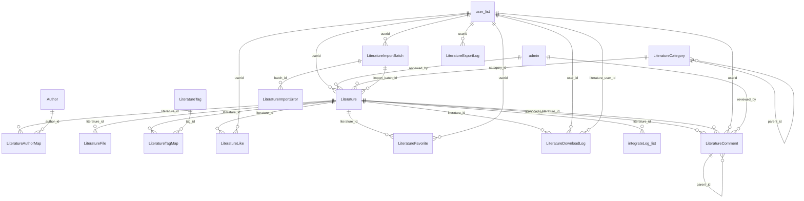
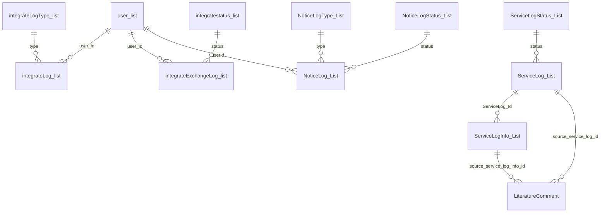

# 数据库表结构

数据库：`manage_db_final`

更新日期：2026-06-08

结构来源：

- `database/table_columns.csv`
- `database/foreign_keys.csv`
- `database/indexes.csv`
- `sql/upgrade_add_literature_comment.sql`

说明：本文件记录当前交付版部署完成后的数据库结构。字段名、表名和索引名按数据库物理名称展示，便于建库、排错和验收时核对。

## 结构统计

| 项目 | 数量 |
|---|---:|
| 表 | 62 |
| 数据库外键关系 | 28 |
| 业务关系 | 7 |
| 索引记录 | 90 |

## 表清单

| 序号 | 表名 | 字段数 |
|---:|---|---:|
| 1 | `dbo.admin` | 9 |
| 2 | `dbo.appeal_list` | 6 |
| 3 | `dbo.appealimg_list` | 4 |
| 4 | `dbo.Author` | 8 |
| 5 | `dbo.cosfile_list` | 3 |
| 6 | `dbo.daoru_list` | 5 |
| 7 | `dbo.daoruerr_list` | 4 |
| 8 | `dbo.data_list` | 14 |
| 9 | `dbo.GeneratedAssetRecord_list` | 17 |
| 10 | `dbo.indexsingle_list` | 16 |
| 11 | `dbo.integrate_list` | 8 |
| 12 | `dbo.integrateExchangeLog_list` | 9 |
| 13 | `dbo.integrateLog_list` | 12 |
| 14 | `dbo.integrateLogType_list` | 3 |
| 15 | `dbo.integratestatus_list` | 2 |
| 16 | `dbo.IntegrationToken_list` | 4 |
| 17 | `dbo.link_list` | 9 |
| 18 | `dbo.Literature` | 31 |
| 19 | `dbo.LiteratureAuthorMap` | 6 |
| 20 | `dbo.LiteratureCategory` | 9 |
| 21 | `dbo.LiteratureComment` | 18 |
| 22 | `dbo.LiteratureDownloadLog` | 8 |
| 23 | `dbo.LiteratureExportLog` | 7 |
| 24 | `dbo.LiteratureFavorite` | 4 |
| 25 | `dbo.LiteratureFile` | 10 |
| 26 | `dbo.LiteratureImportBatch` | 11 |
| 27 | `dbo.LiteratureImportError` | 7 |
| 28 | `dbo.LiteratureLike` | 4 |
| 29 | `dbo.LiteratureTag` | 5 |
| 30 | `dbo.LiteratureTagMap` | 4 |
| 31 | `dbo.LiteratureVenueProfile` | 18 |
| 32 | `dbo.logincode_list` | 5 |
| 33 | `dbo.LoginSingle_List` | 7 |
| 34 | `dbo.model_list` | 7 |
| 35 | `dbo.NoticeLog_List` | 9 |
| 36 | `dbo.NoticeLogStatus_List` | 2 |
| 37 | `dbo.NoticeLogType_List` | 2 |
| 38 | `dbo.OptionColor_list` | 6 |
| 39 | `dbo.OptionMaterial_list` | 5 |
| 40 | `dbo.popedom` | 6 |
| 41 | `dbo.PromptTemplate_list` | 4 |
| 42 | `dbo.RenderStyle_list` | 6 |
| 43 | `dbo.SearchHot_List` | 8 |
| 44 | `dbo.ServiceLog_List` | 8 |
| 45 | `dbo.ServiceLogInfo_List` | 6 |
| 46 | `dbo.ServiceLogStatus_List` | 2 |
| 47 | `dbo.tbl_class` | 20 |
| 48 | `dbo.telcode_list` | 6 |
| 49 | `dbo.TopUpType_List` | 3 |
| 50 | `dbo.user_list` | 11 |
| 51 | `dbo.user_login` | 7 |
| 52 | `dbo.userfile_list` | 3 |
| 53 | `dbo.userimg_list` | 3 |
| 54 | `dbo.userpaylog_list` | 7 |
| 55 | `dbo.userpayloginfo_list` | 14 |
| 56 | `dbo.websiteinfo_list` | 27 |
| 57 | `dbo.WorkflowTaskComment_list` | 10 |
| 58 | `dbo.WorkflowTaskCommentImage_list` | 4 |
| 59 | `dbo.WorkflowTaskLog_list` | 9 |
| 60 | `dbo.WorkflowTaskReaction_list` | 3 |
| 61 | `dbo.WorkflowTaskReply_list` | 9 |
| 62 | `dbo.WorkflowTaskReplyImage_list` | 4 |

## ER 图

### 文献业务关系

### 用户、积分、通知和服务记录关系

## 表关系清单

| 类型 | 子表字段 | 关联主表字段 | 级联删除 | 级联更新 |
|---|---|---|---|---|
| 外键约束 | `integrateExchangeLog_list.status` | `integratestatus_list.id` | NO_ACTION | NO_ACTION |
| 外键约束 | `integrateExchangeLog_list.user_id` | `user_list.id` | NO_ACTION | NO_ACTION |
| 外键约束 | `integrateLog_list.type` | `integrateLogType_list.id` | NO_ACTION | NO_ACTION |
| 外键约束 | `integrateLog_list.literature_id` | `Literature.id` | NO_ACTION | NO_ACTION |
| 外键约束 | `integrateLog_list.user_id` | `user_list.id` | NO_ACTION | NO_ACTION |
| 外键约束 | `Literature.category_id` | `LiteratureCategory.id` | NO_ACTION | NO_ACTION |
| 外键约束 | `Literature.import_batch_id` | `LiteratureImportBatch.id` | NO_ACTION | NO_ACTION |
| 外键约束 | `Literature.reviewed_by` | `admin.id` | NO_ACTION | NO_ACTION |
| 外键约束 | `Literature.userid` | `user_list.id` | NO_ACTION | NO_ACTION |
| 外键约束 | `LiteratureAuthorMap.author_id` | `Author.id` | NO_ACTION | NO_ACTION |
| 外键约束 | `LiteratureAuthorMap.literature_id` | `Literature.id` | NO_ACTION | NO_ACTION |
| 外键约束 | `LiteratureCategory.parent_id` | `LiteratureCategory.id` | NO_ACTION | NO_ACTION |
| 外键约束 | `LiteratureDownloadLog.literature_id` | `Literature.id` | NO_ACTION | NO_ACTION |
| 外键约束 | `LiteratureDownloadLog.literature_user_id` | `user_list.id` | NO_ACTION | NO_ACTION |
| 外键约束 | `LiteratureDownloadLog.user_id` | `user_list.id` | NO_ACTION | NO_ACTION |
| 外键约束 | `LiteratureExportLog.userid` | `user_list.id` | NO_ACTION | NO_ACTION |
| 外键约束 | `LiteratureFavorite.literature_id` | `Literature.id` | NO_ACTION | NO_ACTION |
| 外键约束 | `LiteratureFavorite.userid` | `user_list.id` | NO_ACTION | NO_ACTION |
| 外键约束 | `LiteratureFile.literature_id` | `Literature.id` | NO_ACTION | NO_ACTION |
| 外键约束 | `LiteratureImportBatch.userid` | `user_list.id` | NO_ACTION | NO_ACTION |
| 外键约束 | `LiteratureImportError.batch_id` | `LiteratureImportBatch.id` | NO_ACTION | NO_ACTION |
| 外键约束 | `LiteratureTagMap.literature_id` | `Literature.id` | NO_ACTION | NO_ACTION |
| 外键约束 | `LiteratureTagMap.tag_id` | `LiteratureTag.id` | NO_ACTION | NO_ACTION |
| 外键约束 | `NoticeLog_List.status` | `NoticeLogStatus_List.id` | NO_ACTION | NO_ACTION |
| 外键约束 | `NoticeLog_List.type` | `NoticeLogType_List.id` | NO_ACTION | NO_ACTION |
| 外键约束 | `NoticeLog_List.userid` | `user_list.id` | NO_ACTION | NO_ACTION |
| 外键约束 | `ServiceLog_List.status` | `ServiceLogStatus_List.id` | NO_ACTION | NO_ACTION |
| 外键约束 | `ServiceLogInfo_List.ServiceLog_Id` | `ServiceLog_List.id` | NO_ACTION | NO_ACTION |
| 业务关系 | `LiteratureComment.literature_id` | `Literature.id` | 未设置 | 未设置 |
| 业务关系 | `LiteratureComment.canonical_literature_id` | `Literature.id` | 未设置 | 未设置 |
| 业务关系 | `LiteratureComment.userid` | `user_list.id` | 未设置 | 未设置 |
| 业务关系 | `LiteratureComment.parent_id` | `LiteratureComment.id` | 未设置 | 未设置 |
| 业务关系 | `LiteratureComment.reviewed_by` | `admin.id` | 未设置 | 未设置 |
| 业务关系 | `LiteratureComment.source_service_log_id` | `ServiceLog_List.id` | 未设置 | 未设置 |
| 业务关系 | `LiteratureComment.source_service_log_info_id` | `ServiceLogInfo_List.id` | 未设置 | 未设置 |

## 索引清单

| 表名 | 索引名 | 类型 | 唯一 | 主键 | 字段 |
|---|---|---|---|---|---|
| `dbo.admin` | `PK_Admin` | CLUSTERED | 是 | 是 | `id` |
| `dbo.appeal_list` | `PK_appeal_list` | CLUSTERED | 是 | 是 | `id` |
| `dbo.appealimg_list` | `IX_appealimg_list` | NONCLUSTERED | 是 | 否 | `upload_pic_info` |
| `dbo.Author` | `IX_Author_NameCn` | NONCLUSTERED | 否 | 否 | `name_cn` |
| `dbo.Author` | `PK_Author` | CLUSTERED | 是 | 是 | `id` |
| `dbo.cosfile_list` | `IX_cosfile_list_up_filename` | NONCLUSTERED | 否 | 否 | `up_filename` |
| `dbo.data_list` | `PK_data_list` | CLUSTERED | 是 | 是 | `id` |
| `dbo.GeneratedAssetRecord_list` | `IX_userai3dlog_list` | NONCLUSTERED | 是 | 否 | `requestid` |
| `dbo.GeneratedAssetRecord_list` | `IX_userai3dlog_list_1` | NONCLUSTERED | 是 | 否 | `jobid` |
| `dbo.GeneratedAssetRecord_list` | `PK_userai3dlog_list` | CLUSTERED | 是 | 是 | `id` |
| `dbo.indexsingle_list` | `PK_indexsingle_list` | CLUSTERED | 是 | 是 | `id` |
| `dbo.integrate_list` | `PK_integrate_list` | CLUSTERED | 是 | 是 | `id` |
| `dbo.integrateExchangeLog_list` | `IX_integrateExchangeLog_list` | NONCLUSTERED | 是 | 否 | `codestr` |
| `dbo.integrateExchangeLog_list` | `IX_integrateExchangeLog_list_UserStatus` | NONCLUSTERED | 否 | 否 | `user_id, status, addtime` |
| `dbo.integrateExchangeLog_list` | `PK_integrateExchangeLog_list` | CLUSTERED | 是 | 是 | `id` |
| `dbo.integrateLog_list` | `IX_integrateLog_list_Literature` | NONCLUSTERED | 否 | 否 | `literature_id, addtime` |
| `dbo.integrateLog_list` | `IX_integrateLog_list_UserAddtime` | NONCLUSTERED | 否 | 否 | `user_id, addtime` |
| `dbo.integrateLog_list` | `PK_integrateLog_list` | CLUSTERED | 是 | 是 | `id` |
| `dbo.integrateLogType_list` | `PK_integrateLogType_list` | CLUSTERED | 是 | 是 | `id` |
| `dbo.integrateLogType_list` | `UX_integrateLogType_list_name` | NONCLUSTERED | 是 | 否 | `name` |
| `dbo.integratestatus_list` | `PK_integratestatus_list` | CLUSTERED | 是 | 是 | `id` |
| `dbo.integratestatus_list` | `UX_integratestatus_list_name` | NONCLUSTERED | 是 | 否 | `name` |
| `dbo.Literature` | `IX_Literature_Canonical` | NONCLUSTERED | 否 | 否 | `canonical_literature_id, status, category_id, publish_year` |
| `dbo.Literature` | `IX_Literature_Doi` | NONCLUSTERED | 否 | 否 | `doi` |
| `dbo.Literature` | `IX_Literature_ImportBatch` | NONCLUSTERED | 否 | 否 | `import_batch_id` |
| `dbo.Literature` | `IX_Literature_Review` | NONCLUSTERED | 否 | 否 | `reviewed_by, review_time` |
| `dbo.Literature` | `IX_Literature_StatusCategoryAddtime` | NONCLUSTERED | 否 | 否 | `+ is_top, + publish_year, + source_type, + title, status, category_id, addtime` |
| `dbo.Literature` | `IX_Literature_StatusPublishYear` | NONCLUSTERED | 否 | 否 | `status, publish_year` |
| `dbo.Literature` | `PK_Literature` | CLUSTERED | 是 | 是 | `id` |
| `dbo.LiteratureAuthorMap` | `IX_LiteratureAuthorMap_Author` | NONCLUSTERED | 否 | 否 | `author_id, literature_id` |
| `dbo.LiteratureAuthorMap` | `PK_LiteratureAuthorMap` | CLUSTERED | 是 | 是 | `id` |
| `dbo.LiteratureAuthorMap` | `UX_LiteratureAuthorMap_LitAuthor` | NONCLUSTERED | 是 | 否 | `literature_id, author_id` |
| `dbo.LiteratureCategory` | `PK_LiteratureCategory` | CLUSTERED | 是 | 是 | `id` |
| `dbo.LiteratureComment` | `IX_LiteratureComment_Literature_Status` | NONCLUSTERED | 否 | 否 | `canonical_literature_id, literature_id, parent_id, status, is_deleted, addtime` |
| `dbo.LiteratureComment` | `IX_LiteratureComment_User` | NONCLUSTERED | 否 | 否 | `userid, is_deleted, status, addtime` |
| `dbo.LiteratureComment` | `PK_LiteratureComment` | CLUSTERED | 是 | 是 | `id` |
| `dbo.LiteratureComment` | `UX_LiteratureComment_SourceServiceLog` | NONCLUSTERED | 是 | 否 | `source_service_log_id` |
| `dbo.LiteratureComment` | `UX_LiteratureComment_SourceServiceLogInfo` | NONCLUSTERED | 是 | 否 | `source_service_log_info_id` |
| `dbo.LiteratureDownloadLog` | `PK_LiteratureDownloadLog` | CLUSTERED | 是 | 是 | `id` |
| `dbo.LiteratureDownloadLog` | `UX_LiteratureDownloadLog_UserLiterature` | NONCLUSTERED | 是 | 否 | `user_id, literature_id` |
| `dbo.LiteratureExportLog` | `PK_LiteratureExportLog` | CLUSTERED | 是 | 是 | `id` |
| `dbo.LiteratureFavorite` | `PK_LiteratureFavorite` | CLUSTERED | 是 | 是 | `id` |
| `dbo.LiteratureFavorite` | `UX_LiteratureFavorite_literature_user` | NONCLUSTERED | 是 | 否 | `literature_id, userid` |
| `dbo.LiteratureFavorite` | `UX_LiteratureFavorite_LiteratureUser` | NONCLUSTERED | 是 | 否 | `literature_id, userid` |
| `dbo.LiteratureFile` | `IX_LiteratureFile_LiteratureStatus` | NONCLUSTERED | 否 | 否 | `literature_id, status, orderid` |
| `dbo.LiteratureFile` | `PK_LiteratureFile` | CLUSTERED | 是 | 是 | `id` |
| `dbo.LiteratureImportBatch` | `PK_LiteratureImportBatch` | CLUSTERED | 是 | 是 | `id` |
| `dbo.LiteratureImportError` | `PK_LiteratureImportError` | CLUSTERED | 是 | 是 | `id` |
| `dbo.LiteratureLike` | `PK_LiteratureLike` | CLUSTERED | 是 | 是 | `id` |
| `dbo.LiteratureLike` | `UX_LiteratureLike_literature_user` | NONCLUSTERED | 是 | 否 | `literature_id, userid` |
| `dbo.LiteratureTag` | `IX_LiteratureTag_Name` | NONCLUSTERED | 否 | 否 | `name` |
| `dbo.LiteratureTag` | `PK_LiteratureTag` | CLUSTERED | 是 | 是 | `id` |
| `dbo.LiteratureTagMap` | `IX_LiteratureTagMap_Tag` | NONCLUSTERED | 否 | 否 | `tag_id, literature_id` |
| `dbo.LiteratureTagMap` | `PK_LiteratureTagMap` | CLUSTERED | 是 | 是 | `id` |
| `dbo.LiteratureTagMap` | `UX_LiteratureTagMap_LitTag` | NONCLUSTERED | 是 | 否 | `literature_id, tag_id` |
| `dbo.LiteratureVenueProfile` | `PK__Literatu__3213E83FA0EA3D73` | CLUSTERED | 是 | 是 | `id` |
| `dbo.LiteratureVenueProfile` | `UX_LiteratureVenueProfile_type_name` | NONCLUSTERED | 是 | 否 | `venue_type, venue_name` |
| `dbo.logincode_list` | `PK_logincode_list` | CLUSTERED | 是 | 是 | `code` |
| `dbo.LoginSingle_List` | `PK_LoginSingle_List` | CLUSTERED | 是 | 是 | `Id` |
| `dbo.model_list` | `PK_model_list` | CLUSTERED | 是 | 是 | `id` |
| `dbo.NoticeLog_List` | `IX_NoticeLog_List_UserStatusAddtime` | NONCLUSTERED | 否 | 否 | `userid, status, addtime` |
| `dbo.NoticeLog_List` | `PK_NoticeLog_List` | CLUSTERED | 是 | 是 | `id` |
| `dbo.NoticeLogStatus_List` | `PK_NoticeLogStatus_List` | CLUSTERED | 是 | 是 | `id` |
| `dbo.NoticeLogStatus_List` | `UX_NoticeLogStatus_List_name` | NONCLUSTERED | 是 | 否 | `name` |
| `dbo.NoticeLogType_List` | `PK_NoticeLogType_List` | CLUSTERED | 是 | 是 | `id` |
| `dbo.NoticeLogType_List` | `UX_NoticeLogType_List_name` | NONCLUSTERED | 是 | 否 | `name` |
| `dbo.OptionColor_list` | `IX_Color_List` | NONCLUSTERED | 是 | 否 | `val` |
| `dbo.OptionColor_list` | `PK_Color_List` | CLUSTERED | 是 | 是 | `id` |
| `dbo.OptionMaterial_list` | `IX_ConsumableMaterial_List` | NONCLUSTERED | 是 | 否 | `name` |
| `dbo.OptionMaterial_list` | `PK_ConsumableMaterial_List` | CLUSTERED | 是 | 是 | `id` |
| `dbo.popedom` | `PK_popedom` | CLUSTERED | 是 | 是 | `id` |
| `dbo.PromptTemplate_list` | `IX_AiKeyWord_List` | NONCLUSTERED | 是 | 否 | `name` |
| `dbo.RenderStyle_list` | `IX_AiTexture_List` | NONCLUSTERED | 是 | 否 | `name` |
| `dbo.ServiceLog_List` | `PK_ServiceLog_List` | CLUSTERED | 是 | 是 | `id` |
| `dbo.ServiceLogStatus_List` | `PK_ServiceLogStatus_List` | CLUSTERED | 是 | 是 | `id` |
| `dbo.tbl_class` | `PK_tbl_class` | CLUSTERED | 是 | 是 | `id` |
| `dbo.telcode_list` | `IX_telcode_list_TelTypeAddtime` | NONCLUSTERED | 否 | 否 | `tel, type, addtime` |
| `dbo.telcode_list` | `PK_telcode_list` | CLUSTERED | 是 | 是 | `tel, type, code, addtime, img_x, img_y` |
| `dbo.TopUpType_List` | `IX_TopUpType_List` | NONCLUSTERED | 是 | 否 | `money` |
| `dbo.TopUpType_List` | `PK_TopUpType_List` | CLUSTERED | 是 | 是 | `id` |
| `dbo.user_list` | `PK_user_list` | CLUSTERED | 是 | 是 | `id` |
| `dbo.user_list` | `UX_user_list_tel` | NONCLUSTERED | 是 | 否 | `tel` |
| `dbo.user_login` | `PK_User_Login` | CLUSTERED | 是 | 是 | `id` |
| `dbo.userfile_list` | `IX_userfile_list_up_filename` | NONCLUSTERED | 否 | 否 | `up_filename` |
| `dbo.userpaylog_list` | `PK_userpaylog_list` | CLUSTERED | 是 | 是 | `out_trade_no` |
| `dbo.websiteinfo_list` | `PK_websiteinfo_list` | CLUSTERED | 是 | 是 | `id` |
| `dbo.WorkflowTaskComment_list` | `PK_Ai3dMsg_list` | CLUSTERED | 是 | 是 | `id` |
| `dbo.WorkflowTaskLog_list` | `PK_Ai3dLog_list` | CLUSTERED | 是 | 是 | `id` |
| `dbo.WorkflowTaskReaction_list` | `PK_Ai3DMsgZan_List` | CLUSTERED | 是 | 是 | `ai3dmsg_id, user_id` |
| `dbo.WorkflowTaskReply_list` | `PK_Ai3DMsgReply_list` | CLUSTERED | 是 | 是 | `id` |

说明：索引字段前缀 `+` 表示包含列。

## 全部表结构

### dbo.admin

| 序号 | 字段 | 类型 | 允许空 | 标识列 | 计算列 | 默认值 |
|---:|---|---|---|---|---|---|
| 1 | `id` | `int` | 否 | 是 |  |  |
| 2 | `username` | `nvarchar(50)` | 否 |  |  |  |
| 3 | `password` | `nvarchar(50)` | 是 |  |  |  |
| 4 | `popedom` | `nvarchar(MAX)` | 是 |  |  |  |
| 5 | `lastloginip` | `nvarchar(50)` | 是 |  |  |  |
| 6 | `cityid` | `int` | 是 |  |  |  |
| 7 | `locks` | `int` | 是 |  |  |  |
| 8 | `code` | `nvarchar(50)` | 是 |  |  |  |
| 9 | `lastlogindate` | `datetime` | 是 |  |  | (getdate()) |

### dbo.appeal_list

| 序号 | 字段 | 类型 | 允许空 | 标识列 | 计算列 | 默认值 |
|---:|---|---|---|---|---|---|
| 1 | `id` | `bigint` | 否 | 是 |  |  |
| 2 | `url` | `nvarchar(2500)` | 否 |  |  |  |
| 3 | `info_` | `nvarchar(MAX)` | 否 |  |  |  |
| 4 | `addtime` | `datetime` | 否 |  |  |  |
| 5 | `status` | `int` | 否 |  |  |  |
| 6 | `userid` | `int` | 否 |  |  |  |

### dbo.appealimg_list

| 序号 | 字段 | 类型 | 允许空 | 标识列 | 计算列 | 默认值 |
|---:|---|---|---|---|---|---|
| 1 | `appeal_id` | `bigint` | 否 |  |  |  |
| 2 | `upload_pic_info` | `nvarchar(250)` | 否 |  |  |  |
| 3 | `addtime` | `datetime` | 否 |  |  |  |
| 4 | `orderid` | `int` | 否 |  |  |  |

### dbo.Author

| 序号 | 字段 | 类型 | 允许空 | 标识列 | 计算列 | 默认值 |
|---:|---|---|---|---|---|---|
| 1 | `id` | `int` | 否 | 是 |  |  |
| 2 | `name_cn` | `nvarchar(100)` | 否 |  |  |  |
| 3 | `name_en` | `nvarchar(200)` | 是 |  |  |  |
| 4 | `institution` | `nvarchar(300)` | 是 |  |  |  |
| 5 | `orcid` | `nvarchar(50)` | 是 |  |  |  |
| 6 | `email` | `nvarchar(200)` | 是 |  |  |  |
| 7 | `status` | `int` | 否 |  |  | ((1)) |
| 8 | `addtime` | `datetime` | 否 |  |  | (getdate()) |

### dbo.cosfile_list

| 序号 | 字段 | 类型 | 允许空 | 标识列 | 计算列 | 默认值 |
|---:|---|---|---|---|---|---|
| 1 | `userid` | `int` | 否 |  |  |  |
| 2 | `addtime` | `datetime` | 否 |  |  |  |
| 3 | `up_filename` | `nvarchar(250)` | 否 |  |  |  |

### dbo.daoru_list

| 序号 | 字段 | 类型 | 允许空 | 标识列 | 计算列 | 默认值 |
|---:|---|---|---|---|---|---|
| 1 | `id` | `int` | 否 | 是 |  |  |
| 2 | `posttime` | `datetime` | 否 |  |  |  |
| 3 | `r_info` | `nvarchar(500)` | 否 |  |  |  |
| 4 | `status` | `int` | 否 |  |  |  |
| 5 | `type` | `int` | 否 |  |  |  |

### dbo.daoruerr_list

| 序号 | 字段 | 类型 | 允许空 | 标识列 | 计算列 | 默认值 |
|---:|---|---|---|---|---|---|
| 1 | `info` | `nvarchar(500)` | 否 |  |  |  |
| 2 | `filename` | `nvarchar(250)` | 否 |  |  |  |
| 3 | `addtime` | `datetime` | 否 |  |  |  |
| 4 | `daoruid` | `int` | 否 |  |  |  |

### dbo.data_list

| 序号 | 字段 | 类型 | 允许空 | 标识列 | 计算列 | 默认值 |
|---:|---|---|---|---|---|---|
| 1 | `id` | `int` | 否 | 是 |  |  |
| 2 | `name` | `nvarchar(600)` | 是 |  |  |  |
| 3 | `tbclass_id` | `int` | 否 |  |  | ((0)) |
| 4 | `upload_pic_img` | `nvarchar(50)` | 是 |  |  |  |
| 5 | `isshow` | `int` | 否 |  |  | ((0)) |
| 6 | `addtime` | `datetime` | 否 |  |  |  |
| 7 | `uptime` | `datetime` | 否 |  |  |  |
| 8 | `datetime` | `datetime` | 否 |  |  |  |
| 9 | `orderid` | `int` | 否 |  |  |  |
| 10 | `info_` | `nvarchar(MAX)` | 是 |  |  |  |
| 11 | `keywords` | `nvarchar(MAX)` | 是 |  |  |  |
| 12 | `description` | `nvarchar(MAX)` | 是 |  |  |  |
| 13 | `title` | `nvarchar(MAX)` | 是 |  |  |  |
| 14 | `istop` | `int` | 否 |  |  |  |

### dbo.GeneratedAssetRecord_list

| 序号 | 字段 | 类型 | 允许空 | 标识列 | 计算列 | 默认值 |
|---:|---|---|---|---|---|---|
| 1 | `id` | `bigint` | 否 | 是 |  |  |
| 2 | `userid` | `int` | 否 |  |  |  |
| 3 | `addtime` | `datetime` | 否 |  |  |  |
| 4 | `jobid` | `nvarchar(250)` | 否 |  |  |  |
| 5 | `requestid` | `nvarchar(250)` | 否 |  |  |  |
| 6 | `status` | `nvarchar(50)` | 是 |  |  |  |
| 7 | `ai_key` | `nvarchar(500)` | 是 |  |  |  |
| 8 | `ai_img` | `nvarchar(500)` | 是 |  |  |  |
| 9 | `type` | `int` | 否 |  |  |  |
| 10 | `upload_pic_cover` | `nvarchar(250)` | 是 |  |  |  |
| 11 | `iscos` | `int` | 否 |  |  |  |
| 12 | `upload_pic_cos` | `nvarchar(250)` | 是 |  |  |  |
| 13 | `isshow` | `int` | 是 |  |  |  |
| 14 | `istop` | `int` | 是 |  |  |  |
| 15 | `num_integrate` | `int` | 是 |  |  |  |
| 16 | `api_err` | `nvarchar(MAX)` | 是 |  |  |  |
| 17 | `cos_name` | `nvarchar(250)` | 是 |  |  |  |

### dbo.indexsingle_list

| 序号 | 字段 | 类型 | 允许空 | 标识列 | 计算列 | 默认值 |
|---:|---|---|---|---|---|---|
| 1 | `id` | `int` | 否 | 是 |  |  |
| 2 | `name` | `nvarchar(600)` | 是 |  |  |  |
| 3 | `upload_pic_img` | `nvarchar(50)` | 是 |  |  |  |
| 4 | `upload_pic_m` | `nvarchar(250)` | 是 |  |  |  |
| 5 | `upload_pic_pc` | `nvarchar(250)` | 是 |  |  |  |
| 6 | `isshow` | `int` | 否 |  |  | ((0)) |
| 7 | `addtime` | `datetime` | 否 |  |  |  |
| 8 | `uptime` | `datetime` | 否 |  |  |  |
| 9 | `orderid` | `int` | 否 |  |  |  |
| 10 | `info_` | `nvarchar(MAX)` | 是 |  |  |  |
| 11 | `keywords` | `nvarchar(MAX)` | 是 |  |  |  |
| 12 | `description` | `nvarchar(MAX)` | 是 |  |  |  |
| 13 | `title` | `nvarchar(MAX)` | 是 |  |  |  |
| 14 | `istop` | `int` | 否 |  |  |  |
| 15 | `istype` | `int` | 否 |  |  |  |
| 16 | `url` | `nvarchar(2500)` | 是 |  |  |  |

### dbo.integrate_list

| 序号 | 字段 | 类型 | 允许空 | 标识列 | 计算列 | 默认值 |
|---:|---|---|---|---|---|---|
| 1 | `id` | `int` | 否 | 是 |  |  |
| 2 | `name` | `nvarchar(250)` | 否 |  |  |  |
| 3 | `orderid` | `int` | 否 |  |  |  |
| 4 | `uptime` | `datetime` | 否 |  |  |  |
| 5 | `addtime` | `datetime` | 否 |  |  |  |
| 6 | `upload_pic_img` | `nvarchar(250)` | 是 |  |  |  |
| 7 | `about_` | `nvarchar(MAX)` | 是 |  |  |  |
| 8 | `num_integrate` | `int` | 否 |  |  |  |

### dbo.integrateExchangeLog_list

| 序号 | 字段 | 类型 | 允许空 | 标识列 | 计算列 | 默认值 |
|---:|---|---|---|---|---|---|
| 1 | `id` | `bigint` | 否 | 是 |  |  |
| 2 | `name` | `nvarchar(500)` | 否 |  |  |  |
| 3 | `num_integrate` | `int` | 否 |  |  |  |
| 4 | `codestr` | `nvarchar(250)` | 否 |  |  |  |
| 5 | `addtime` | `datetime` | 否 |  |  |  |
| 6 | `status` | `int` | 是 |  |  |  |
| 7 | `user_id` | `int` | 否 |  |  |  |
| 8 | `upload_pic_img` | `nvarchar(250)` | 是 |  |  |  |
| 9 | `hexiaotime` | `nvarchar(250)` | 是 |  |  |  |

### dbo.integrateLog_list

| 序号 | 字段 | 类型 | 允许空 | 标识列 | 计算列 | 默认值 |
|---:|---|---|---|---|---|---|
| 1 | `id` | `int` | 否 | 是 |  |  |
| 2 | `num_integrate` | `int` | 否 |  |  |  |
| 3 | `type` | `int` | 否 |  |  |  |
| 4 | `name` | `nvarchar(500)` | 否 |  |  |  |
| 5 | `info_` | `nvarchar(MAX)` | 是 |  |  |  |
| 6 | `addtime` | `datetime` | 否 |  |  |  |
| 7 | `user_id` | `int` | 否 |  |  |  |
| 8 | `adminname` | `nvarchar(250)` | 是 |  |  |  |
| 9 | `pro_id` | `bigint` | 是 |  |  |  |
| 10 | `prodata_id` | `bigint` | 是 |  |  |  |
| 11 | `orderpro_orderno` | `nvarchar(50)` | 是 |  |  |  |
| 12 | `literature_id` | `int` | 是 |  |  |  |

### dbo.integrateLogType_list

| 序号 | 字段 | 类型 | 允许空 | 标识列 | 计算列 | 默认值 |
|---:|---|---|---|---|---|---|
| 1 | `id` | `int` | 否 |  |  |  |
| 2 | `name` | `nvarchar(50)` | 否 |  |  |  |
| 3 | `num_integrate` | `int` | 是 |  |  |  |

### dbo.integratestatus_list

| 序号 | 字段 | 类型 | 允许空 | 标识列 | 计算列 | 默认值 |
|---:|---|---|---|---|---|---|
| 1 | `id` | `int` | 否 |  |  |  |
| 2 | `name` | `nvarchar(50)` | 否 |  |  |  |

### dbo.IntegrationToken_list

| 序号 | 字段 | 类型 | 允许空 | 标识列 | 计算列 | 默认值 |
|---:|---|---|---|---|---|---|
| 1 | `id` | `int` | 否 |  |  |  |
| 2 | `adddate` | `datetime` | 否 |  |  |  |
| 3 | `access_token` | `nvarchar(250)` | 否 |  |  |  |
| 4 | `expires_in` | `int` | 否 |  |  |  |

### dbo.link_list

| 序号 | 字段 | 类型 | 允许空 | 标识列 | 计算列 | 默认值 |
|---:|---|---|---|---|---|---|
| 1 | `id` | `int` | 否 | 是 |  |  |
| 2 | `name` | `nvarchar(150)` | 是 |  |  |  |
| 3 | `isshow` | `int` | 否 |  |  | ((0)) |
| 4 | `addtime` | `datetime` | 否 |  |  |  |
| 5 | `uptime` | `datetime` | 否 |  |  |  |
| 6 | `orderid` | `int` | 否 |  |  |  |
| 7 | `url` | `nvarchar(600)` | 是 |  |  |  |
| 8 | `type` | `int` | 否 |  |  |  |
| 9 | `upload_pic_icon` | `nvarchar(50)` | 是 |  |  |  |

### dbo.Literature

| 序号 | 字段 | 类型 | 允许空 | 标识列 | 计算列 | 默认值 |
|---:|---|---|---|---|---|---|
| 1 | `id` | `int` | 否 | 是 |  |  |
| 2 | `title` | `nvarchar(500)` | 否 |  |  |  |
| 3 | `subtitle` | `nvarchar(500)` | 是 |  |  |  |
| 5 | `doi` | `nvarchar(100)` | 是 |  |  |  |
| 6 | `keywords` | `nvarchar(500)` | 是 |  |  |  |
| 7 | `abstract_text` | `nvarchar(MAX)` | 是 |  |  |  |
| 8 | `source_type` | `nvarchar(50)` | 是 |  |  |  |
| 9 | `language` | `nvarchar(50)` | 是 |  |  |  |
| 10 | `publish_year` | `int` | 是 |  |  |  |
| 11 | `journal_name` | `nvarchar(300)` | 是 |  |  |  |
| 12 | `conference_name` | `nvarchar(300)` | 是 |  |  |  |
| 13 | `publisher` | `nvarchar(300)` | 是 |  |  |  |
| 14 | `volume` | `nvarchar(50)` | 是 |  |  |  |
| 15 | `issue` | `nvarchar(50)` | 是 |  |  |  |
| 16 | `pages` | `nvarchar(100)` | 是 |  |  |  |
| 17 | `category_id` | `int` | 否 |  |  | ((0)) |
| 19 | `cover_pic` | `nvarchar(255)` | 是 |  |  |  |
| 22 | `external_url` | `nvarchar(500)` | 是 |  |  |  |
| 23 | `source_db` | `nvarchar(200)` | 是 |  |  |  |
| 24 | `remark` | `nvarchar(1000)` | 是 |  |  |  |
| 25 | `is_top` | `int` | 否 |  |  | ((0)) |
| 26 | `status` | `int` | 否 |  |  | ((1)) |
| 27 | `userid` | `int` | 否 |  |  | ((0)) |
| 28 | `addtime` | `datetime` | 否 |  |  | (getdate()) |
| 29 | `updatetime` | `datetime` | 否 |  |  | (getdate()) |
| 30 | `institution` | `nvarchar(500)` | 是 |  |  |  |
| 31 | `download_points` | `int` | 否 |  |  | ((0)) |
| 32 | `reviewed_by` | `int` | 是 |  |  |  |
| 33 | `review_time` | `datetime` | 是 |  |  |  |
| 34 | `import_batch_id` | `int` | 是 |  |  |  |
| 35 | `canonical_literature_id` | `int` | 是 |  |  |  |

### dbo.LiteratureAuthorMap

| 序号 | 字段 | 类型 | 允许空 | 标识列 | 计算列 | 默认值 |
|---:|---|---|---|---|---|---|
| 1 | `id` | `int` | 否 | 是 |  |  |
| 2 | `literature_id` | `int` | 否 |  |  |  |
| 3 | `author_id` | `int` | 否 |  |  |  |
| 4 | `author_order` | `int` | 否 |  |  | ((1)) |
| 5 | `is_corresponding` | `int` | 否 |  |  | ((0)) |
| 6 | `addtime` | `datetime` | 否 |  |  | (getdate()) |

### dbo.LiteratureCategory

| 序号 | 字段 | 类型 | 允许空 | 标识列 | 计算列 | 默认值 |
|---:|---|---|---|---|---|---|
| 1 | `id` | `int` | 否 | 是 |  |  |
| 2 | `parent_id` | `int` | 是 |  |  | ((0)) |
| 3 | `name` | `nvarchar(100)` | 否 |  |  |  |
| 4 | `name_en` | `nvarchar(200)` | 是 |  |  |  |
| 5 | `code` | `nvarchar(100)` | 是 |  |  |  |
| 6 | `orderid` | `int` | 否 |  |  | ((0)) |
| 7 | `status` | `int` | 否 |  |  | ((1)) |
| 8 | `addtime` | `datetime` | 否 |  |  | (getdate()) |
| 9 | `updatetime` | `datetime` | 否 |  |  | (getdate()) |

### dbo.LiteratureComment

| 序号 | 字段 | 类型 | 允许空 | 标识列 | 计算列 | 默认值 |
|---:|---|---|---|---|---|---|
| 1 | `id` | `int` | 否 | 是 |  |  |
| 2 | `literature_id` | `int` | 否 |  |  |  |
| 3 | `canonical_literature_id` | `int` | 是 |  |  |  |
| 4 | `userid` | `int` | 否 |  |  |  |
| 5 | `parent_id` | `int` | 否 |  |  | ((0)) |
| 6 | `content` | `nvarchar(MAX)` | 否 |  |  |  |
| 7 | `status` | `int` | 否 |  |  | ((0)) |
| 8 | `like_count` | `int` | 否 |  |  | ((0)) |
| 9 | `report_count` | `int` | 否 |  |  | ((0)) |
| 10 | `is_deleted` | `int` | 否 |  |  | ((0)) |
| 11 | `delete_time` | `datetime` | 是 |  |  |  |
| 12 | `reviewed_by` | `int` | 是 |  |  |  |
| 13 | `review_time` | `datetime` | 是 |  |  |  |
| 14 | `review_remark` | `nvarchar(500)` | 是 |  |  |  |
| 15 | `source_service_log_id` | `int` | 是 |  |  |  |
| 16 | `source_service_log_info_id` | `int` | 是 |  |  |  |
| 17 | `addtime` | `datetime` | 否 |  |  | (getdate()) |
| 18 | `updatetime` | `datetime` | 否 |  |  | (getdate()) |

### dbo.LiteratureDownloadLog

| 序号 | 字段 | 类型 | 允许空 | 标识列 | 计算列 | 默认值 |
|---:|---|---|---|---|---|---|
| 1 | `id` | `int` | 否 | 是 |  |  |
| 2 | `literature_id` | `int` | 否 |  |  |  |
| 3 | `user_id` | `int` | 否 |  |  |  |
| 4 | `literature_title` | `nvarchar(500)` | 是 |  |  |  |
| 5 | `file_url` | `nvarchar(255)` | 是 |  |  |  |
| 6 | `download_points` | `int` | 否 |  |  | ((0)) |
| 7 | `literature_user_id` | `int` | 否 |  |  | ((0)) |
| 8 | `addtime` | `datetime` | 否 |  |  | (getdate()) |

### dbo.LiteratureExportLog

| 序号 | 字段 | 类型 | 允许空 | 标识列 | 计算列 | 默认值 |
|---:|---|---|---|---|---|---|
| 1 | `id` | `int` | 否 | 是 |  |  |
| 2 | `export_name` | `nvarchar(200)` | 否 |  |  |  |
| 3 | `export_type` | `nvarchar(50)` | 否 |  |  |  |
| 4 | `file_name` | `nvarchar(255)` | 是 |  |  |  |
| 5 | `record_count` | `int` | 否 |  |  | ((0)) |
| 6 | `userid` | `int` | 否 |  |  | ((0)) |
| 7 | `addtime` | `datetime` | 否 |  |  | (getdate()) |

### dbo.LiteratureFavorite

| 序号 | 字段 | 类型 | 允许空 | 标识列 | 计算列 | 默认值 |
|---:|---|---|---|---|---|---|
| 1 | `id` | `int` | 否 | 是 |  |  |
| 2 | `literature_id` | `int` | 否 |  |  |  |
| 3 | `userid` | `int` | 否 |  |  |  |
| 4 | `addtime` | `datetime` | 否 |  |  | (getdate()) |

### dbo.LiteratureFile

| 序号 | 字段 | 类型 | 允许空 | 标识列 | 计算列 | 默认值 |
|---:|---|---|---|---|---|---|
| 1 | `id` | `int` | 否 | 是 |  |  |
| 2 | `literature_id` | `int` | 否 |  |  |  |
| 3 | `file_type` | `nvarchar(50)` | 否 |  |  |  |
| 4 | `file_name` | `nvarchar(255)` | 否 |  |  |  |
| 5 | `file_path` | `nvarchar(255)` | 否 |  |  |  |
| 6 | `file_size` | `bigint` | 是 |  |  |  |
| 7 | `mime_type` | `nvarchar(100)` | 是 |  |  |  |
| 8 | `orderid` | `int` | 否 |  |  | ((0)) |
| 9 | `status` | `int` | 否 |  |  | ((1)) |
| 10 | `addtime` | `datetime` | 否 |  |  | (getdate()) |

### dbo.LiteratureImportBatch

| 序号 | 字段 | 类型 | 允许空 | 标识列 | 计算列 | 默认值 |
|---:|---|---|---|---|---|---|
| 1 | `id` | `int` | 否 | 是 |  |  |
| 2 | `batch_name` | `nvarchar(200)` | 否 |  |  |  |
| 3 | `import_type` | `nvarchar(50)` | 否 |  |  |  |
| 4 | `file_name` | `nvarchar(255)` | 是 |  |  |  |
| 5 | `status` | `int` | 否 |  |  | ((0)) |
| 6 | `total_count` | `int` | 否 |  |  | ((0)) |
| 7 | `success_count` | `int` | 否 |  |  | ((0)) |
| 8 | `fail_count` | `int` | 否 |  |  | ((0)) |
| 9 | `userid` | `int` | 否 |  |  | ((0)) |
| 10 | `addtime` | `datetime` | 否 |  |  | (getdate()) |
| 11 | `finishtime` | `datetime` | 是 |  |  |  |

### dbo.LiteratureImportError

| 序号 | 字段 | 类型 | 允许空 | 标识列 | 计算列 | 默认值 |
|---:|---|---|---|---|---|---|
| 1 | `id` | `int` | 否 | 是 |  |  |
| 2 | `batch_id` | `int` | 否 |  |  |  |
| 3 | `row_no` | `int` | 否 |  |  |  |
| 4 | `title` | `nvarchar(500)` | 是 |  |  |  |
| 5 | `error_msg` | `nvarchar(1000)` | 否 |  |  |  |
| 6 | `raw_data` | `nvarchar(MAX)` | 是 |  |  |  |
| 7 | `addtime` | `datetime` | 否 |  |  | (getdate()) |

### dbo.LiteratureLike

| 序号 | 字段 | 类型 | 允许空 | 标识列 | 计算列 | 默认值 |
|---:|---|---|---|---|---|---|
| 1 | `id` | `int` | 否 | 是 |  |  |
| 2 | `literature_id` | `int` | 否 |  |  |  |
| 3 | `userid` | `int` | 否 |  |  |  |
| 4 | `addtime` | `datetime` | 否 |  |  | (getdate()) |

### dbo.LiteratureTag

| 序号 | 字段 | 类型 | 允许空 | 标识列 | 计算列 | 默认值 |
|---:|---|---|---|---|---|---|
| 1 | `id` | `int` | 否 | 是 |  |  |
| 2 | `name` | `nvarchar(100)` | 否 |  |  |  |
| 3 | `orderid` | `int` | 否 |  |  | ((0)) |
| 4 | `status` | `int` | 否 |  |  | ((1)) |
| 5 | `addtime` | `datetime` | 否 |  |  | (getdate()) |

### dbo.LiteratureTagMap

| 序号 | 字段 | 类型 | 允许空 | 标识列 | 计算列 | 默认值 |
|---:|---|---|---|---|---|---|
| 1 | `id` | `int` | 否 | 是 |  |  |
| 2 | `literature_id` | `int` | 否 |  |  |  |
| 3 | `tag_id` | `int` | 否 |  |  |  |
| 4 | `addtime` | `datetime` | 否 |  |  | (getdate()) |

### dbo.LiteratureVenueProfile

| 序号 | 字段 | 类型 | 允许空 | 标识列 | 计算列 | 默认值 |
|---:|---|---|---|---|---|---|
| 1 | `id` | `int` | 否 | 是 |  |  |
| 2 | `venue_type` | `nvarchar(30)` | 否 |  |  |  |
| 3 | `venue_name` | `nvarchar(500)` | 否 |  |  |  |
| 4 | `introduction` | `nvarchar(MAX)` | 是 |  |  |  |
| 5 | `impact_factor` | `nvarchar(100)` | 是 |  |  |  |
| 6 | `jcr_quartile` | `nvarchar(100)` | 是 |  |  |  |
| 7 | `issn` | `nvarchar(100)` | 是 |  |  |  |
| 8 | `conference_level` | `nvarchar(100)` | 是 |  |  |  |
| 9 | `conference_cycle` | `nvarchar(100)` | 是 |  |  |  |
| 10 | `location` | `nvarchar(250)` | 是 |  |  |  |
| 11 | `website_url` | `nvarchar(500)` | 是 |  |  |  |
| 12 | `publisher` | `nvarchar(250)` | 是 |  |  |  |
| 13 | `remark` | `nvarchar(MAX)` | 是 |  |  |  |
| 14 | `status` | `int` | 否 |  |  | ((0)) |
| 15 | `created_by` | `int` | 否 |  |  | ((0)) |
| 16 | `updated_by` | `int` | 否 |  |  | ((0)) |
| 17 | `addtime` | `datetime` | 否 |  |  | (getdate()) |
| 18 | `updatetime` | `datetime` | 否 |  |  | (getdate()) |

### dbo.logincode_list

| 序号 | 字段 | 类型 | 允许空 | 标识列 | 计算列 | 默认值 |
|---:|---|---|---|---|---|---|
| 1 | `code` | `nvarchar(50)` | 否 |  |  |  |
| 2 | `val` | `nchar(10)` | 否 |  |  |  |
| 3 | `addtime` | `datetime` | 否 |  |  |  |
| 4 | `ip_str` | `nvarchar(50)` | 否 |  |  |  |
| 5 | `type` | `int` | 否 |  |  |  |

### dbo.LoginSingle_List

| 序号 | 字段 | 类型 | 允许空 | 标识列 | 计算列 | 默认值 |
|---:|---|---|---|---|---|---|
| 1 | `Id` | `int` | 否 | 是 |  |  |
| 2 | `Name` | `nvarchar(250)` | 否 |  |  |  |
| 3 | `IsShow` | `int` | 否 |  |  |  |
| 4 | `OrderId` | `int` | 否 |  |  |  |
| 5 | `UpTime` | `datetime` | 否 |  |  |  |
| 6 | `AddTime` | `datetime` | 否 |  |  |  |
| 7 | `Info_` | `nvarchar(MAX)` | 是 |  |  |  |

### dbo.model_list

| 序号 | 字段 | 类型 | 允许空 | 标识列 | 计算列 | 默认值 |
|---:|---|---|---|---|---|---|
| 1 | `id` | `int` | 否 | 是 |  |  |
| 2 | `m_name` | `nvarchar(255)` | 是 |  |  |  |
| 3 | `m_url` | `nvarchar(255)` | 是 |  |  |  |
| 4 | `page_url` | `nvarchar(255)` | 是 |  |  |  |
| 5 | `orderid` | `int` | 是 |  |  |  |
| 6 | `addtime` | `datetime` | 是 |  |  |  |
| 7 | `upload_pic` | `nvarchar(50)` | 是 |  |  |  |

### dbo.NoticeLog_List

| 序号 | 字段 | 类型 | 允许空 | 标识列 | 计算列 | 默认值 |
|---:|---|---|---|---|---|---|
| 1 | `id` | `int` | 否 | 是 |  |  |
| 2 | `info_` | `nvarchar(MAX)` | 是 |  |  |  |
| 3 | `type` | `int` | 否 |  |  |  |
| 4 | `addtime` | `datetime` | 否 |  |  |  |
| 5 | `userid` | `int` | 否 |  |  |  |
| 6 | `looktime` | `nvarchar(50)` | 是 |  |  |  |
| 7 | `status` | `int` | 否 |  |  |  |
| 8 | `url` | `nvarchar(500)` | 是 |  |  |  |
| 9 | `name` | `nvarchar(500)` | 否 |  |  |  |

### dbo.NoticeLogStatus_List

| 序号 | 字段 | 类型 | 允许空 | 标识列 | 计算列 | 默认值 |
|---:|---|---|---|---|---|---|
| 1 | `id` | `int` | 否 |  |  |  |
| 2 | `name` | `nvarchar(50)` | 否 |  |  |  |

### dbo.NoticeLogType_List

| 序号 | 字段 | 类型 | 允许空 | 标识列 | 计算列 | 默认值 |
|---:|---|---|---|---|---|---|
| 1 | `id` | `int` | 否 |  |  |  |
| 2 | `name` | `nvarchar(50)` | 否 |  |  |  |

### dbo.OptionColor_list

| 序号 | 字段 | 类型 | 允许空 | 标识列 | 计算列 | 默认值 |
|---:|---|---|---|---|---|---|
| 1 | `id` | `int` | 否 | 是 |  |  |
| 2 | `name` | `nvarchar(50)` | 否 |  |  |  |
| 3 | `val` | `nvarchar(50)` | 否 |  |  |  |
| 4 | `orderid` | `int` | 否 |  |  |  |
| 5 | `uptime` | `datetime` | 否 |  |  |  |
| 6 | `addtime` | `datetime` | 否 |  |  |  |

### dbo.OptionMaterial_list

| 序号 | 字段 | 类型 | 允许空 | 标识列 | 计算列 | 默认值 |
|---:|---|---|---|---|---|---|
| 1 | `id` | `int` | 否 | 是 |  |  |
| 2 | `name` | `nvarchar(50)` | 否 |  |  |  |
| 3 | `orderid` | `int` | 否 |  |  |  |
| 4 | `uptime` | `datetime` | 否 |  |  |  |
| 5 | `addtime` | `datetime` | 否 |  |  |  |

### dbo.popedom

| 序号 | 字段 | 类型 | 允许空 | 标识列 | 计算列 | 默认值 |
|---:|---|---|---|---|---|---|
| 1 | `id` | `int` | 否 | 是 |  |  |
| 2 | `popedom_name` | `nvarchar(50)` | 是 |  |  |  |
| 3 | `popedom_father` | `int` | 是 |  |  |  |
| 4 | `popedom_url` | `nvarchar(255)` | 是 |  |  |  |
| 5 | `orderid` | `int` | 是 |  |  |  |
| 6 | `ishead` | `int` | 是 |  |  |  |

### dbo.PromptTemplate_list

| 序号 | 字段 | 类型 | 允许空 | 标识列 | 计算列 | 默认值 |
|---:|---|---|---|---|---|---|
| 1 | `id` | `int` | 否 | 是 |  |  |
| 2 | `addtime` | `datetime` | 否 |  |  |  |
| 3 | `name` | `nvarchar(250)` | 否 |  |  |  |
| 4 | `uptime` | `datetime` | 是 |  |  |  |

### dbo.RenderStyle_list

| 序号 | 字段 | 类型 | 允许空 | 标识列 | 计算列 | 默认值 |
|---:|---|---|---|---|---|---|
| 1 | `id` | `int` | 否 | 是 |  |  |
| 2 | `addtime` | `datetime` | 否 |  |  |  |
| 3 | `name` | `nvarchar(250)` | 否 |  |  |  |
| 4 | `uptime` | `datetime` | 否 |  |  |  |
| 5 | `orderid` | `int` | 否 |  |  |  |
| 6 | `upload_pic_img` | `nvarchar(250)` | 否 |  |  |  |

### dbo.SearchHot_List

| 序号 | 字段 | 类型 | 允许空 | 标识列 | 计算列 | 默认值 |
|---:|---|---|---|---|---|---|
| 1 | `id` | `int` | 否 | 是 |  |  |
| 2 | `addtime` | `datetime` | 否 |  |  |  |
| 3 | `name` | `nvarchar(500)` | 否 |  |  |  |
| 4 | `url` | `nvarchar(2500)` | 否 |  |  |  |
| 5 | `isshow` | `int` | 否 |  |  |  |
| 6 | `orderid` | `int` | 否 |  |  |  |
| 7 | `uptime` | `datetime` | 是 |  |  |  |
| 8 | `num_click` | `int` | 否 |  |  |  |

### dbo.ServiceLog_List

| 序号 | 字段 | 类型 | 允许空 | 标识列 | 计算列 | 默认值 |
|---:|---|---|---|---|---|---|
| 1 | `id` | `int` | 否 | 是 |  |  |
| 2 | `name` | `nvarchar(500)` | 否 |  |  |  |
| 3 | `info_` | `nvarchar(MAX)` | 否 |  |  |  |
| 4 | `addtime` | `datetime` | 否 |  |  |  |
| 5 | `status` | `int` | 否 |  |  |  |
| 6 | `userid` | `int` | 否 |  |  |  |
| 7 | `uptime` | `datetime` | 否 |  |  |  |
| 8 | `looktime` | `nvarchar(50)` | 是 |  |  |  |

### dbo.ServiceLogInfo_List

| 序号 | 字段 | 类型 | 允许空 | 标识列 | 计算列 | 默认值 |
|---:|---|---|---|---|---|---|
| 1 | `id` | `int` | 否 | 是 |  |  |
| 2 | `ServiceLog_Id` | `int` | 否 |  |  |  |
| 3 | `info_` | `nvarchar(MAX)` | 否 |  |  |  |
| 4 | `type` | `int` | 否 |  |  |  |
| 5 | `addtime` | `datetime` | 否 |  |  |  |
| 6 | `adminname` | `nvarchar(250)` | 是 |  |  |  |

### dbo.ServiceLogStatus_List

| 序号 | 字段 | 类型 | 允许空 | 标识列 | 计算列 | 默认值 |
|---:|---|---|---|---|---|---|
| 1 | `id` | `int` | 否 |  |  |  |
| 2 | `name` | `nvarchar(50)` | 否 |  |  |  |

### dbo.tbl_class

| 序号 | 字段 | 类型 | 允许空 | 标识列 | 计算列 | 默认值 |
|---:|---|---|---|---|---|---|
| 1 | `id` | `int` | 否 | 是 |  |  |
| 2 | `parentid` | `int` | 否 |  |  |  |
| 3 | `children` | `nvarchar(MAX)` | 是 |  |  |  |
| 4 | `classname` | `nvarchar(250)` | 否 |  |  |  |
| 5 | `model` | `int` | 否 |  |  |  |
| 6 | `orderid` | `int` | 否 |  |  |  |
| 7 | `isurl` | `int` | 否 |  |  |  |
| 8 | `classurl` | `nvarchar(250)` | 是 |  |  |  |
| 9 | `about` | `nvarchar(MAX)` | 是 |  |  |  |
| 10 | `info_` | `nvarchar(MAX)` | 是 |  |  |  |
| 11 | `isshow` | `int` | 否 |  |  | ((0)) |
| 12 | `adddate` | `datetime` | 否 |  |  |  |
| 13 | `isfoot` | `int` | 否 |  |  |  |
| 14 | `istop` | `int` | 否 |  |  | ((0)) |
| 15 | `description` | `nvarchar(MAX)` | 是 |  |  |  |
| 16 | `keywords` | `nvarchar(MAX)` | 是 |  |  |  |
| 17 | `upload_pic_m` | `nvarchar(250)` | 是 |  |  |  |
| 18 | `title` | `nvarchar(MAX)` | 是 |  |  |  |
| 19 | `urlnamebtn` | `nvarchar(250)` | 否 |  |  |  |
| 20 | `upload_pic_pc` | `nvarchar(250)` | 是 |  |  |  |

### dbo.telcode_list

| 序号 | 字段 | 类型 | 允许空 | 标识列 | 计算列 | 默认值 |
|---:|---|---|---|---|---|---|
| 1 | `tel` | `nvarchar(150)` | 否 |  |  |  |
| 2 | `type` | `int` | 否 |  |  |  |
| 3 | `code` | `nvarchar(50)` | 否 |  |  |  |
| 4 | `addtime` | `datetime` | 否 |  |  |  |
| 5 | `img_x` | `int` | 否 |  |  |  |
| 6 | `img_y` | `int` | 否 |  |  |  |

### dbo.TopUpType_List

| 序号 | 字段 | 类型 | 允许空 | 标识列 | 计算列 | 默认值 |
|---:|---|---|---|---|---|---|
| 1 | `id` | `int` | 否 | 是 |  |  |
| 2 | `money` | `int` | 否 |  |  |  |
| 3 | `isshow` | `int` | 否 |  |  |  |

### dbo.user_list

| 序号 | 字段 | 类型 | 允许空 | 标识列 | 计算列 | 默认值 |
|---:|---|---|---|---|---|---|
| 1 | `id` | `int` | 否 | 是 |  |  |
| 2 | `name` | `nvarchar(150)` | 是 |  |  |  |
| 3 | `tel` | `nvarchar(150)` | 否 |  |  |  |
| 4 | `addtime` | `datetime` | 否 |  |  |  |
| 5 | `uptime` | `datetime` | 是 |  |  |  |
| 6 | `isshow` | `int` | 否 |  |  |  |
| 7 | `logintime` | `nvarchar(50)` | 是 |  |  |  |
| 8 | `loginip` | `nvarchar(50)` | 是 |  |  |  |
| 9 | `code` | `nvarchar(50)` | 是 |  |  |  |
| 10 | `email` | `nvarchar(250)` | 是 |  |  |  |
| 11 | `upload_pic_avatar` | `nvarchar(250)` | 是 |  |  |  |

### dbo.user_login

| 序号 | 字段 | 类型 | 允许空 | 标识列 | 计算列 | 默认值 |
|---:|---|---|---|---|---|---|
| 1 | `id` | `int` | 否 | 是 |  |  |
| 2 | `username` | `nvarchar(50)` | 是 |  |  |  |
| 3 | `time` | `datetime` | 是 |  |  |  |
| 4 | `ip` | `nvarchar(50)` | 是 |  |  |  |
| 5 | `password` | `nvarchar(50)` | 是 |  |  |  |
| 6 | `type` | `int` | 是 |  |  |  |
| 7 | `content` | `nvarchar(MAX)` | 是 |  |  |  |

### dbo.userfile_list

| 序号 | 字段 | 类型 | 允许空 | 标识列 | 计算列 | 默认值 |
|---:|---|---|---|---|---|---|
| 1 | `userid` | `int` | 否 |  |  |  |
| 2 | `addtime` | `datetime` | 否 |  |  |  |
| 3 | `up_filename` | `nvarchar(250)` | 否 |  |  |  |

### dbo.userimg_list

| 序号 | 字段 | 类型 | 允许空 | 标识列 | 计算列 | 默认值 |
|---:|---|---|---|---|---|---|
| 1 | `userid` | `int` | 否 |  |  |  |
| 2 | `addtime` | `datetime` | 否 |  |  |  |
| 3 | `upload_pic_img` | `nvarchar(250)` | 否 |  |  |  |

### dbo.userpaylog_list

| 序号 | 字段 | 类型 | 允许空 | 标识列 | 计算列 | 默认值 |
|---:|---|---|---|---|---|---|
| 1 | `user_id` | `int` | 否 |  |  |  |
| 2 | `out_trade_no` | `nvarchar(250)` | 否 |  |  |  |
| 3 | `add_time` | `datetime` | 否 |  |  |  |
| 4 | `pay_type` | `int` | 否 |  |  |  |
| 5 | `pay_status` | `int` | 否 |  |  |  |
| 6 | `up_time` | `nvarchar(250)` | 是 |  |  |  |
| 7 | `payer_total` | `decimal(18,2)` | 是 |  |  |  |

### dbo.userpayloginfo_list

| 序号 | 字段 | 类型 | 允许空 | 标识列 | 计算列 | 默认值 |
|---:|---|---|---|---|---|---|
| 1 | `id` | `bigint` | 否 | 是 |  |  |
| 2 | `appid` | `nvarchar(250)` | 是 |  |  |  |
| 3 | `mchid` | `nvarchar(250)` | 是 |  |  |  |
| 4 | `out_trade_no` | `nvarchar(250)` | 否 |  |  |  |
| 5 | `transaction_id` | `nvarchar(250)` | 否 |  |  |  |
| 6 | `trade_type` | `nvarchar(50)` | 是 |  |  |  |
| 7 | `trade_state` | `nvarchar(50)` | 是 |  |  |  |
| 8 | `trade_state_desc` | `nvarchar(350)` | 是 |  |  |  |
| 9 | `bank_type` | `nvarchar(50)` | 是 |  |  |  |
| 10 | `success_time` | `nvarchar(150)` | 否 |  |  |  |
| 11 | `payer_total` | `decimal(18,2)` | 是 |  |  |  |
| 12 | `pay_type` | `int` | 否 |  |  |  |
| 13 | `add_time` | `datetime` | 否 |  |  |  |
| 14 | `user_id` | `int` | 否 |  |  |  |

### dbo.websiteinfo_list

| 序号 | 字段 | 类型 | 允许空 | 标识列 | 计算列 | 默认值 |
|---:|---|---|---|---|---|---|
| 1 | `id` | `int` | 否 |  |  |  |
| 2 | `companyname` | `nvarchar(250)` | 是 |  |  |  |
| 3 | `wangzhanbeian` | `nvarchar(250)` | 是 |  |  |  |
| 4 | `wangzhanbeianurl` | `nvarchar(250)` | 是 |  |  |  |
| 5 | `gonganbeian` | `nvarchar(250)` | 是 |  |  |  |
| 6 | `gonganbeianurl` | `nvarchar(250)` | 是 |  |  |  |
| 7 | `banquan` | `nvarchar(250)` | 是 |  |  |  |
| 8 | `upload_pic_logotop` | `nvarchar(50)` | 是 |  |  |  |
| 9 | `upload_pic_favicon` | `nvarchar(50)` | 是 |  |  |  |
| 10 | `title` | `nvarchar(500)` | 是 |  |  |  |
| 11 | `keywords` | `nvarchar(500)` | 是 |  |  |  |
| 12 | `description` | `nvarchar(500)` | 是 |  |  |  |
| 13 | `emailnum` | `nvarchar(250)` | 是 |  |  |  |
| 14 | `emailpasswd` | `nvarchar(250)` | 是 |  |  |  |
| 15 | `email_to` | `nvarchar(250)` | 是 |  |  |  |
| 16 | `smtpserverport` | `nvarchar(250)` | 是 |  |  |  |
| 17 | `host` | `nvarchar(250)` | 是 |  |  |  |
| 18 | `emailname` | `nvarchar(250)` | 是 |  |  |  |
| 19 | `upload_pic_indexbj` | `nvarchar(50)` | 是 |  |  |  |
| 20 | `upload_pic_indexbj_m` | `nvarchar(50)` | 是 |  |  |  |
| 21 | `info_IntegrateWithdrawal` | `nvarchar(MAX)` | 是 |  |  |  |
| 22 | `info_WorkflowInfo` | `nvarchar(MAX)` | 是 |  |  |  |
| 23 | `money_integrate` | `int` | 是 |  |  |  |
| 24 | `integrate_donate` | `int` | 是 |  |  |  |
| 25 | `integrate_buy` | `int` | 是 |  |  |  |
| 26 | `integrate_fare` | `int` | 是 |  |  |  |
| 27 | `integrate_allocation` | `int` | 是 |  |  |  |

### dbo.WorkflowTaskComment_list

| 序号 | 字段 | 类型 | 允许空 | 标识列 | 计算列 | 默认值 |
|---:|---|---|---|---|---|---|
| 1 | `id` | `bigint` | 否 | 是 |  |  |
| 2 | `userai3dlog_id` | `bigint` | 否 |  |  |  |
| 3 | `user_id` | `int` | 否 |  |  |  |
| 4 | `addtime` | `datetime` | 否 |  |  |  |
| 5 | `info_` | `nvarchar(MAX)` | 是 |  |  |  |
| 6 | `isshow` | `int` | 否 |  |  |  |
| 7 | `num_dianzan` | `int` | 否 |  |  |  |
| 8 | `reviewtime` | `nvarchar(50)` | 是 |  |  |  |
| 9 | `about_` | `nvarchar(MAX)` | 是 |  |  |  |
| 10 | `num_msg` | `int` | 否 |  |  |  |

### dbo.WorkflowTaskCommentImage_list

| 序号 | 字段 | 类型 | 允许空 | 标识列 | 计算列 | 默认值 |
|---:|---|---|---|---|---|---|
| 1 | `Ai3dMsg_Id` | `bigint` | 否 |  |  |  |
| 2 | `upload_pic_info` | `nvarchar(250)` | 否 |  |  |  |
| 3 | `addtime` | `datetime` | 否 |  |  |  |
| 4 | `orderid` | `int` | 否 |  |  |  |

### dbo.WorkflowTaskLog_list

| 序号 | 字段 | 类型 | 允许空 | 标识列 | 计算列 | 默认值 |
|---:|---|---|---|---|---|---|
| 1 | `id` | `bigint` | 否 | 是 |  |  |
| 2 | `userid` | `int` | 否 |  |  |  |
| 3 | `addtime` | `datetime` | 否 |  |  |  |
| 4 | `jobid` | `nvarchar(250)` | 否 |  |  |  |
| 5 | `requestid` | `nvarchar(250)` | 是 |  |  |  |
| 6 | `ai_key` | `nvarchar(500)` | 是 |  |  |  |
| 7 | `ai_img` | `nvarchar(500)` | 是 |  |  |  |
| 8 | `type` | `int` | 否 |  |  |  |
| 9 | `img_url` | `nvarchar(500)` | 是 |  |  |  |

### dbo.WorkflowTaskReaction_list

| 序号 | 字段 | 类型 | 允许空 | 标识列 | 计算列 | 默认值 |
|---:|---|---|---|---|---|---|
| 1 | `ai3dmsg_id` | `bigint` | 否 |  |  |  |
| 2 | `user_id` | `int` | 否 |  |  |  |
| 3 | `addtime` | `datetime` | 否 |  |  |  |

### dbo.WorkflowTaskReply_list

| 序号 | 字段 | 类型 | 允许空 | 标识列 | 计算列 | 默认值 |
|---:|---|---|---|---|---|---|
| 1 | `id` | `bigint` | 否 | 是 |  |  |
| 2 | `ai3dmsg_id` | `bigint` | 否 |  |  |  |
| 3 | `user_id` | `int` | 否 |  |  |  |
| 4 | `addtime` | `datetime` | 否 |  |  |  |
| 5 | `info_` | `nvarchar(MAX)` | 是 |  |  |  |
| 6 | `isshow` | `int` | 否 |  |  |  |
| 7 | `reviewtime` | `nvarchar(50)` | 是 |  |  |  |
| 8 | `about_` | `nvarchar(MAX)` | 是 |  |  |  |
| 9 | `msguser_id` | `int` | 否 |  |  |  |

### dbo.WorkflowTaskReplyImage_list

| 序号 | 字段 | 类型 | 允许空 | 标识列 | 计算列 | 默认值 |
|---:|---|---|---|---|---|---|
| 1 | `Ai3DMsgReply_Id` | `bigint` | 否 |  |  |  |
| 2 | `upload_pic_info` | `nvarchar(250)` | 否 |  |  |  |
| 3 | `addtime` | `datetime` | 否 |  |  |  |
| 4 | `orderid` | `int` | 否 |  |  |  |

