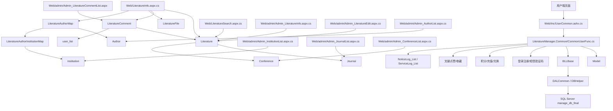

# 核心依赖图

## 当前必须保护的核心链路

- 登录注册：`UserCommon.ashx.cs` -> `CommonUserFunc.GetUserLoginFunc` / `GetAddCodeFunc` / `GetSmsCodeFunc` -> `user_list` / `telcode_list`。
- 文献详情：`LiteratureInfo.aspx.cs` -> `Literature` / `LiteratureFile` / `LiteratureComment` / `LiteratureAuthorMap` / `LiteratureAuthorInstitutionMap`。
- 评论：`LiteratureCommentAdd/Delete` -> `CommonUserFunc` -> `LiteratureComment`。
- 点赞收藏：`LiteratureReactionToggle` -> `LiteratureLike` / `LiteratureFavorite`。
- 作者机构：后台作者、机构和文献编辑页面 -> `Author` / `Institution` / `AuthorInstitutionHistory` / `LiteratureAuthorMap` / `LiteratureAuthorInstitutionMap`。
- 期刊会议：后台期刊、会议和文献编辑页面 -> `Journal` / `Conference`；上传/导入时由 `LiteratureVenueSync` 按文献类型同步主数据。
- 积分充值兑换：`CommonUserFunc` -> `integrateLog_list` / `integrateExchangeLog_list` / `userpaylog_list`。
- 后台审核：`admin/Admin_LiteratureList.aspx.cs`、`admin/Admin_LiteratureCommentList.aspx.cs`。
