<style>
body {
  color: #1f2933;
  font-family: "Microsoft YaHei", "PingFang SC", "Noto Sans CJK SC", Arial, sans-serif;
  line-height: 1.72;
}
h1, h2, h3, h4 {
  color: #102033;
}
h2 {
  border-bottom: 1px solid #d9e2ec;
  padding-bottom: 6px;
  margin-top: 34px;
}
h3 {
  background: #eef3f8;
  border-bottom: 1px solid #d6e0ea;
  border-left: 6px solid #2f5f8f;
  border-radius: 4px;
  font-size: 1.42em;
  font-weight: 700;
  line-height: 1.35;
  margin-top: 32px;
  margin-bottom: 14px;
  padding: 8px 12px;
}
h4 {
  background: transparent;
  border-bottom: 1px solid #d9e2ec;
  border-left: 4px solid #9fb3c8;
  color: #243b53;
  font-size: 1.10em;
  font-weight: 700;
  line-height: 1.45;
  margin-top: 22px;
  margin-bottom: 10px;
  padding: 3px 0 5px 9px;
}
p {
  margin: 8px 0 12px;
}
table {
  width: 100%;
  border-collapse: collapse;
  margin: 12px 0 20px;
  font-size: 0.94em;
}
th {
  background: #eef3f8;
  color: #102033;
  font-weight: 600;
}
th, td {
  border: 1px solid #d9e2ec;
  padding: 7px 10px;
  vertical-align: top;
}
tr:nth-child(even) td {
  background: #fafcff;
}
code {
  background: #f3f6f9;
  border-radius: 3px;
  padding: 1px 4px;
}
pre code {
  background: transparent;
  padding: 0;
}
blockquote {
  border-left: 4px solid #6b8fb3;
  color: #425466;
  margin: 14px 0;
  padding: 2px 0 2px 14px;
}
img {
  display: block;
  max-width: 92%;
  margin: 12px auto 4px;
}
.mermaid,
.md-diagram-panel,
.md-fences-advanced {
  max-width: 82%;
  margin: 10px auto 4px;
  text-align: center;
}
.mermaid svg,
.md-diagram-panel svg,
.md-fences-advanced svg {
  max-width: 100% !important;
  max-height: 420px !important;
  height: auto !important;
}
@media print {
  img {
    max-width: 88%;
    max-height: 420px;
  }
  .mermaid,
  .md-diagram-panel,
  .md-fences-advanced,
  img {
    break-inside: avoid;
    page-break-inside: avoid;
  }
  .mermaid svg,
  .md-diagram-panel svg,
  .md-fences-advanced svg {
    max-width: 86% !important;
    max-height: 360px !important;
  }
  .caption {
    margin: 4px 0 10px;
  }
}
.cover {
  display: flex;
  flex-direction: column;
  justify-content: center;
  margin: 0 auto;
  max-width: 820px;
  min-height: 84vh;
  text-align: center;
}
.cover-title {
  font-size: 2.25em;
  margin-bottom: 8px;
}
.cover-subtitle {
  color: #52616f;
  font-size: 1.28em;
  margin-top: 0;
  margin-bottom: 34px;
}
.cover table td:first-child {
  width: 28%;
  color: #52616f;
  font-weight: 600;
  text-align: right;
}
@media print {
  .cover {
    min-height: 88vh;
  }
}
.caption {
  color: #52616f;
  font-size: 0.92em;
  text-align: center;
  margin: 6px 0 18px;
}
.summary-grid {
  display: grid;
  grid-template-columns: repeat(2, minmax(0, 1fr));
  gap: 12px;
  margin: 18px 0 20px;
}
.summary-card {
  border: 1px solid #d9e2ec;
  border-radius: 6px;
  padding: 12px 14px;
  background: #fbfdff;
}
.summary-card strong {
  display: block;
  color: #102033;
  margin-bottom: 4px;
}
.appendix-note {
  background: #f6f8fb;
  border: 1px solid #d9e2ec;
  border-radius: 6px;
  padding: 10px 14px;
  margin: 12px 0 18px;
}
.page-break {
  page-break-after: always;
}
.toc {
  margin-top: 8px;
  line-height: 1.35;
}
.toc ul {
  list-style: none;
  margin: 0;
  padding-left: 0;
}
.toc li {
  margin: 2px 0;
}
.toc a {
  color: #102033;
  text-decoration: none;
}
.toc .toc-level-1 {
  font-size: 1em;
  font-weight: 600;
  margin-top: 5px;
}
.toc .toc-level-2 {
  font-size: 0.88em;
  font-weight: 400;
  margin-left: 1.6em;
  color: #52616f;
}
.toc .toc-level-2 a {
  color: #52616f;
}
.toc .toc-appendix {
  margin-top: 8px;
}
.toc {
  margin: 14px auto 0;
  max-width: 900px;
  line-height: 1.28;
}
.toc-columns {
  display: grid;
  grid-template-columns: 1fr 1fr;
  column-gap: 34px;
  align-items: start;
}
.toc-col {
  min-width: 0;
}
.toc-main {
  margin: 7px 0 3px;
  padding-left: 0;
  font-size: 11.5pt;
  font-weight: 700;
  color: #102033;
}
.toc-sub {
  margin: 1px 0 1px 1.55em;
  padding-left: 0;
  font-size: 9.5pt;
  font-weight: 400;
  color: #52616f;
}
.toc-main a,
.toc-sub a {
  text-decoration: none;
}
.toc-main a {
  color: #102033;
}
.toc-sub a {
  color: #52616f;
}
@media print {
  .toc {
    max-width: 92%;
    page-break-inside: avoid;
  }
  .toc-main {
    font-size: 11pt;
  }
  .toc-sub {
    font-size: 9.2pt;
  }
}
</style>

<div align="center" class="cover">
<h1 class="cover-title">文献管理与学术资源管理系统</h1>
<p class="cover-subtitle">项目文档</p>

<table>
<tr><td>项目类型</td><td>ASP.NET Web Forms + C# + SQL Server 文献管理系统</td></tr>
<tr><td>主项目源码目录</td><td><code>/网站源码</code></td></tr>
<tr><td>RAG 模块源码目录</td><td><code>/RAG</code></td></tr>
<tr><td>数据库</td><td><code>manage_db_final</code></td></tr>
<tr><td>文档日期</td><td>2026 年 7 月 1 日</td></tr>
<tr><td>课程名称</td><td>数据库及实现</td></tr>
<tr><td>小组成员/学号</td><td>李粟阳 / 24300980051<br>朱天铭 / 24300980006<br>卢可 / 24300980057<br>陈丽滟 / 24300980066</td></tr>
</table>
</div>

<div class="page-break"></div>

# 文档摘要

本项目围绕学术文献资源管理场景，构建了一个覆盖文献上传、元数据解析、审核发布、检索展示、下载互动、后台维护、统计分析和智能问答的 Web 信息系统。系统以 SQL Server 作为主数据存储，通过多表关系表达文献、作者、机构、期刊/会议、评论、收藏、下载和审核日志等核心实体，并使用 ASP.NET Web Forms 与 C# 完成前后台业务流程。

<div class="summary-grid">
<div class="summary-card"><strong>系统定位</strong>面向课程项目交付的文献管理与学术资源管理系统，强调数据库建模、业务闭环和后台维护能力。</div>
<div class="summary-card"><strong>核心链路</strong>普通用户投稿，管理员审核发布，公开页面检索展示，用户下载、评论、点赞和收藏。</div>
<div class="summary-card"><strong>数据库重点</strong>围绕文献主表建立作者、机构、来源、标签、附件、互动记录和状态日志等关联表。</div>
<div class="summary-card"><strong>扩展能力</strong>集成 PDF 解析服务、Redis 限流、RAG 智能问答和文献关系图谱展示。</div>
</div>


<div class="page-break"></div>

# 目录

<div class="toc">
  <div class="toc-columns">
    <div class="toc-col">
      <div class="toc-main"><a href="#文档摘要">文档摘要</a></div>
      <div class="toc-main"><a href="#1-项目概述">1. 项目概述</a></div>
      <div class="toc-sub"><a href="#11-项目基本信息">1.1 项目基本信息</a></div>
      <div class="toc-sub"><a href="#12-建设背景">1.2 建设背景</a></div>
      <div class="toc-sub"><a href="#13-项目目标">1.3 项目目标</a></div>
      <div class="toc-sub"><a href="#14-用户角色">1.4 用户角色</a></div>
      <div class="toc-sub"><a href="#15-功能范围">1.5 功能范围</a></div>
      <div class="toc-main"><a href="#2-系统需求分析">2. 系统需求分析</a></div>
      <div class="toc-sub"><a href="#21-功能性需求">2.1 功能性需求</a></div>
      <div class="toc-sub"><a href="#22-非功能性需求">2.2 非功能性需求</a></div>
      <div class="toc-main"><a href="#3-系统总体架构">3. 系统总体架构</a></div>
      <div class="toc-sub"><a href="#31-架构概述">3.1 架构概述</a></div>
      <div class="toc-sub"><a href="#32-访问与调用链路">3.2 访问与调用链路</a></div>
      <div class="toc-sub"><a href="#33-架构图">3.3 架构图</a></div>
      <div class="toc-sub"><a href="#34-分层说明">3.4 分层说明</a></div>
      <div class="toc-sub"><a href="#35-通用数据库访问模式">3.5 通用数据库访问模式</a></div>
      <div class="toc-main"><a href="#4-技术栈与运行环境">4. 技术栈与运行环境</a></div>
      <div class="toc-sub"><a href="#41-技术栈">4.1 技术栈</a></div>
      <div class="toc-sub"><a href="#42-运行环境">4.2 运行环境</a></div>
      <div class="toc-sub"><a href="#43-关键配置">4.3 关键配置</a></div>
      <div class="toc-main"><a href="#5-系统功能模块">5. 系统功能模块</a></div>
      <div class="toc-sub"><a href="#51-用户注册与登录模块">5.1 用户注册与登录模块</a></div>
      <div class="toc-sub"><a href="#52-文献上传模块">5.2 文献上传模块</a></div>
      <div class="toc-sub"><a href="#53-文献审核与管理模块">5.3 文献审核与管理模块</a></div>
      <div class="toc-sub"><a href="#54-文献搜索与展示模块">5.4 文献搜索与展示模块</a></div>
      <div class="toc-sub"><a href="#55-作者管理模块">5.5 作者管理模块</a></div>
      <div class="toc-sub"><a href="#56-机构期刊与会议管理模块">5.6 机构、期刊与会议管理模块</a></div>
      <div class="toc-sub"><a href="#57-评论点赞与收藏模块">5.7 评论、点赞与收藏模块</a></div>
      <div class="toc-sub"><a href="#58-文件上传存储与下载模块">5.8 文件上传、存储与下载模块</a></div>
      <div class="toc-sub"><a href="#59-智能问答与关系图谱模块">5.9 智能问答与关系图谱模块</a></div>
      <div class="toc-main"><a href="#6-数据库设计">6. 数据库设计</a></div>
      <div class="toc-sub"><a href="#61-数据库设计思路">6.1 数据库设计思路</a></div>
      <div class="toc-sub"><a href="#62-核心数据表">6.2 核心数据表</a></div>
      <div class="toc-sub"><a href="#63-表关系-er-图">6.3 表关系 ER 图</a></div>
      <div class="toc-sub"><a href="#64-数据状态与逻辑删除">6.4 数据状态与逻辑删除</a></div>
    </div>
    <div class="toc-col">
      <div class="toc-main"><a href="#7-核心业务流程">7. 核心业务流程</a></div>
      <div class="toc-sub"><a href="#71-用户注册登录流程">7.1 用户注册登录流程</a></div>
      <div class="toc-sub"><a href="#72-文献上传与审核流程">7.2 文献上传与审核流程</a></div>
      <div class="toc-sub"><a href="#73-作者匹配与机构关联流程">7.3 作者匹配与机构关联流程</a></div>
      <div class="toc-sub"><a href="#74-文献重复合并流程">7.4 文献重复合并流程</a></div>
      <div class="toc-sub"><a href="#75-机构别名与机构维护流程">7.5 机构别名与机构维护流程</a></div>
      <div class="toc-sub"><a href="#76-点赞收藏切换流程">7.6 点赞收藏切换流程</a></div>
      <div class="toc-sub"><a href="#77-文件上传下载流程">7.7 文件上传下载流程</a></div>
      <div class="toc-main"><a href="#8-权限控制与安全机制">8. 权限控制与安全机制</a></div>
      <div class="toc-sub"><a href="#81-权限与安全策略汇总">8.1 权限与安全策略汇总</a></div>
      <div class="toc-sub"><a href="#82-关键机制说明">8.2 关键机制说明</a></div>
      <div class="toc-main"><a href="#9-文件上传存储与下载机制">9. 文件上传、存储与下载机制</a></div>
      <div class="toc-sub"><a href="#91-存储边界与路径设计">9.1 存储边界与路径设计</a></div>
      <div class="toc-sub"><a href="#92-上传解析链路">9.2 上传解析链路</a></div>
      <div class="toc-sub"><a href="#93-下载控制与批量限制">9.3 下载控制与批量限制</a></div>
      <div class="toc-main"><a href="#10-管理员后台功能">10. 管理员后台功能</a></div>
      <div class="toc-sub"><a href="#101-后台工作域划分">10.1 后台工作域划分</a></div>
      <div class="toc-sub"><a href="#102-后台管理流程">10.2 后台管理流程</a></div>
      <div class="toc-main"><a href="#11-统计报表与数据查询">11. 统计报表与数据查询</a></div>
      <div class="toc-sub"><a href="#111-统计口径与数据来源">11.1 统计口径与数据来源</a></div>
      <div class="toc-sub"><a href="#112-页面统计呈现">11.2 页面统计呈现</a></div>
      <div class="toc-main"><a href="#12-项目亮点">12. 项目亮点</a></div>
      <div class="toc-sub"><a href="#121-业务闭环完整">12.1 业务闭环完整</a></div>
      <div class="toc-sub"><a href="#122-数据治理能力较强">12.2 数据治理能力较强</a></div>
      <div class="toc-sub"><a href="#123-扩展性与可维护性较好">12.3 扩展性与可维护性较好</a></div>
      <div class="toc-main"><a href="#13-系统运行与部署说明">13. 系统运行与部署说明</a></div>
      <div class="toc-sub"><a href="#131-数据库部署">13.1 数据库部署</a></div>
      <div class="toc-sub"><a href="#132-iis-部署">13.2 IIS 部署</a></div>
      <div class="toc-sub"><a href="#133-python-pdf-解析服务">13.3 Python PDF 解析服务</a></div>
      <div class="toc-sub"><a href="#134-rag-服务部署">13.4 RAG 服务部署</a></div>
      <div class="toc-sub"><a href="#135-redis-配置">13.5 Redis 配置</a></div>
      <div class="toc-main"><a href="#14-项目总结">14. 项目总结</a></div>
      <div class="toc-main"><a href="#附录-a-关键代码文件说明">附录 A. 关键代码文件说明</a></div>
      <div class="toc-main"><a href="#附录-b-数据库全表结构">附录 B. 数据库全表结构</a></div>
    </div>
  </div>
</div>

<div class="page-break"></div>

## 1. 项目概述

### 1.1 项目基本信息

**表 1-1 项目基本信息**

| 项目项 | 内容 |
| --- | --- |
| 项目名称 | 文献管理与学术资源管理系统 |
| 项目定位 | 面向学术资源管理场景的 Web 信息系统 |
| 主要技术 | ASP.NET Web Forms、C#、SQL Server、HTML、CSS、JavaScript、jQuery、Ajax |
| 解决方案入口 | `网站源码/web.sln` |
| Web 站点目录 | `网站源码/Web/` |
| 数据库材料 | `database/manage_db_schema.sql`、`database/manage_db_full.bak`、`database/table_columns.csv`、`database/foreign_keys.csv`、`database/indexes.csv` |
| 辅助服务 | Python PDF 解析服务、独立 RAG 微服务、Redis 限流/并发控制、短信服务配置、微信支付 |
| 可选配置 | 腾讯云 COS |

### 1.2 建设背景

本项目面向学术文献管理场景，解决文献文件分散、元数据缺乏结构化管理、作者和机构关系难以维护、用户上传内容缺少审核、文献下载和互动缺少记录等问题。系统围绕“文献、作者、机构、期刊/会议、用户、评论、下载记录、审核状态”等实体建立数据库模型，使 PDF 文献不仅能被保存，还能被检索、审核、统计、关联和维护。

从源码和数据库结构看，系统既支持普通用户上传单篇或批量 PDF，也支持管理员进行文献导入、审核、编辑和导出。上传或导入后的文献会与作者、机构、标签、附件、期刊/会议等实体建立关系，并通过 `Literature.status` 控制是否公开展示、是否允许下载以及是否进入后续 RAG 索引流程。

### 1.3 项目目标

本项目的目标是形成一个相对完整的学术资源管理闭环：

- 建立文献从上传、解析、审核、发布、检索、下载到维护的完整流程。
- 使用多表关系表达文献、作者、机构、期刊/会议和用户互动。
- 通过审核状态、逻辑删除、重复文献合并、作者消歧和机构别名机制提高数据质量。
- 区分普通用户端与管理员后台，形成角色职责清晰的 Web 系统。
- 通过 `BLLBase<T>`、`DALCommon<T>`、`DBHelper` 和公共业务类降低重复代码，提高后续维护能力。
- 接入 PDF 解析、Redis 限流、RAG 智能问答和关系图谱展示，实现系统集成。

### 1.4 用户角色

| 角色 | 主要能力 |
| --- | --- |
| 普通用户 | 手机号验证码登录、上传文献、查看个人投稿、下载文献、评论、点赞、收藏、积分兑换、提交反馈 |
| 投稿用户 | 查看自己上传文献的审核状态，提交元数据修改申请，下载自己上传的附件 |
| 后台管理员 | 审核文献、维护文献元数据、管理作者/机构/期刊/会议、审核评论、处理申诉、导入导出文献 |
| 权限管理员/超级管理员 | 管理后台账号、分配菜单权限、锁定或解锁管理员、查看登录日志 |

### 1.5 功能范围

系统当前覆盖以下功能：

- 用户注册登录、短信验证码、Cookie 登录态维护。
- 单篇文献上传、批量 PDF 上传、管理员 CSV/PDF 导入。
- PDF 元数据解析、作者与机构关系同步、文献附件保存。
- 文献审核、驳回、逻辑删除、元数据修改审核、重复文献合并。
- 文献搜索、分类筛选、来源期刊/会议浏览、文献详情展示。
- 作者管理、作者详情、作者合并、作者当前机构和历史机构展示。
- 机构管理、机构别名、上下级机构、期刊和会议主数据维护。
- 评论提交与审核、点赞收藏、积分下载、免费下载券、批量下载。
- 管理员后台、权限菜单、登录日志、服务工单、申诉管理、导入错误查看。
- 首页统计、文献列表统计、文献详情互动趋势、用户中心投稿统计。
- RAG 智能问答、文献发布后的 RAG 索引触发。
- 文献关系图谱接口和 vis-network 前端可视化组件。

## 2. 系统需求分析

### 2.1 功能性需求

**表 2-1 功能性需求与项目实现对应关系**

| 需求类别 | 需求说明 | 项目实现 |
| --- | --- | --- |
| 用户认证 | 用户通过手机号和短信验证码登录；不存在的手机号可自动注册 | `UserCommon.ashx.cs`、`CommonUserFunc.cs`、`user_list`、`telcode_list` |
| 文献投稿 | 普通用户可上传 PDF 并填写标题、作者、机构、摘要、关键词、发表日期等元数据 | `Web/UserCenter/LiteratureUpload.aspx.cs`、`Literature`、`LiteratureFile` |
| 文献审核 | 投稿默认待审核，管理员可审核通过、驳回、删除或合并重复文献 | `Web/admin/Admin_LiteratureList.aspx.cs`、`LiteratureStatusLog` |
| 文献检索 | 前台只展示已发布主文献，支持关键词、分类、年份、作者、标签等筛选 | `Web/LiteratureSearch.aspx.cs` |
| 作者机构 | 上传和编辑文献时同步作者、机构、作者机构历史和论文机构关系 | `LiteratureRelationSync.cs`、`Author`、`Institution` |
| 用户互动 | 用户可评论、点赞、收藏、下载文献，互动数据归并到主文献 | `CommonUserFunc.cs`、`LiteratureComment`、`LiteratureLike`、`LiteratureFavorite` |
| 文件管理 | PDF、图片和附件保存到上传目录，数据库保存文件元数据和相对路径 | `LiteratureFile`、`userimg_list`、`userfile_list` |
| 后台管理 | 后台提供文献、作者、机构、期刊、会议、评论、积分、申诉、配置等维护页面 | `Web/admin/*.aspx.cs` |
| 统计查询 | 首页、列表页、详情页和用户中心展示文献数、作者数、下载量、互动量等统计 | `Web/index.aspx.cs`、`LiteratureInfo.aspx.cs` |
| 智能问答 | Web 端通过 `RagApi.ashx` 中转到特定端口（默认 5051）的 RAG 服务，按文献检索片段并生成回答 | `LiteratureQA.aspx`、`RagApi.ashx.cs` |

### 2.2 非功能性需求

**表 2-2 非功能性需求说明**

| 需求类别 | 设计要求 | 当前实现与说明 |
| --- | --- | --- |
| 数据一致性 | 文献审核、重复合并、积分兑换等操作需避免数据状态不一致 | 重复合并迁移互动数据；积分兑换使用事务和锁；关键关系表设置索引和外键 |
| 安全性 | 登录态校验、后台权限控制、上传类型限制、接口输入限制 | Cookie + 数据库 code 校验；后台 `Check_AdminLogin`；上传大小和扩展名限制 |
| 可维护性 | 页面层、公共业务层、BLL、DAL、DB 工具层分工明确 | `BLLBase<T>`、`DALCommon<T>`、`DBHelper` 提供通用访问能力 |
| 可扩展性 | 支持新增文献来源、作者机构维护、智能问答和图谱展示 | 期刊/会议主数据、机构别名、RAG 微服务、图谱接口均采用相对独立模块 |
| 性能与稳定性 | 文件解析、短信和评论需要限流，列表需要分页 | Redis 与本地 `SemaphoreSlim` 限流；SQL 分页和索引辅助查询 |
| 可审计性 | 重要状态变化、登录、导入、导出和合并行为应可追踪 | 登录日志、状态日志、作者合并日志、导入错误和导出日志表 |

系统以文献资源管理为核心，重点处理文献元数据、文件、用户互动和后台审核。RAG 服务作为独立 Python 微服务运行，不直接改变 SQL Server 主数据；其向量库仅保存从已发布文献提取出的文本块和 `paper_id` 元数据。关系图谱当前使用 SQL Server 关系表建模并由前端可视化。

## 3. 系统总体架构

### 3.1 架构概述

系统采用传统 ASP.NET Web Forms 架构。用户浏览器访问 `.aspx` 页面，`.aspx` 文件负责页面结构、服务端控件和前端脚本，`.aspx.cs` 文件负责页面生命周期、表单提交、数据绑定、业务判断和响应输出。Ajax 请求主要由 `.ashx` 接口接收，再调用公共业务类、BLL 层和 DAL 层访问数据库或文件系统。

<div class="caption">图 3-1 数据访问模式示意图</div>

我们将用户端页面、个人中心和管理员后台组织在同一 Web 项目中。为了降低重复代码，项目抽象出 `BLLBase<T>`、`DALCommon<T>`、`DBHelper` 等通用访问类，同时将登录、短信、上传策略、作者机构同步、文献状态、RAG 同步等业务放入 `LiteratureManager.Common`。

### 3.2 访问与调用链路

典型请求链路如下：

1. 用户浏览器访问 `Web/*.aspx`、`Web/UserCenter/*.aspx` 或 `Web/admin/*.aspx`。
2. `.aspx` 前端标记定义表单、列表、按钮、隐藏域和 JavaScript。
3. `.aspx.cs` 后台代码在 `Page_Load` 或按钮事件中读取请求参数、校验登录状态、执行查询或更新。
4. 页面后台代码调用 `LiteratureManager.Common` 中的公共业务类处理复杂业务。
5. 页面后台代码或公共业务类通过 `BLLBase<T>` 调用 `DALCommon<T>`。
6. `DALCommon<T>` 根据实体类名映射表名，并通过 `DBHelper` 执行 SQL、存储过程或事务。
7. `DBHelper` 读取环境变量 `MANAGE_SQL_CONNECTION_STRING` 或 `Web.config` 中的 `SQLCONNECTIONSTRING`。
8. 文件上传、PDF 解析、RAG 问答和图谱数据等功能分别访问本地文件目录、Python 服务或 JSON 接口。

### 3.3 架构图

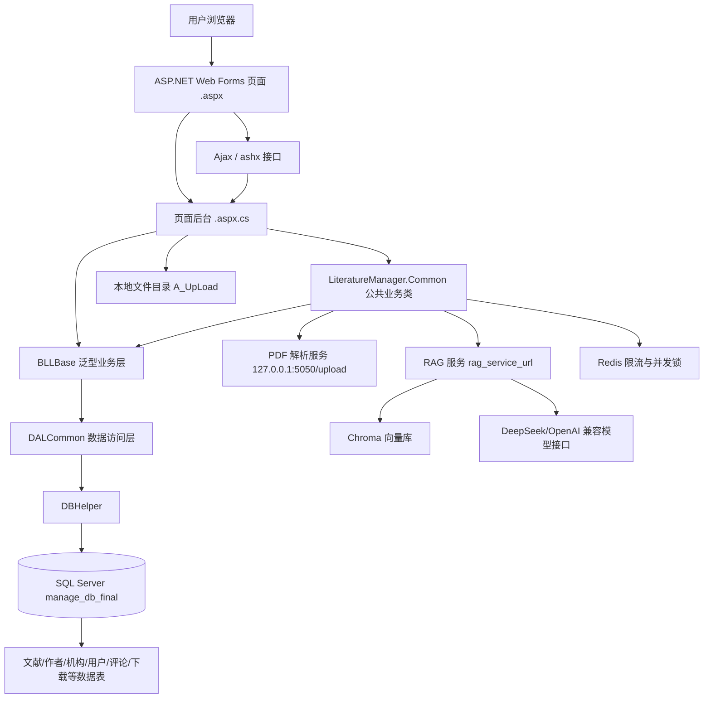

<div class="caption">图 3-2 系统总体架构图</div>

### 3.4 分层说明

**表 3-1 系统分层说明**

| 层次 | 代表文件 | 主要职责 |
| --- | --- | --- |
| 页面层 | `.aspx`、`.aspx.cs` | 页面展示、表单提交、列表绑定、按钮事件、页面权限判断 |
| 接口层 | `Web/Inc/UserCommon.ashx.cs`、`RagApi.ashx.cs`、`LiteratureGraph.ashx.cs` | 接收 Ajax 请求，输出 JSON 或转发外部服务 |
| 公共业务层 | `LiteratureManager.Common/*.cs` | 登录、短信、评论、上传策略、作者机构同步、期刊会议同步、RAG 同步 |
| BLL 层 | `BLL/BLLBase.cs` | 泛型业务入口，封装增删改查、分页和实体查询 |
| DAL 层 | `DAL/DALCommon.cs` | 通用 SQL 生成、实体映射、分页和存储过程调用 |
| DB 工具层 | `DAL/DBHelper.cs` | SQL Server 连接、命令执行、事务、参数化命令、存储过程调用 |
| 数据库层 | SQL Server | 保存业务实体、关系表、日志表、状态表、索引和外键 |

### 3.5 通用数据库访问模式

`BLLBase<T>` 内部持有 `DALCommon<T>`，页面通常通过 `BLLBase<Model>` 使用 `GetListByPage()`、`AddIdentity()`、`Update()`、`Delete()`、`GetModel()` 等通用方法。`DALCommon<T>` 根据实体类名推断表名，再调用 `DBHelper` 执行 SQL。该模式减少了每个实体重复编写基础 CRUD 的工作量，也增强了后期的可维护性。

## 4. 技术栈与运行环境

### 4.1 技术栈

**表 4-1 技术栈说明**

| 类型 | 技术或文件 | 说明 |
| --- | --- | --- |
| 前端页面 | ASP.NET Web Forms、HTML、CSS、JavaScript、jQuery | `.aspx` 页面直出，局部功能通过 Ajax 更新 |
| 后端语言 | C# | 页面后台、业务类、数据访问类和 Handler |
| 接口形式 | `.ashx` | 用户接口、RAG 中转、图谱接口、PDF 解析接口 |
| 数据库 | SQL Server / SQL Server Express | 主业务数据、关系数据、日志数据 |
| 数据访问 | `BLLBase<T>`、`DALCommon<T>`、`DBHelper` | 通用增删改查、分页、存储过程、事务 |
| 文件解析 | Python、`pdf_parser.py`、`app.py` | PDF 元数据解析  |
| RAG 检索 | Flask、Chroma、m3e embedding、LangChain、SQL Server | 独立 Python 微服务，按 `Literature.id` 建立语义索引 |
| RAG 生成 | DeepSeek / OpenAI 兼容接口 | 根据检索片段生成回答 |
| 图谱展示 | `LiteratureGraph.ashx`、`literature-graph.js`、vis-network | 从 SQL Server 生成节点和边并前端渲染 |
| 限流与并发 | Redis、本地 `SemaphoreSlim` | 短信冷却、评论冷却、PDF 解析并发控制 |

### 4.2 运行环境

**表 4-2 运行环境要求**

| 环境项 | 要求 |
| --- | --- |
| 操作系统 | Windows Server 或 Windows 开发环境 |
| Web 容器 | IIS / IIS Express |
| .NET Framework | 4.6 |
| 数据库 | SQL Server / SQL Server Express |
| Python | Python 3.9+，用于 PDF 解析服务和 RAG 微服务 |
| 可选服务 | Redis、短信服务、DeepSeek API、腾讯云 COS、微信支付配置 |
| 开发工具 | Visual Studio |

### 4.3 关键配置

`Web/Web.config` 中的关键配置包括：

**表 4-3 Web.config 关键配置项**

| 配置项 | 作用 |
| --- | --- |
| `SQLCONNECTIONSTRING` | SQL Server 连接字符串 |
| `httpRuntime maxRequestLength` | ASP.NET 请求大小限制，默认为 210 MB |
| `requestLimits maxAllowedContentLength` | IIS 请求大小限制，默认为 210 MB |
| `UploadMaxPdfMb` | 单个 PDF 上传限制，默认为 50 MB |
| `UploadMaxImageMb` | 图片上传限制，默认为 10 MB |
| `UploadMaxAttachmentMb` | 附件上传限制，默认为 100 MB |
| `UploadBatchMaxFiles` | 批量上传文件数限制，默认为 20 |
| `UploadBatchMaxTotalMb` | 批量上传总大小限制，默认为 200 MB |
| `DownloadBatchMaxFiles` | 批量下载文件数限制，默认为 10 |
| `SmsCooldownSeconds` | 短信验证码冷却时间，默认为 60 秒 |
| `CommentCooldownSeconds` | 评论冷却时间，默认为 15 秒 |
| `PdfParseMaxConcurrent` | PDF 解析并发数，默认为 10 |
| `RedisEnabled`、`RedisHost`、`RedisPort` | Redis 限流和分布式锁配置 |
| `rag_service_url`、`rag_auto_index_enabled` | RAG 服务地址和自动索引开关 |

## 5. 系统功能模块

系统功能围绕“文献生命周期”展开，并由用户入口、后台治理、智能扩展和数据服务共同支撑。普通用户侧负责登录、投稿、检索、下载和互动；管理员侧负责审核发布、主数据维护、评论与申诉处理、导入导出和日志审计；底层则通过 SQL Server、文件存储、Redis 限流和 RAG/Chroma 服务支撑文献数据的保存、访问控制、智能问答和关系图谱展示。


<div class="caption">图 5-1 系统功能模块划分图</div>

### 5.1 用户注册与登录模块

用户注册与登录模块负责普通用户身份建立和登录态维护。系统采用手机号 + 短信验证码方式登录，若手机号不存在则自动创建用户并写入注册积分流水。

#### 主要文件与数据表

| 类型 | 内容 |
| --- | --- |
| 页面/接口 | `Web/Inc/UserCommon.ashx.cs` |
| 业务类 | `LiteratureManager.Common/CommonUserFunc.cs` |
| 数据表 | `user_list`、`telcode_list`、`integrateLog_list` |

#### 实现逻辑

`UserCommon.ashx.cs` 是统一 Ajax 入口，前端通过 JSON 中的 `btn` 字段指定操作。登录请求进入 `CommonUserFunc.GetUserLoginFunc()` 后，系统会校验 `telcode_list` 中的手机号、验证码、类型、坐标和有效期。验证码校验成功后删除验证码记录，保证一次性使用。登录成功后系统写入 `user_id`、`user_tel`、`user_code` Cookie，并更新 `user_list.logintime`、`loginip` 和 `code`。

登录状态通过 Cookie 和数据库中的 `code` 共同校验。该设计能够降低伪造用户 ID 直接登录的风险。


### 5.2 文献上传模块

文献上传模块负责普通用户投稿和文献元数据采集。用户提交 PDF 和标题、作者、机构、摘要、关键词等信息后，系统保存文件并写入文献主表，随后同步作者、机构、标签、附件等关系。

#### 主要文件与数据表

| 类型 | 内容 |
| --- | --- |
| 页面 | `Web/UserCenter/LiteratureUpload.aspx.cs` |
| 辅助接口 | `Web/admin/PdfParse.ashx.cs` |
| 业务类 | `LiteratureRelationSync.cs`、`LiteratureVenueSync.cs`、`UploadPolicy.cs` |
| 数据表 | `Literature`、`LiteratureFile`、`Author`、`LiteratureAuthorMap`、`Institution`、`AuthorInstitutionHistory`、`LiteratureAuthorInstitutionMap`、`LiteratureTag`、`LiteratureTagMap` |

#### 实现逻辑

上传时系统先检查用户登录状态，再校验标题、PDF 扩展名和文件大小。PDF 文件默认保存到 `Web/A_UpLoad/upload_file/` 相关目录，数据库中 `LiteratureFile.file_path` 保存文件路径和大小等元数据。发表日期由上传代码校验年份、月份和日期的合法性，避免出现不完整或非法日期。

文献查重优先使用 DOI；当 DOI 为空时使用规范化标题作为保守查重依据。若当前用户已经上传相同文献，则拒绝重复提交；若平台已有主文献，则通过 `canonical_literature_id` 指向主文献。文献保存后 `Literature.status=0`，表示待审核，前台搜索不会展示。

上传完成后调用 `LiteratureRelationSync.Sync()` 同步作者、机构、标签和文件关系，并调用 `LiteratureVenueSync.EnsureForLiterature()` 维护期刊或会议主数据。用户上传阶段不直接触发 RAG 索引，只有管理员审核通过后的正式文献才进入索引流程。

### 5.3 文献审核与管理模块

文献审核模块是系统数据质量控制的核心。管理员可查看待审核文献，对投稿执行通过、驳回、删除、导出、重复合并和元数据修改审核。

#### 主要文件与数据表

| 类型 | 内容 |
| --- | --- |
| 后台页面 | `Web/admin/Admin_LiteratureList.aspx.cs`、`Admin_LiteratureEdit.aspx.cs`、`Admin_LiteratureInfo.aspx.cs` |
| 导入页面 | `Admin_LiteratureImport.aspx.cs`、`Admin_LiteratureImportError.aspx.cs` |
| 业务类 | `LiteratureRagSync.cs`、`LiteratureStatus.cs` |
| 数据表 | `Literature`、`LiteratureFile`、`LiteratureStatusLog`、`LiteratureImportBatch`、`LiteratureImportError`、`LiteratureExportLog` |

#### 状态设计

**表 5-1 Literature 状态设计**

| `Literature.status` | 含义 | 前台展示 |
| --- | --- | --- |
| `-1` | 逻辑删除 | 不展示 |
| `0` | 待审核 | 不展示 |
| `1` | 已发布 | 公开检索、展示、下载，可触发 RAG 索引 |
| `2` | 已驳回 | 不展示 |
| `3` | 重复合并 | 不单独展示，访问时指向主文献 |
| `4` | 元数据修改已应用 | 不单独展示，指向原主文献 |

#### 实现逻辑

后台文献列表根据模式显示待审核文献或已发布文献。普通文献审核通过后更新为 `status=1`，记录审核人和审核时间，并触发期刊/会议同步和 RAG 索引。驳回时更新为 `status=2`。重复投稿审核通过时更新为 `status=3`，并将 `canonical_literature_id` 指向主文献。

重复合并不是简单删除重复文献，而是保留重复记录并迁移有价值的关联数据。系统会在必要时迁移 PDF 附件，对点赞、收藏去重，将下载记录和评论改指向主文献，并最终只对主文献触发 RAG 索引。

### 5.4 文献搜索与展示模块


文献搜索与展示模块面向普通访问者和登录用户，提供公开文献检索、筛选、分页、详情查看、下载入口和用户互动入口。

#### 主要文件与数据表

| 类型 | 内容 |
| --- | --- |
| 页面 | `Web/LiteratureSearch.aspx.cs`、`Web/LiteratureInfo.aspx.cs`、`Web/LiteratureVenue.aspx.cs` |
| 数据表 | `Literature`、`LiteratureFile`、`LiteratureAuthorMap`、`Author`、`LiteratureTagMap`、`LiteratureTag`、`Journal`、`Conference`、`LiteratureDownloadLog` |

#### 实现逻辑

前台检索只查询 `status=1` 且 `canonical_literature_id is null` 的主文献。待审核、驳回、删除、重复合并记录不会单独出现在公开搜索结果中。检索条件包括标题、机构、关键词、DOI、期刊/会议、作者和标签等，用户可自行选择条件组合进行个性化筛选。分页主要通过 SQL `row_number()` 或通用分页方法实现。

详情页展示文献标题、摘要、关键词、作者、机构、来源、发表时间、PDF 附件、评论、点赞、收藏、下载状态等信息。

### 5.5 作者管理模块


作者管理模块维护作者主数据、作者详情、作者论文列表、当前机构、历史机构和作者合并。它既服务于后台人工维护，也服务于上传和编辑文献时的自动关系同步。

#### 主要文件与数据表

| 类型 | 内容 |
| --- | --- |
| 页面 | `Admin_AuthorList.aspx.cs`、`Admin_AuthorInfo.aspx.cs`、`Admin_AuthorEdit.aspx.cs`、`Admin_AuthorMerge.aspx.cs` |
| 业务类 | `LiteratureRelationSync.cs`、`AuthorMergeService.cs` |
| 数据表 | `Author`、`LiteratureAuthorMap`、`AuthorInstitutionHistory`、`LiteratureAuthorInstitutionMap`、`AuthorMergeLog` |

#### 实现逻辑

文献和作者是多对多关系，通过 `LiteratureAuthorMap` 维护。一篇文献可有多个作者，一个作者可关联多篇文献。上传或编辑时如果存在明确 `author_id`，系统会直接关联未删除作者；如果没有 `author_id`，则按姓名查找候选作者，再结合当前机构、历史机构和论文机构进行保守匹配。无法确认时创建新作者，并同时将其状态设置为"待确认"，由管理员确定是否与现有作者合并，避免将同名作者错误合并。作者合并由 `AuthorMergeService` 处理，合并时迁移作者与文献、机构历史等关系，并写入 `AuthorMergeLog`，保证操作可追溯。

作者当前机构依据作者最新文献中的机构关系计算后写回 `Author.current_institution_name` 等字段。历史机构通过 `AuthorInstitutionHistory` 和 `LiteratureAuthorInstitutionMap` 展示。


### 5.6 机构、期刊与会议管理模块

机构管理用于维护作者所属单位、机构别名、上下级机构和逻辑停用；期刊与会议管理用于维护文献来源主数据，支撑来源浏览和统计。

#### 主要文件与数据表

| 类型 | 内容 |
| --- | --- |
| 页面 | `Admin_InstitutionList.aspx.cs`、`Admin_JournalList.aspx.cs`、`Admin_ConferenceList.aspx.cs` |
| 业务类 | `LiteratureRelationSync.cs`、`LiteratureVenueSync.cs` |
| 数据表 | `Institution`、`InstitutionAlias`、`Journal`、`Conference`、`MasterNameChangeLog` |

#### 实现逻辑

机构保存时生成 `normalized_name` 用于查重。考虑到一个机构可能有多个别名，别名拆分后写入 `InstitutionAlias`，便于识别同一机构的中英文名、简称和历史写法。机构停用采用 `status=-1`，避免物理删除破坏历史文献和作者机构关系，可利用项目中的存储过程进行定期清除。

期刊和会议分别由 `Journal`、`Conference` 保存。`LiteratureVenueSync` 根据文献的 `source_type`、期刊名或会议名匹配或创建主数据，并将 `journal_id` 或 `conference_id` 写回 `Literature`。


### 5.7 评论、点赞与收藏模块

评论、点赞和收藏模块记录用户与文献之间的互动，提升文献详情页的参与度，并为统计和通知提供数据来源。

#### 主要文件与数据表

| 类型 | 内容 |
| --- | --- |
| 接口 | `Web/Inc/UserCommon.ashx.cs` |
| 业务类 | `CommonUserFunc.cs` |
| 数据表 | `LiteratureComment`、`LiteratureLike`、`LiteratureFavorite`、`NoticeLog_List`、`ServiceLog_List` |

#### 实现逻辑

前端通过 Ajax 调用 `UserCommon.ashx`，由 `btn` 分发到 `CommonUserFunc`。点赞和收藏使用 toggle 逻辑：若当前用户已有记录则删除，表示取消；若不存在则插入，表示选中。系统通过唯一索引和查询判断避免同一用户重复点赞或重复收藏。

评论提交后写入 `LiteratureComment`，默认 `status=0` 待审核。后台评论审核通过后才公开展示。互动前系统会先调用主文献解析逻辑，保证重复文献的评论、点赞和收藏归并到主文献。

### 5.8 文件上传、存储与下载模块

文件模块负责保存 PDF、图片、附件和批量下载 ZIP，保证文件路径、文件大小、访问权限和数据库记录之间一致。

#### 主要文件与数据表

| 类型 | 内容 |
| --- | --- |
| 上传页面/接口 | `LiteratureUpload.aspx.cs`、`PdfParse.ashx.cs`、`UserCommon.ashx.cs` |
| 下载处理 | `LiteratureInfo.aspx.cs`、`LiteratureBatchDownload.ashx.cs` |
| 数据表 | `LiteratureFile`、`LiteratureDownloadLog`、`userimg_list`、`userfile_list`、`cosfile_list` |

#### 实现逻辑

系统将 PDF 保存在服务器目录中（或使用腾讯云 COS），数据库保存相对路径、文件名、大小、类型和状态。下载时根据文献状态、登录用户、积分或免费下载权益判断是否允许下载，并记录 `LiteratureDownloadLog`。批量下载会检查文件数量、总大小和路径合法性，确保文件路径位于上传根目录内，降低路径穿越风险。

### 5.9 智能问答与关系图谱模块

#### RAG 智能问答

RAG 智能问答由主 Web 系统和独立 Python 微服务共同完成。主项目中的 `Web/LiteratureQA.aspx` 是问答页面，页面通过 JavaScript 调用 `/Inc/RagApi.ashx`。`RagApi.ashx.cs` 根据 `action=search` 将请求转发到 `{rag_service_url}/rag/search_paper`，根据 `action=ask` 将 `paper_id` 和 `question` 转发到 `{rag_service_url}/rag/ask`。文献审核通过、后台导入已发布文献、已发布文献编辑保存和元数据修改审核通过后，`LiteratureRagSync.QueueReindex()` 会调用 `{rag_service_url}/rag/index_paper`，实现单篇文献增量重建索引。

RAG 服务实现位于 `/RAG`，核心文件如下：

**表 5-2 RAG 服务核心文件**

| 文件 | 作用 |
| --- | --- |
| `app.py` | Flask 接口服务，提供 `/health`、`/rag/search_paper`、`/rag/ask`、`/rag/index_paper`、`/rag/search` |
| `config.py` | 从 `.env` 读取 DeepSeek、SQL Server、Chroma、embedding 模型、PDF 根目录等配置 |
| `db_utils.py` | 通过 `pymssql` 连接 SQL Server，读取 `Literature` 和 `LiteratureFile` |
| `rag_utils.py` | RAG 核心逻辑，包括文本清洗、切块、向量化、Chroma 检索、问答入口 |
| `llm_utils.py` | DeepSeek / OpenAI 兼容接口调用封装 |
| `backfill_index.py` | 批量回填脚本，将已审核文献写入向量库 |
| `pdf_parser.py` | PDF 全文提取和文本修复 |

RAG 数据流如下：

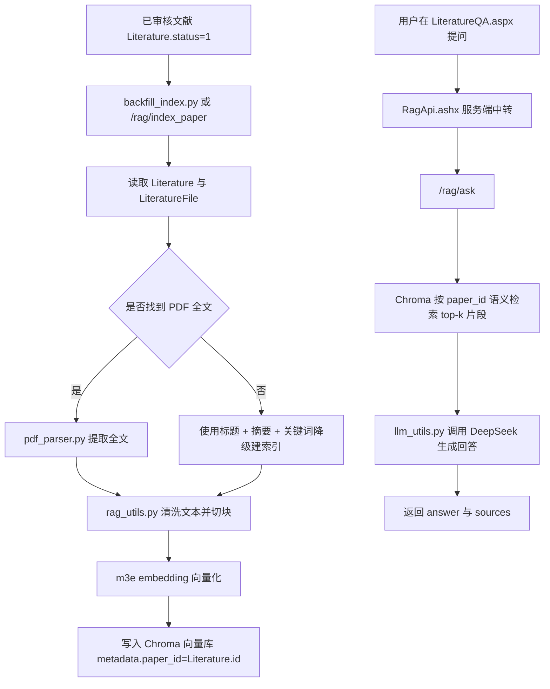

<div class="caption">图 5-2 RAG 智能问答数据流</div>

#### 文献关系图谱

该模块基于现有关系型数据库生成可视化关系图。
`Web/Inc/LiteratureGraph.ashx.cs` 从数据库读取文献、分类、期刊/会议、作者和机构关系，生成 `nodes` 和 `edges` JSON。`Web/js/literature-graph.js` 使用 vis-network 渲染交互式图谱，并定时刷新接口数据。图谱节点包括 Literature、Author、Institution、Venue、Category，关系边包括文献-作者、作者-机构、文献-分类、文献-出版物等。


## 6. 数据库设计

### 6.1 数据库设计思路

数据库设计以 `Literature` 为中心，围绕文献建立作者、机构、期刊/会议、标签、附件、评论、点赞、收藏、下载、导入和审核日志等关系，并将作者、机构和文献通过多对多关系表和历史表表达复杂学术场景。

设计重点包括：

- 使用 `Literature.status` 控制文献生命周期。
- 使用 `LiteratureAuthorMap` 表达文献与作者多对多关系。
- 使用 `LiteratureAuthorInstitutionMap` 表达某篇文献中某位作者对应的机构。
- 使用 `AuthorInstitutionHistory` 记录作者机构历史。
- 使用点赞、收藏、下载和评论表记录用户互动。
- 使用日志表如状态日志、作者合并日志和主数据名称变更日志增强可追溯性。

### 6.2 核心数据表

**表 6-1 核心数据表说明**

| 数据表 | 作用 | 核心字段 | 说明 |
| --- | --- | --- | --- |
| `user_list` | 普通用户主表 | `id`、`name`、`tel`、`email`、`isshow`、`logintime`、`code` | `tel` 有唯一索引，是验证码登录的用户标识 |
| `admin` | 后台管理员 | `id`、`username`、`password`、`popedom`、`locks`、`code`、`lastlogindate` | 后台登录和权限判断 |
| `telcode_list` | 短信验证码 | `tel`、`type`、`code`、`addtime` | 登录验证码记录 |
| `Literature` | 文献主表 | `title`、`doi`、`abstract_text`、`source_type`、`publish_year`、`status`、`userid`、`canonical_literature_id`、`journal_id`、`conference_id` | 系统核心表，控制文献审核和展示 |
| `LiteratureCategory` | 文献分类 | `parent_id`、`name`、`code`、`orderid`、`status` | 支持分类筛选和统计 |
| `Author` | 作者主表 | `name_cn`、`name_en`、`orcid`、`email`、`current_institution_name`、`identity_status`、`merged_to_author_id`、`status` | 支持作者消歧和合并 |
| `LiteratureAuthorMap` | 文献-作者关系 | `literature_id`、`author_id`、`author_order`、`display_author_name`、`identity_confidence` | 多对多关系表 |
| `Institution` | 机构主表 | `name_cn`、`name_en`、`normalized_name`、`alias_names`、`parent_id`、`status` | `normalized_name` 唯一，支持上下级机构 |
| `InstitutionAlias` | 机构别名 | `institution_id`、`alias_name`、`normalized_alias`、`language`、`status` | 辅助识别机构不同写法 |
| `LiteratureAuthorInstitutionMap` | 文献作者机构映射 | `literature_id`、`author_id`、`institution_id`、`affiliation_text`、`author_order`、`institution_order` | 记录某篇论文中某作者的机构 |
| `AuthorInstitutionHistory` | 作者机构历史 | `author_id`、`institution_name`、`institution_id`、`source_literature_id`、`is_current`、`status` | 支撑当前机构和历史机构展示 |
| `Journal` | 期刊主数据 | `name_cn`、`name_en`、`normalized_name`、`issn`、`publisher`、`status` | 期刊归档和来源浏览 |
| `Conference` | 会议主数据 | `name_cn`、`name_en`、`acronym`、`normalized_name`、`organizer`、`start_date`、`end_date`、`status` | 会议归档和来源浏览 |
| `LiteratureFile` | 文献附件 | `literature_id`、`file_type`、`file_name`、`file_path`、`file_size`、`mime_type`、`status` | 保存 PDF 附件元数据 |
| `LiteratureComment` | 文献评论 | `literature_id`、`canonical_literature_id`、`userid`、`content`、`status`、`is_deleted`、`review_time` | 评论默认待审核 |
| `LiteratureLike` | 文献点赞 | `literature_id`、`userid`、`addtime` | 用户点赞记录 |
| `LiteratureFavorite` | 文献收藏 | `literature_id`、`userid`、`addtime` | 用户收藏记录 |
| `LiteratureDownloadLog` | 下载日志 | `literature_id`、`userid`、`points_spent`、`addtime` | 下载记录和积分依据 |
| `LiteratureStatusLog` | 文献状态日志 | `literature_id`、`old_status`、`new_status`、`operator_id`、`remark` | 文献审核与状态变更追踪 |
| `LiteratureImportBatch` | 导入批次 | `batch_no`、`admin_id`、`total_count`、`success_count`、`fail_count` | 管理员导入记录 |
| `LiteratureImportError` | 导入错误 | `batch_id`、`row_no`、`error_message` | 导入失败明细 |
| `LiteratureExportLog` | 导出日志 | `admin_id`、`export_type`、`file_count`、`total_bytes` | CSV 和 ZIP 导出记录 |
| `appeal_list`、`appealimg_list` | 用户申诉 | `userid`、`url`、`info_`、`status` | 版权申诉和反馈图片 |
| `integrateLog_list`、`integrateExchangeLog_list` | 积分流水和兑换 | `user_id`、`integrate`、`type`、`status` | 通过流水计算积分，兑换时使用事务 |
| `NoticeLog_List`、`ServiceLog_List` | 通知和服务工单 | `userid`、`status`、`content`、`addtime` | 用户通知、后台待办和服务记录 |

### 6.3 表关系 ER 图

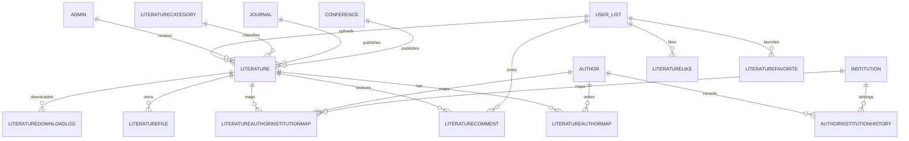

<div class="caption">图 6-1 核心数据表关系 ER 图</div>

### 6.4 数据状态与逻辑删除

系统使用 `status` 字段表达业务状态。逻辑删除通常使用 `status=-1`，即保留数据库记录但在常规查询中排除。这样可以避免误删重要业务数据，也能保留历史引用关系和审计线索。数据库提供了软删除清理的维护过程，可以定期清理无效数据，在数据安全性和内存节约之间实现平衡。

## 7. 核心业务流程

### 7.1 用户注册登录流程

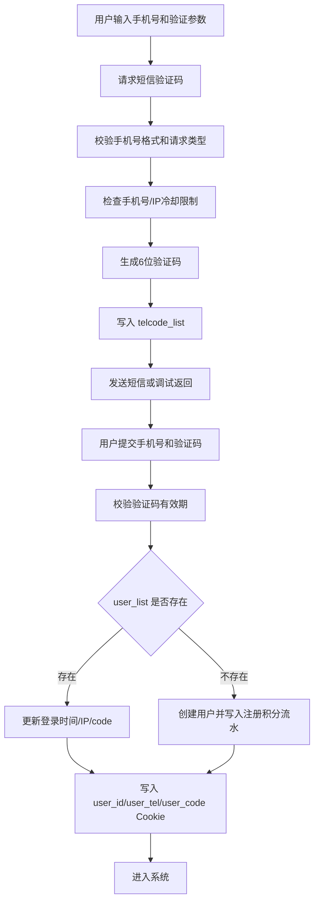

<div class="caption">图 7-1 用户注册登录流程</div>

### 7.2 文献上传与审核流程

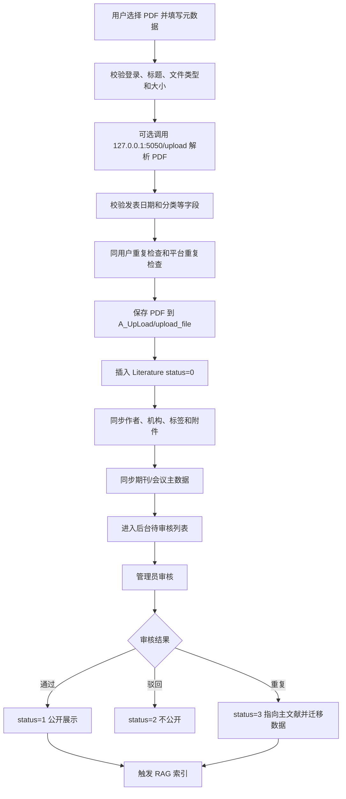

<div class="caption">图 7-2 文献上传与审核流程</div>

### 7.3 作者匹配与机构关联流程

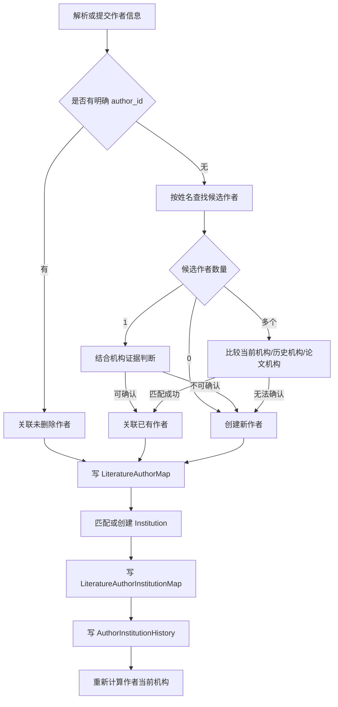

<div class="caption">图 7-3 作者匹配与机构关联流程</div>

### 7.4 文献重复合并流程

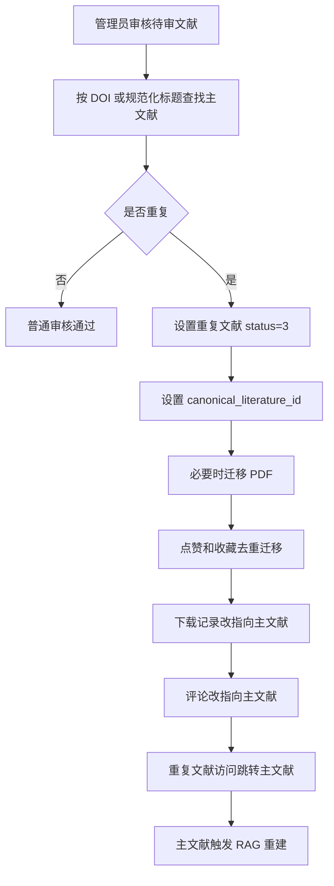

<div class="caption">图 7-4 文献重复合并流程</div>

### 7.5 机构别名与机构维护流程

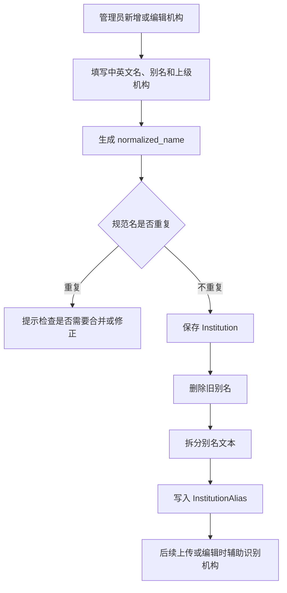

<div class="caption">图 7-5 机构别名与机构维护流程</div>

### 7.6 点赞收藏切换流程

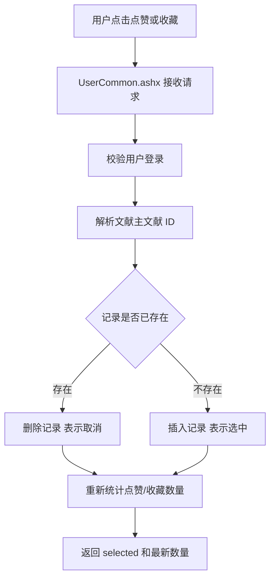

<div class="caption">图 7-6 点赞收藏切换流程</div>

### 7.7 文件上传下载流程

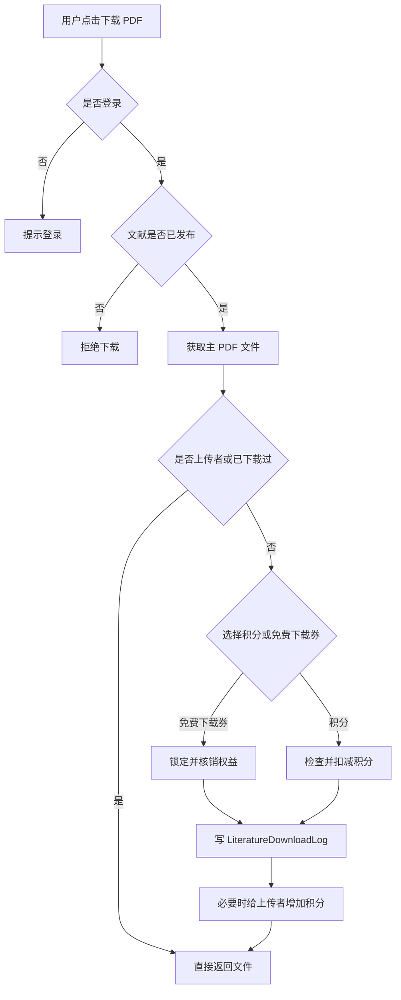

<div class="caption">图 7-7 文件上传下载流程</div>

## 8. 权限控制与安全机制

系统的权限与安全机制主要围绕“身份确认、角色隔离、输入校验、文件边界和并发控制”展开。普通用户侧重点在登录态校验和受控操作限制，管理员侧重点在后台账号、菜单权限和操作审计；接口与文件处理侧则通过参数化 SQL、HTML 编码、上传策略和 Redis 限流降低恶意请求、大文件上传和并发解析带来的风险。

### 8.1 权限与安全策略汇总

**表 8-1 权限控制与安全机制汇总**

| 控制点 | 适用对象或场景 | 主要实现 | 作用 |
| --- | --- | --- | --- |
| 普通用户登录态 | 上传、评论、点赞、收藏、下载、申诉 | `user_id`、`user_tel`、`user_code` Cookie 与 `user_list.code` 共同校验 | 避免仅伪造用户 ID 即获得受控操作权限 |
| 管理员后台权限 | 文献审核、主数据维护、站点配置、日志查看 | `Web/admin/Login.aspx.cs`、`admin`、`popedom`、`popedomhead` | 区分后台账号能力，限制未授权页面访问 |
| SQL 注入防护 | 登录、审核、积分、RAG 索引触发、后台维护 | 使用 `SqlParameter` 和参数化命令 | 减少拼接 SQL 导致的数据篡改和查询风险 |
| XSS 与输出编码 | 标题、摘要、评论、机构、反馈内容等用户输入 | 展示时进行 HTML 编码 | 避免恶意脚本在前台页面执行 |
| 上传安全 | PDF、图片、附件、批量上传 | `UploadPolicy`、`Web.config`、扩展名和大小限制 | 控制文件类型、单文件大小、批量数量和总大小 |
| 接口请求限制 | Ajax JSON 请求和需要登录的操作 | `UserCommon.ashx.cs` 请求体大小限制与登录校验 | 降低异常请求、超大请求和未登录调用风险 |
| Redis 限流与并发锁 | PDF 解析、短信验证码、评论提交 | Redis token 锁、本地 `SemaphoreSlim` 降级 | 控制高频请求和解析并发，避免服务被瞬时流量压垮 |
| 操作审计 | 登录、审核、导入、导出、作者合并等关键行为 | 登录日志、状态日志、导入错误、导出日志、作者合并日志 | 便于追踪数据变化来源和排查异常操作 |

### 8.2 关键机制说明

普通用户登录状态由 Cookie 与数据库中的动态 `code` 共同确认。未登录用户可以浏览公开内容，但不能上传、评论、点赞、收藏、下载受控 PDF 或提交申诉。相关页面会在 `Page_Load` 或接口入口中校验登录状态，未通过校验时跳转登录页或返回提示信息。

后台管理员通过独立登录页进入系统，管理员信息存储在 `admin` 表中。后台页面通过登录校验函数判断当前管理员是否有效，并结合 `popedom`、`popedomhead` 等菜单权限表控制可访问功能。管理员账号支持锁定状态，登录、审核、导入导出和状态变更等行为会写入相关日志表，增强后台操作的可追溯性。

输入安全方面，项目核心逻辑使用 `SqlParameter` 和参数化命令处理数据库访问；对标题、摘要、评论、机构、反馈内容等用户可输入字段，展示时统一进行 HTML 编码，降低 SQL 注入和 XSS 风险。文件安全方面，上传限制由 `UploadPolicy` 和 `Web.config` 共同控制，包括单个 PDF、图片、附件、批量数量和总大小；批量下载还会检查真实文件路径必须位于上传根目录内，避免路径穿越和任意文件下载。

Redis 用于分布式并发控制和限流，主要场景包括：

- PDF 解析并发控制：使用 `PdfParseConcurrencyGate.TryEnter()` 抢占 `manage:pdfparse:slot:N` 槽位。
- 评论限流：按用户设置冷却窗口。
- 短信验证码限流：按手机号和 IP 设置冷却窗口。

Redis 释放锁时通过 token 校验，避免误删其他请求持有的锁。若 Redis 不可用，系统支持降级为本机 `SemaphoreSlim`。


## 9. 文件上传、存储与下载机制

文件模块承担的是“文件本体在磁盘或对象存储中安全保存，文件元数据在数据库中可追踪维护”的职责。系统不把 PDF、图片和附件直接写入数据库，而是将文件保存到上传目录，并在 `LiteratureFile`、`userimg_list`、`userfile_list`、`cosfile_list` 等表中记录路径、文件名、大小、类型和状态。这样既能降低数据库体积，也便于后续备份、迁移和权限校验。

### 9.1 存储边界与路径设计

系统主要使用 `Web/A_UpLoad/upload_file/`、`Web/A_UpLoad/upload_file/temp/` 和 `Web/A_UpLoad/upload_pic/` 保存上传文件。其中，正式文献 PDF 和附件进入 `upload_file`，临时解析文件进入 `temp`，图片类资源进入 `upload_pic`。数据库只保存相对路径和文件元数据，例如 `file_name`、`file_path`、`file_size`、`mime_type`、`file_type` 和 `status`，从而避免业务数据与大二进制文件直接耦合。

文件访问时，系统会根据数据库记录反查服务器文件路径，并校验真实路径仍位于上传根目录内。这个边界检查尤其用于批量下载场景，可以防止用户通过构造路径访问上传目录之外的服务器文件。

### 9.2 上传解析链路

主项目根目录 `app.py` 是 PDF 元数据解析服务，默认 `PDF_PARSE_PORT=5050`，接口为 `/upload`。`Web/admin/PdfParse.ashx.cs` 将 PDF 临时文件上传到 `http://127.0.0.1:5050/upload`，解析标题、作者、机构、DOI、摘要、关键词、期刊/会议和发表时间等信息。若外部服务不可用，代码中还保留了本地 Python 进程解析的降级逻辑。

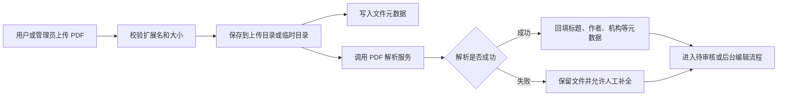

<div class="caption">图 9-1 文件上传与 PDF 解析链路</div>

### 9.3 下载控制与批量限制

文献详情页下载时会判断文献是否已发布、当前用户是否登录、是否为投稿者、是否已下载、是否使用积分或免费下载权益。下载成功后写入 `LiteratureDownloadLog`，并按规则扣减用户积分或给上传者增加积分。积分余额通过 `integrateLog_list` 流水求和，而不是依赖单个余额字段，便于审计。

批量下载通过 `LiteratureBatchDownload.ashx.cs` 执行。系统限制批量文件数量和总大小，并检查文件真实路径必须位于上传目录内，避免路径穿越和任意文件下载风险。

因此，文件下载不是简单地返回服务器文件，而是一个带状态判断、身份判断、积分判断、日志记录和路径边界检查的受控流程。这样的设计可以让文件资源与文献审核状态、用户权益和审计记录保持一致。

## 10. 管理员后台功能

后台页面集中在 `Web/admin/` 目录，是系统进行数据治理和运行维护的主要入口。后台需管理员账号登录，利用管理员权限，管理员需要判断文献是否可以公开，维护作者、机构、期刊和会议等主数据，处理评论、申诉和积分相关事务，并通过日志记录追踪关键操作。

### 10.1 后台工作域划分

后台功能可以按实际工作路径划分为以下几组：

- **登录与权限管理**：通过 `Login.aspx.cs` 进入后台，结合 `Admin_Admin.aspx.cs`、`Admin_SiteMenu.aspx.cs` 和 `Admin_Log.aspx.cs` 管理后台账号、菜单权限和登录日志，保证审核、配置等高风险操作只由授权管理员执行。
- **文献审核与导入导出**：以 `Admin_LiteratureList.aspx.cs` 为核心处理待审核文献、已发布文献、驳回、逻辑删除和重复合并；`Admin_LiteratureEdit.aspx.cs`、`Admin_LiteratureInfo.aspx.cs` 用于编辑和查看文献详情；`Admin_LiteratureImport.aspx.cs`、`Admin_LiteratureImportError.aspx.cs` 负责批量导入和错误回溯。
- **主数据维护**：通过 `Admin_AuthorList.aspx.cs`、`Admin_AuthorInfo.aspx.cs`、`Admin_AuthorMerge.aspx.cs` 维护作者和作者合并；通过 `Admin_InstitutionList.aspx.cs` 维护机构与别名；通过 `Admin_JournalList.aspx.cs`、`Admin_ConferenceList.aspx.cs` 维护期刊和会议来源；通过 `Admin_LiteratureCategory.aspx.cs`、`Admin_LiteratureTag.aspx.cs` 维护分类和标签。
- **用户互动与运营处理**：`Admin_LiteratureCommentList.aspx.cs` 用于评论审核；`Admin_IntegrateList.aspx.cs`、`Admin_IntegrateLogList.aspx.cs`、`Admin_TopUpTypeList.aspx.cs` 用于积分、流水和充值类型维护；`Admin_AppealList.aspx.cs`、`Admin_ServiceLogList.aspx.cs` 用于处理用户申诉和服务工单。
- **站点配置与内容运营**：`Admin_WebsiteInfo.aspx.cs`、`Admin_WebsiteEmail.aspx.cs` 和 `Admin_SearchHotList.aspx.cs` 用于维护站点基础信息、邮件配置和热门搜索等运营内容。

### 10.2 后台管理流程

后台围绕文献数据质量形成了一条维护链路。文献进入系统后，管理员先在文献列表中审核基础信息和附件；如果元数据不完整，可以进入编辑页补全文献、作者、机构、来源和标签；如果发现重复文献，则执行合并并保留状态日志；如果文献通过审核，则进入公开检索、下载和后续 RAG 索引流程。

用户互动相关数据也会进入后台处理。评论需要审核后才公开展示，积分和充值记录用于支撑下载权益，申诉和工单用于处理用户反馈。站点配置、邮件配置、热门搜索和后台日志则提供运行维护能力，使管理员可以在不直接修改代码的情况下调整基础运营信息，并在出现异常时追踪操作来源。

## 11. 统计报表与数据查询

统计报表模块用于把系统中的文献数据、作者机构数据和用户互动数据转化为可观察的运营信息，在首页、文献列表、文献详情和用户中心等页面中，为用户浏览、管理员判断和项目展示提供数据支撑。

### 11.1 统计口径与数据来源

系统统计通常以“公开主文献”为主要口径，即优先统计 `status=1` 且 `canonical_literature_id is null` 的文献，避免待审核、已驳回、逻辑删除和重复合并记录影响公开页面的数据展示。首页中的文献数量、作者数量、机构数量、近 12 个月上传或发布趋势，从 `Literature`、`Author`、`Institution`、`LiteratureDownloadLog` 等表聚合得出。

互动类统计来自用户行为表。点赞和收藏从 `LiteratureLike`、`LiteratureFavorite` 汇总，下载从 `LiteratureDownloadLog` 汇总，评论从 `LiteratureComment` 中按审核状态和删除状态筛选。用户中心统计主要面向个人投稿和通知，数据来自 `Literature`、`NoticeLog_List`、`ServiceLog_List` 等表。

### 11.2 页面统计呈现

不同页面的统计重点可以概括为以下结构：

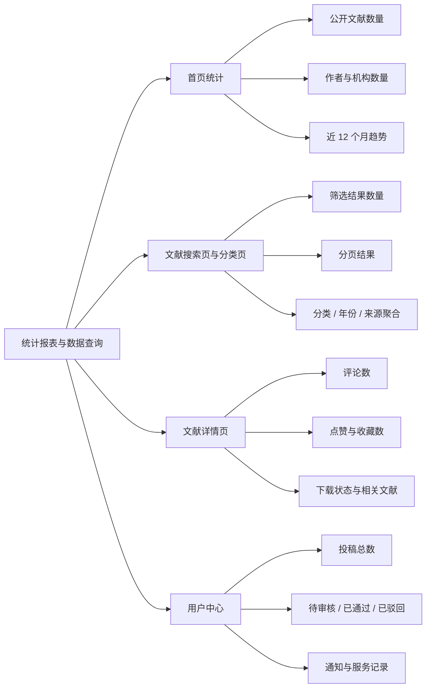

<div class="caption">图 11-1 页面统计呈现结构图</div>

通过这些统计视角，系统既能展示平台整体资源规模，也能支持用户查看个人投稿进度，并为后台管理员判断内容质量和运营状态提供依据。

## 12. 项目亮点

本项目的亮点主要体现在三个方面：一是业务流程覆盖完整，能够从文献进入系统一直支撑到公开展示和用户互动；二是数据库建模围绕文献、作者、机构和用户行为形成较完整的关系网络；三是系统在传统 Web 管理功能之外，加入了 RAG 问答、关系图谱、限流和通用数据访问等扩展能力。

### 12.1 业务闭环完整

系统覆盖文献上传、PDF 解析、审核、公开检索、详情展示、下载、评论、点赞收藏、作者机构维护、后台导入导出和统计查询等流程。用户上传文献后，系统会保存文件、解析元数据、同步作者机构关系，并等待管理员审核；管理员审核通过后，文献进入公开检索和详情展示，同时支持下载、评论、点赞、收藏和后续统计。

重复投稿和元数据修改申请也有专门状态处理，能够保证公开数据质量。形成一个有准入、有审核、有展示、有互动、有维护的学术资源管理闭环。

### 12.2 数据治理能力较强

数据库设计以 `Literature` 为核心，建立作者、机构、期刊、会议、标签、附件、评论、下载、点赞、收藏等关系。作者与文献之间使用多对多关系表，文献、作者和机构之间通过三元关系表达某篇论文中某位作者的具体机构，作者机构历史则通过 `AuthorInstitutionHistory` 和 `LiteratureAuthorInstitutionMap` 共同支撑。

作者消歧采用相对保守的策略，系统不会简单按姓名合并作者，而是优先使用明确 `author_id`，没有 ID 时再结合姓名、当前机构、历史机构和论文机构进行判断。无法确认时创建新作者并标记为"待确认"，保留后台合并入口，降低同名作者误合并风险。机构管理也支持别名、上下级机构和历史机构展示，使学术实体关系更接近真实场景。

状态控制和审计机制也比较完整。系统使用 `status=-1` 进行逻辑删除，避免误删文献、机构和其他主数据；登录日志、状态日志、导入错误、导出日志和作者合并日志则增强了系统可追溯性。

### 12.3 扩展性与可维护性较好

系统通过 `BLLBase<T>`、`DALCommon<T>` 和 `DBHelper` 提供通用增删改查、分页、实体转换和数据库执行能力，使大量页面可以复用基础数据访问逻辑，减少重复代码。上传下载相关限制也集中通过配置项控制，包括单文件大小、批量数量、批量总大小、批量下载数量和 PDF 解析并发数等，能够降低大文件和高并发解析对系统稳定性的影响。

在扩展能力上，RAG 服务将 SQL Server 文献主数据与 Chroma 向量库、m3e embedding、DeepSeek 生成能力结合；关系图谱则利用 SQL Server 关系表输出节点和边并由 vis-network 展示。这些模块体现了传统 Web 系统与智能检索、可视化能力的集成，也为后续继续扩展论文推荐、相似文献检索和知识图谱分析留下空间。


## 13. 系统运行与部署说明

### 13.1 数据库部署

推荐将数据库部署为 `manage_db_final`。可通过两种方式初始化：

1. 还原 `database/manage_db_full.bak`。
2. 在空数据库执行 `database/manage_db_schema.sql` 创建表结构。

数据库连接配置位于 `Web/Web.config`：

```xml
<add name="SQLCONNECTIONSTRING"
     connectionString="data source=(local)\SQLEXPRESS; Initial Catalog=manage_db_final;User ID=EXAMPLE;Password=123456;"
     providerName="System.Data.SqlClient"/>
```

部署时请改为实际数据库地址、账号和密码，或使用环境变量 `MANAGE_SQL_CONNECTION_STRING` 覆盖配置文件连接串。

### 13.2 IIS 部署

1. 在 IIS 中创建应用程序池，选择 .NET CLR v4.0 和 Integrated 管道。
2. 新建站点，物理路径指向 `Web/`。
3. 配置端口或域名，并将 `website_url` 改为实际访问地址。
4. 给应用程序池身份授予 `A_UpLoad` 相关目录写入权限。
5. 确认 `httpRuntime maxRequestLength` 和 `requestFiltering maxAllowedContentLength` 满足上传需求。
6. 访问首页、登录后台并测试文献上传和审核流程。

### 13.3 Python PDF 解析服务

主项目根目录 `app.py` 是 PDF 元数据解析服务，默认地址为 `http://127.0.0.1:5050/upload`。可在主项目根目录运行：

```powershell
cd PATH_TO_PJ
pip install -r requirements.txt
python app.py
```

### 13.4 RAG 服务部署

RAG 服务实现位于 `/RAG`，与主 Web 项目解耦部署。推荐部署步骤如下：

```powershell
cd PATH_TO_PJ/RAG
copy .env.example .env
pip install -r requirements.txt
python backfill_index.py --rebuild
python app.py -port 5051(or else)
```

`.env` 中需要配置 SQL Server 连接信息、`LLM_API_KEY`、`LLM_BASE_URL`、`LLM_MODEL`、`CHROMA_PERSIST_DIR` 和 `PDF_BASE_DIR`。`backfill_index.py` 会读取 `Literature.status=1` 的已发布文献，优先根据 `LiteratureFile.file_path` 和 `PDF_BASE_DIR` 提取 PDF 全文，无法读取 PDF 时降级使用标题、摘要和关键词建立向量索引。

默认的端口可修改，但部署时必须保证以下三处一致：

- `Web/Web.config` 的 `rag_service_url`。
- `LiteratureRagSync.cs` 默认地址或配置读取结果。
- RAG 服务 `.env` 中的 `RAG_PORT` 或 `app.py` 启动端口。

### 13.5 Redis 配置

Redis 配置位于 `Web.config`，包括 `RedisEnabled`、`RedisHost`、`RedisPort`、`RedisDatabase`、`RedisKeyPrefix` 等。若部署 Redis，需要保证 Web 服务器能访问 Redis 端口；若不使用 Redis，系统可降级使用本机信号量，但多机部署下限流能力会下降。


## 14. 项目总结

本项目实现了一个基于 ASP.NET Web Forms、C# 和 SQL Server 的文献管理与学术资源管理系统。系统完成了用户登录、文献上传、PDF 解析、文献审核、公开检索、文献详情、下载、评论、点赞收藏、作者管理、机构管理、期刊会议维护、批量导入、后台权限、统计查询、RAG 中转和关系图谱展示等功能，形成了较完整的业务闭环。

技术上，项目体现了 Web Forms 页面开发、C# 后端业务处理、通用 BLL/DAL 数据访问、SQL Server 数据库建模、文件上传下载、外部 Python 服务调用、Redis 限流和 JSON 接口集成能力。数据库设计上，系统围绕文献、作者、机构、期刊会议、用户互动和审核日志建立多表关联，能够支撑较复杂的学术资源管理场景。

业务上，系统的主要特点是审核机制明确、逻辑删除可追溯、重复文献可合并、作者消歧较保守、作者机构历史可展示、下载积分有并发控制。这些设计使系统不仅能够保存文献文件，还能维护文献背后的学术实体关系和用户行为数据。


<div class="page-break"></div>

## 附录 A. 关键代码文件说明

**表 A-1 关键代码文件说明**

| 文件路径 | 所属模块 | 主要作用 | 关键逻辑 |
| --- | --- | --- | --- |
| `Web/Web.config` | 配置 | 数据库连接、上传限制、Redis、RAG、短信、请求大小 | `SQLCONNECTIONSTRING`、`UploadMaxPdfMb`、`rag_service_url` |
| `Web/index.aspx.cs` | 首页 | 首页统计和推荐文献 | 公开文献数、作者数、趋势统计 |
| `Web/LiteratureSearch.aspx.cs` | 文献搜索 | 公开文献检索、分页、筛选 | `status=1`、`canonical_literature_id is null` |
| `Web/LiteratureInfo.aspx.cs` | 文献详情 | 详情展示、下载、点赞收藏、评论、元数据修改 | 重复文献跳转主文献，积分下载 |
| `Web/LiteratureVenue.aspx.cs` | 来源浏览 | 按期刊/会议聚合文献 | 来源统计和主数据展示 |
| `Web/LiteratureBatchDownload.ashx.cs` | 批量下载 | 多 PDF 打包下载 | 数量/总大小限制，路径安全检查 |
| `Web/LiteratureQA.aspx.cs` | 智能问答 | RAG 问答页面外壳 | 前端调用 `RagApi.ashx` |
| `Web/UserCenter/LiteratureUpload.aspx.cs` | 文献上传 | 普通用户单篇/批量上传 | 文件校验、重复检测、待审核状态 |
| `Web/UserCenter/Center.aspx.cs` | 用户中心 | 投稿摘要 | 投稿总数、待审核数、已通过数 |
| `Web/Inc/UserCommon.ashx.cs` | 用户接口 | JSON 请求分发 | 登录、评论、点赞收藏、申诉、积分兑换 |
| `Web/Inc/RagApi.ashx.cs` | RAG 中转 | 转发搜索和问答请求 | `/rag/search_paper`、`/rag/ask` |
| `Web/Inc/LiteratureGraph.ashx.cs` | 图谱接口 | 输出文献关系节点和边 | SQL 查询文献、作者、机构、分类、来源 |
| `Web/js/literature-graph.js` | 图谱前端 | 渲染关系图 | vis-network 展示节点和边 |
| `Web/admin/PdfParse.ashx.cs` | PDF 解析 | 调用 Python PDF 解析服务 | `127.0.0.1:5050/upload`，失败时本地解析降级 |
| `Web/admin/Login.aspx.cs` | 后台登录 | 管理员登录 | 验证码、密码校验、失败锁定 |
| `Web/admin/Admin_LiteratureList.aspx.cs` | 文献审核 | 审核、驳回、删除、导出、合并 | 状态流转、重复合并、RAG 重建 |
| `Web/admin/Admin_LiteratureEdit.aspx.cs` | 文献编辑 | 后台新增/编辑文献 | 元数据、封面/PDF、作者机构同步 |
| `Web/admin/Admin_LiteratureImport.aspx.cs` | 批量导入 | CSV/PDF 导入 | 批次记录、错误记录、重复检测 |
| `Web/admin/Admin_LiteratureCommentList.aspx.cs` | 评论审核 | 评论通过、驳回、删除 | 更新 `LiteratureComment` |
| `Web/admin/Admin_AuthorList.aspx.cs` | 作者管理 | 作者列表和合并入口 | 当前机构、历史机构、论文数 |
| `Web/admin/Admin_AuthorInfo.aspx.cs` | 作者详情 | 作者基础信息和论文列表 | 当前机构来源论文、历史机构 |
| `Web/admin/Admin_AuthorMerge.aspx.cs` | 作者合并 | 合并重复作者 | 调用 `AuthorMergeService` |
| `Web/admin/Admin_InstitutionList.aspx.cs` | 机构管理 | 机构新增、编辑、停用、别名 | 规范名查重，重建别名 |
| `Web/admin/Admin_JournalList.aspx.cs` | 期刊管理 | 期刊主数据维护 | 规范名查重、逻辑停用 |
| `Web/admin/Admin_ConferenceList.aspx.cs` | 会议管理 | 会议主数据维护 | 规范名查重、日期地点维护 |
| `LiteratureManager.Common/CommonUserFunc.cs` | 用户公共业务 | 登录、验证码、积分、评论、点赞收藏 | 用户登录态和互动业务核心 |
| `LiteratureManager.Common/UploadPolicy.cs` | 配置策略 | 上传和下载限制 | 从 `Web.config` 读取限制 |
| `LiteratureManager.Common/PdfParseConcurrencyGate.cs` | 限流并发 | PDF 解析、短信、评论限流 | Redis 或本地 `SemaphoreSlim` |
| `LiteratureManager.Common/LiteratureRelationSync.cs` | 关系同步 | 作者、机构、标签、附件同步 | 作者保守匹配、当前机构重算 |
| `LiteratureManager.Common/LiteratureVenueSync.cs` | 来源同步 | 期刊/会议同步 | 创建或匹配 `Journal`、`Conference` |
| `LiteratureManager.Common/LiteratureRagSync.cs` | RAG 同步 | 发布文献索引触发 | 只索引已发布主文献 |
| `LiteratureManager.Common/AuthorMergeService.cs` | 作者合并 | 事务性迁移作者关系 | 映射去重、合并日志 |
| `BLL/BLLBase.cs` | 业务基础层 | 泛型业务入口 | 调用 `DALCommon<T>` |
| `DAL/DALCommon.cs` | 数据访问 | 通用 CRUD、分页、存储过程 | `GetListByPage()`、`GetDataTable_Pro()` |
| `DAL/DBHelper.cs` | 数据库连接 | SQL Server 连接和执行 | 支持 `MANAGE_SQL_CONNECTION_STRING` |
| `database/manage_db_schema.sql` | 数据库结构 | 完整建表脚本 | 表、索引、外键、默认值 |
| `database/table_columns.csv` | 数据库结构导出 | 全部表字段 | 本文附录表结构来源 |
| `E:/db-project-2026-rag-test/app.py` | RAG 微服务 | Flask 接口入口 | `/health`、`/rag/search_paper`、`/rag/ask`、`/rag/index_paper`、`/rag/search` |
| `E:/db-project-2026-rag-test/config.py` | RAG 配置 | 读取 `.env` 和默认配置 | DeepSeek、SQL Server、Chroma、embedding 模型、PDF 根目录 |
| `E:/db-project-2026-rag-test/db_utils.py` | RAG 数据访问 | 读取 SQL Server 文献数据 | 查询 `Literature`、`LiteratureFile`，仅检索 `status=1` 文献 |
| `E:/db-project-2026-rag-test/rag_utils.py` | RAG 核心 | 文本切块、向量化、检索和问答 | m3e embedding、Chroma 持久化、按 `paper_id` 过滤 |
| `E:/db-project-2026-rag-test/llm_utils.py` | RAG 生成 | LLM 调用封装 | DeepSeek / OpenAI 兼容接口，基于检索片段生成回答 |
| `E:/db-project-2026-rag-test/backfill_index.py` | RAG 回填 | 批量建立向量索引 | 已发布文献全量索引，支持 `--rebuild` |
| `E:/db-project-2026-rag-test/pdf_parser.py` | RAG/PDF | PDF 全文提取 | 优先解析 PDF 全文，失败时降级使用元数据 |

<div class="page-break"></div>

## 附录 B. 数据库全表结构

<div class="appendix-note">本附录用于完整核对数据库结构。正文已归纳核心设计，这里保留全量字段、外键和索引信息，便于评审或后续维护时查阅。</div>

相关信息详见 `database/table_columns.csv`、`database/foreign_keys.csv` 和 `database/indexes.csv`。

**表 B-1 数据表字段数量汇总**

| 序号 | 数据表 | 字段数 |
| --- | --- | --- |
| 1 | dbo.admin | 9 |
| 2 | dbo.appeal_list | 6 |
| 3 | dbo.appealimg_list | 4 |
| 4 | dbo.Author | 17 |
| 5 | dbo.AuthorInstitutionHistory | 13 |
| 6 | dbo.AuthorMergeLog | 6 |
| 7 | dbo.Conference | 14 |
| 8 | dbo.cosfile_list | 3 |
| 9 | dbo.daoru_list | 5 |
| 10 | dbo.daoruerr_list | 4 |
| 11 | dbo.data_list | 14 |
| 12 | dbo.indexsingle_list | 16 |
| 13 | dbo.Institution | 13 |
| 14 | dbo.InstitutionAlias | 7 |
| 15 | dbo.integrate_list | 8 |
| 16 | dbo.integrateExchangeLog_list | 9 |
| 17 | dbo.integrateLog_list | 10 |
| 18 | dbo.integrateLogType_list | 3 |
| 19 | dbo.integratestatus_list | 2 |
| 20 | dbo.Journal | 13 |
| 21 | dbo.link_list | 9 |
| 22 | dbo.Literature | 37 |
| 23 | dbo.LiteratureAuthorInstitutionMap | 15 |
| 24 | dbo.LiteratureAuthorMap | 14 |
| 25 | dbo.LiteratureCategory | 9 |
| 26 | dbo.LiteratureComment | 16 |
| 27 | dbo.LiteratureDownloadLog | 8 |
| 28 | dbo.LiteratureExportLog | 7 |
| 29 | dbo.LiteratureFavorite | 4 |
| 30 | dbo.LiteratureFile | 10 |
| 31 | dbo.LiteratureImportBatch | 11 |
| 32 | dbo.LiteratureImportError | 7 |
| 33 | dbo.LiteratureLike | 4 |
| 34 | dbo.LiteratureStatusLog | 8 |
| 35 | dbo.LiteratureTag | 5 |
| 36 | dbo.LiteratureTagMap | 4 |
| 37 | dbo.logincode_list | 5 |
| 38 | dbo.LoginSingle_List | 7 |
| 39 | dbo.MasterNameChangeLog | 10 |
| 40 | dbo.NoticeLog_List | 9 |
| 41 | dbo.NoticeLogStatus_List | 2 |
| 42 | dbo.NoticeLogType_List | 2 |
| 43 | dbo.popedom | 6 |
| 44 | dbo.popedomhead | 4 |
| 45 | dbo.SearchHot_List | 8 |
| 46 | dbo.ServiceLog_List | 8 |
| 47 | dbo.ServiceLogInfo_List | 6 |
| 48 | dbo.ServiceLogStatus_List | 2 |
| 49 | dbo.tbl_class | 20 |
| 50 | dbo.telcode_list | 6 |
| 51 | dbo.TopUpType_List | 3 |
| 52 | dbo.user_list | 11 |
| 53 | dbo.user_login | 7 |
| 54 | dbo.userfile_list | 3 |
| 55 | dbo.userimg_list | 3 |
| 56 | dbo.userpaylog_list | 7 |
| 57 | dbo.userpayloginfo_list | 14 |
| 58 | dbo.websiteinfo_list | 25 |

### B.1 dbo.admin

| 序号 | 字段名 | 数据类型 | 可空 | 自增 | 默认值 |
| --- | --- | --- | --- | --- | --- |
| 1 | id | int | False | seed=1, inc=1 |  |
| 2 | username | nvarchar(50) | False |  |  |
| 3 | password | nvarchar(50) | True |  |  |
| 4 | popedom | nvarchar(MAX) | True |  |  |
| 5 | lastloginip | nvarchar(50) | True |  |  |
| 6 | cityid | int | True |  |  |
| 7 | locks | int | True |  |  |
| 8 | code | nvarchar(50) | True |  |  |
| 9 | lastlogindate | datetime | True |  | (getdate()) |

索引信息：

| 索引名 | 类型 | 唯一 | 主键 | 字段 |
| --- | --- | --- | --- | --- |
| PK_Admin | CLUSTERED | True | True | id |

### B.2 dbo.appeal_list

| 序号 | 字段名 | 数据类型 | 可空 | 自增 | 默认值 |
| --- | --- | --- | --- | --- | --- |
| 1 | id | bigint | False | seed=1, inc=1 |  |
| 2 | url | nvarchar(2500) | False |  |  |
| 3 | info_ | nvarchar(MAX) | False |  |  |
| 4 | addtime | datetime | False |  |  |
| 5 | status | int | False |  |  |
| 6 | userid | int | False |  |  |

索引信息：

| 索引名 | 类型 | 唯一 | 主键 | 字段 |
| --- | --- | --- | --- | --- |
| PK_appeal_list | CLUSTERED | True | True | id |

### B.3 dbo.appealimg_list

| 序号 | 字段名 | 数据类型 | 可空 | 自增 | 默认值 |
| --- | --- | --- | --- | --- | --- |
| 1 | appeal_id | bigint | False |  |  |
| 2 | upload_pic_info | nvarchar(250) | False |  |  |
| 3 | addtime | datetime | False |  |  |
| 4 | orderid | int | False |  |  |

索引信息：

| 索引名 | 类型 | 唯一 | 主键 | 字段 |
| --- | --- | --- | --- | --- |
| IX_appealimg_list | NONCLUSTERED | True | False | upload_pic_info |

### B.4 dbo.Author

| 序号 | 字段名 | 数据类型 | 可空 | 自增 | 默认值 |
| --- | --- | --- | --- | --- | --- |
| 1 | id | int | False | seed=1, inc=1 |  |
| 2 | name_cn | nvarchar(100) | False |  |  |
| 3 | name_en | nvarchar(200) | True |  |  |
| 4 | institution | nvarchar(300) | True |  |  |
| 5 | orcid | nvarchar(50) | True |  |  |
| 6 | email | nvarchar(200) | True |  |  |
| 7 | status | int | False |  | ((1)) |
| 8 | addtime | datetime | False |  | (getdate()) |
| 9 | current_institution_id | int | True |  |  |
| 10 | current_institution_name | nvarchar(1000) | True |  |  |
| 11 | current_institution_literature_id | int | True |  |  |
| 12 | current_institution_sort_date | date | True |  |  |
| 13 | current_institution_precision | nvarchar(20) | True |  |  |
| 14 | identity_status | nvarchar(30) | True |  |  |
| 15 | merge_group_id | int | True |  |  |
| 16 | updatetime | datetime | False |  | (getdate()) |
| 17 | merged_to_author_id | int | True |  |  |

索引信息：

| 索引名 | 类型 | 唯一 | 主键 | 字段 |
| --- | --- | --- | --- | --- |
| IX_Author_CurrentInstitution | NONCLUSTERED | False | False | INCLUDE:current_institution_name, current_institution_literature_id, current_institution_sort_date DESC |
| IX_Author_NameCn | NONCLUSTERED | False | False | name_cn |
| PK_Author | CLUSTERED | True | True | id |

### B.5 dbo.AuthorInstitutionHistory

| 序号 | 字段名 | 数据类型 | 可空 | 自增 | 默认值 |
| --- | --- | --- | --- | --- | --- |
| 1 | id | int | False | seed=1, inc=1 |  |
| 2 | author_id | int | False |  |  |
| 3 | institution_name | nvarchar(500) | False |  |  |
| 4 | is_current | int | False |  | ((0)) |
| 5 | start_year | int | True |  |  |
| 6 | end_year | int | True |  |  |
| 7 | source_literature_id | int | True |  |  |
| 8 | source_type | nvarchar(50) | True |  |  |
| 9 | remark | nvarchar(500) | True |  |  |
| 10 | status | int | False |  | ((1)) |
| 11 | addtime | datetime | False |  | (getdate()) |
| 12 | updatetime | datetime | False |  | (getdate()) |
| 13 | institution_id | int | True |  |  |

索引信息：

| 索引名 | 类型 | 唯一 | 主键 | 字段 |
| --- | --- | --- | --- | --- |
| IX_AuthorInstitutionHistory_author | NONCLUSTERED | False | False | author_id, status, is_current |
| IX_AuthorInstitutionHistory_literature | NONCLUSTERED | False | False | source_literature_id, author_id |
| PK_AuthorInstitutionHistory | CLUSTERED | True | True | id |

### B.6 dbo.AuthorMergeLog

| 序号 | 字段名 | 数据类型 | 可空 | 自增 | 默认值 |
| --- | --- | --- | --- | --- | --- |
| 1 | id | int | False | seed=1, inc=1 |  |
| 2 | master_author_id | int | False |  |  |
| 3 | duplicate_author_id | int | False |  |  |
| 4 | admin_id | int | False |  | ((0)) |
| 5 | remark | nvarchar(1000) | True |  |  |
| 6 | addtime | datetime | False |  | (getdate()) |

索引信息：

| 索引名 | 类型 | 唯一 | 主键 | 字段 |
| --- | --- | --- | --- | --- |
| PK_AuthorMergeLog | CLUSTERED | True | True | id |

### B.7 dbo.Conference

| 序号 | 字段名 | 数据类型 | 可空 | 自增 | 默认值 |
| --- | --- | --- | --- | --- | --- |
| 1 | id | int | False | seed=1, inc=1 |  |
| 2 | name_cn | nvarchar(300) | False |  | (N'') |
| 3 | name_en | nvarchar(500) | True |  |  |
| 4 | acronym | nvarchar(100) | True |  |  |
| 5 | normalized_name | nvarchar(500) | False |  |  |
| 6 | organizer | nvarchar(500) | True |  |  |
| 7 | country | nvarchar(200) | True |  |  |
| 8 | city | nvarchar(200) | True |  |  |
| 9 | start_date | datetime | True |  |  |
| 10 | end_date | datetime | True |  |  |
| 11 | website | nvarchar(1000) | True |  |  |
| 12 | status | int | False |  | ((1)) |
| 14 | addtime | datetime | False |  | (getdate()) |
| 15 | updatetime | datetime | False |  | (getdate()) |

索引信息：

| 索引名 | 类型 | 唯一 | 主键 | 字段 |
| --- | --- | --- | --- | --- |
| PK_Conference | CLUSTERED | True | True | id |
| UX_Conference_normalized | NONCLUSTERED | True | False | normalized_name |

### B.8 dbo.cosfile_list

| 序号 | 字段名 | 数据类型 | 可空 | 自增 | 默认值 |
| --- | --- | --- | --- | --- | --- |
| 1 | userid | int | False |  |  |
| 2 | addtime | datetime | False |  |  |
| 3 | up_filename | nvarchar(250) | False |  |  |

索引信息：

| 索引名 | 类型 | 唯一 | 主键 | 字段 |
| --- | --- | --- | --- | --- |
| IX_cosfile_list_up_filename | NONCLUSTERED | False | False | up_filename |

### B.9 dbo.daoru_list

| 序号 | 字段名 | 数据类型 | 可空 | 自增 | 默认值 |
| --- | --- | --- | --- | --- | --- |
| 1 | id | int | False | seed=1, inc=1 |  |
| 2 | posttime | datetime | False |  |  |
| 3 | r_info | nvarchar(500) | False |  |  |
| 4 | status | int | False |  |  |
| 5 | type | int | False |  |  |

### B.10 dbo.daoruerr_list

| 序号 | 字段名 | 数据类型 | 可空 | 自增 | 默认值 |
| --- | --- | --- | --- | --- | --- |
| 1 | info | nvarchar(500) | False |  |  |
| 2 | filename | nvarchar(250) | False |  |  |
| 3 | addtime | datetime | False |  |  |
| 4 | daoruid | int | False |  |  |

### B.11 dbo.data_list

| 序号 | 字段名 | 数据类型 | 可空 | 自增 | 默认值 |
| --- | --- | --- | --- | --- | --- |
| 1 | id | int | False | seed=1, inc=1 |  |
| 2 | name | nvarchar(600) | True |  |  |
| 3 | tbclass_id | int | False |  | ((0)) |
| 4 | upload_pic_img | nvarchar(50) | True |  |  |
| 5 | isshow | int | False |  | ((0)) |
| 6 | addtime | datetime | False |  |  |
| 7 | uptime | datetime | False |  |  |
| 8 | datetime | datetime | False |  |  |
| 9 | orderid | int | False |  |  |
| 10 | info_ | nvarchar(MAX) | True |  |  |
| 11 | keywords | nvarchar(MAX) | True |  |  |
| 12 | description | nvarchar(MAX) | True |  |  |
| 13 | title | nvarchar(MAX) | True |  |  |
| 14 | istop | int | False |  |  |

索引信息：

| 索引名 | 类型 | 唯一 | 主键 | 字段 |
| --- | --- | --- | --- | --- |
| PK_data_list | CLUSTERED | True | True | id |

### B.12 dbo.indexsingle_list

| 序号 | 字段名 | 数据类型 | 可空 | 自增 | 默认值 |
| --- | --- | --- | --- | --- | --- |
| 1 | id | int | False | seed=1, inc=1 |  |
| 2 | name | nvarchar(600) | True |  |  |
| 3 | upload_pic_img | nvarchar(50) | True |  |  |
| 4 | upload_pic_m | nvarchar(250) | True |  |  |
| 5 | upload_pic_pc | nvarchar(250) | True |  |  |
| 6 | isshow | int | False |  | ((0)) |
| 7 | addtime | datetime | False |  |  |
| 8 | uptime | datetime | False |  |  |
| 9 | orderid | int | False |  |  |
| 10 | info_ | nvarchar(MAX) | True |  |  |
| 11 | keywords | nvarchar(MAX) | True |  |  |
| 12 | description | nvarchar(MAX) | True |  |  |
| 13 | title | nvarchar(MAX) | True |  |  |
| 14 | istop | int | False |  |  |
| 15 | istype | int | False |  |  |
| 16 | url | nvarchar(2500) | True |  |  |

索引信息：

| 索引名 | 类型 | 唯一 | 主键 | 字段 |
| --- | --- | --- | --- | --- |
| PK_indexsingle_list | CLUSTERED | True | True | id |

### B.13 dbo.Institution

| 序号 | 字段名 | 数据类型 | 可空 | 自增 | 默认值 |
| --- | --- | --- | --- | --- | --- |
| 1 | id | int | False | seed=1, inc=1 |  |
| 2 | name_cn | nvarchar(300) | False |  | (N'') |
| 3 | name_en | nvarchar(500) | True |  |  |
| 4 | normalized_name | nvarchar(500) | False |  |  |
| 5 | alias_names | nvarchar(MAX) | True |  |  |
| 6 | country | nvarchar(200) | True |  |  |
| 7 | province | nvarchar(200) | True |  |  |
| 8 | city | nvarchar(200) | True |  |  |
| 9 | website | nvarchar(1000) | True |  |  |
| 10 | status | int | False |  | ((1)) |
| 12 | addtime | datetime | False |  | (getdate()) |
| 13 | updatetime | datetime | False |  | (getdate()) |
| 14 | parent_id | int | True |  |  |

外键约束：

| 约束名 | 字段 | 引用表 | 引用字段 | 删除 | 更新 |
| --- | --- | --- | --- | --- | --- |
| FK_Institution_Parent | parent_id | dbo.Institution | id | NO_ACTION | NO_ACTION |

索引信息：

| 索引名 | 类型 | 唯一 | 主键 | 字段 |
| --- | --- | --- | --- | --- |
| IX_Institution_ParentId | NONCLUSTERED | False | False | parent_id |
| PK_Institution | CLUSTERED | True | True | id |
| UX_Institution_normalized | NONCLUSTERED | True | False | normalized_name |

### B.14 dbo.InstitutionAlias

| 序号 | 字段名 | 数据类型 | 可空 | 自增 | 默认值 |
| --- | --- | --- | --- | --- | --- |
| 1 | id | int | False | seed=1, inc=1 |  |
| 2 | institution_id | int | False |  |  |
| 3 | alias_name | nvarchar(500) | False |  |  |
| 4 | normalized_alias | nvarchar(500) | False |  |  |
| 5 | language | nvarchar(50) | True |  |  |
| 6 | status | int | False |  | ((1)) |
| 7 | addtime | datetime | False |  | (getdate()) |

索引信息：

| 索引名 | 类型 | 唯一 | 主键 | 字段 |
| --- | --- | --- | --- | --- |
| IX_InstitutionAlias_normalized | NONCLUSTERED | False | False | normalized_alias, status |
| PK_InstitutionAlias | CLUSTERED | True | True | id |

### B.15 dbo.integrate_list

| 序号 | 字段名 | 数据类型 | 可空 | 自增 | 默认值 |
| --- | --- | --- | --- | --- | --- |
| 1 | id | int | False | seed=1, inc=1 |  |
| 2 | name | nvarchar(250) | False |  |  |
| 3 | orderid | int | False |  |  |
| 4 | uptime | datetime | False |  |  |
| 5 | addtime | datetime | False |  |  |
| 6 | upload_pic_img | nvarchar(250) | True |  |  |
| 7 | about_ | nvarchar(MAX) | True |  |  |
| 8 | num_integrate | int | False |  |  |

索引信息：

| 索引名 | 类型 | 唯一 | 主键 | 字段 |
| --- | --- | --- | --- | --- |
| PK_integrate_list | CLUSTERED | True | True | id |

### B.16 dbo.integrateExchangeLog_list

| 序号 | 字段名 | 数据类型 | 可空 | 自增 | 默认值 |
| --- | --- | --- | --- | --- | --- |
| 1 | id | bigint | False | seed=1, inc=1 |  |
| 2 | name | nvarchar(500) | False |  |  |
| 3 | num_integrate | int | False |  |  |
| 4 | codestr | nvarchar(250) | False |  |  |
| 5 | addtime | datetime | False |  |  |
| 6 | status | int | True |  |  |
| 7 | user_id | int | False |  |  |
| 8 | upload_pic_img | nvarchar(250) | True |  |  |
| 9 | hexiaotime | nvarchar(250) | True |  |  |

外键约束：

| 约束名 | 字段 | 引用表 | 引用字段 | 删除 | 更新 |
| --- | --- | --- | --- | --- | --- |
| FK_integrateExchangeLog_list_integratestatus_list | status | dbo.integratestatus_list | id | NO_ACTION | NO_ACTION |
| FK_integrateExchangeLog_list_user_list | user_id | dbo.user_list | id | NO_ACTION | NO_ACTION |

索引信息：

| 索引名 | 类型 | 唯一 | 主键 | 字段 |
| --- | --- | --- | --- | --- |
| IX_integrateExchangeLog_list | NONCLUSTERED | True | False | codestr |
| IX_integrateExchangeLog_list_UserStatus | NONCLUSTERED | False | False | user_id, status, addtime DESC |
| PK_integrateExchangeLog_list | CLUSTERED | True | True | id |

### B.17 dbo.integrateLog_list

| 序号 | 字段名 | 数据类型 | 可空 | 自增 | 默认值 |
| --- | --- | --- | --- | --- | --- |
| 1 | id | int | False | seed=1, inc=1 |  |
| 2 | num_integrate | int | False |  |  |
| 3 | type | int | False |  |  |
| 4 | name | nvarchar(500) | False |  |  |
| 5 | info_ | nvarchar(MAX) | True |  |  |
| 6 | addtime | datetime | False |  |  |
| 7 | user_id | int | False |  |  |
| 8 | adminname | nvarchar(250) | True |  |  |
| 11 | orderpro_orderno | nvarchar(50) | True |  |  |
| 12 | literature_id | int | True |  |  |

外键约束：

| 约束名 | 字段 | 引用表 | 引用字段 | 删除 | 更新 |
| --- | --- | --- | --- | --- | --- |
| FK_integrateLog_list_integrateLogType_list | type | dbo.integrateLogType_list | id | NO_ACTION | NO_ACTION |
| FK_integrateLog_list_Literature | literature_id | dbo.Literature | id | NO_ACTION | NO_ACTION |
| FK_integrateLog_list_user_list | user_id | dbo.user_list | id | NO_ACTION | NO_ACTION |

索引信息：

| 索引名 | 类型 | 唯一 | 主键 | 字段 |
| --- | --- | --- | --- | --- |
| IX_integrateLog_list_Literature | NONCLUSTERED | False | False | literature_id, addtime DESC |
| IX_integrateLog_list_UserAddtime | NONCLUSTERED | False | False | user_id, addtime DESC |
| PK_integrateLog_list | CLUSTERED | True | True | id |

### B.18 dbo.integrateLogType_list

| 序号 | 字段名 | 数据类型 | 可空 | 自增 | 默认值 |
| --- | --- | --- | --- | --- | --- |
| 1 | id | int | False |  |  |
| 2 | name | nvarchar(50) | False |  |  |
| 3 | num_integrate | int | True |  |  |

索引信息：

| 索引名 | 类型 | 唯一 | 主键 | 字段 |
| --- | --- | --- | --- | --- |
| PK_integrateLogType_list | CLUSTERED | True | True | id |
| UX_integrateLogType_list_name | NONCLUSTERED | True | False | name |

### B.19 dbo.integratestatus_list

| 序号 | 字段名 | 数据类型 | 可空 | 自增 | 默认值 |
| --- | --- | --- | --- | --- | --- |
| 1 | id | int | False |  |  |
| 2 | name | nvarchar(50) | False |  |  |

索引信息：

| 索引名 | 类型 | 唯一 | 主键 | 字段 |
| --- | --- | --- | --- | --- |
| PK_integratestatus_list | CLUSTERED | True | True | id |
| UX_integratestatus_list_name | NONCLUSTERED | True | False | name |

### B.20 dbo.Journal

| 序号 | 字段名 | 数据类型 | 可空 | 自增 | 默认值 |
| --- | --- | --- | --- | --- | --- |
| 1 | id | int | False | seed=1, inc=1 |  |
| 2 | name_cn | nvarchar(300) | False |  | (N'') |
| 3 | name_en | nvarchar(500) | True |  |  |
| 4 | normalized_name | nvarchar(500) | False |  |  |
| 5 | issn | nvarchar(100) | True |  |  |
| 6 | eissn | nvarchar(100) | True |  |  |
| 7 | publisher | nvarchar(500) | True |  |  |
| 8 | country | nvarchar(200) | True |  |  |
| 9 | subject | nvarchar(500) | True |  |  |
| 10 | website | nvarchar(1000) | True |  |  |
| 11 | status | int | False |  | ((1)) |
| 13 | addtime | datetime | False |  | (getdate()) |
| 14 | updatetime | datetime | False |  | (getdate()) |

索引信息：

| 索引名 | 类型 | 唯一 | 主键 | 字段 |
| --- | --- | --- | --- | --- |
| PK_Journal | CLUSTERED | True | True | id |
| UX_Journal_normalized | NONCLUSTERED | True | False | normalized_name |

### B.21 dbo.link_list

| 序号 | 字段名 | 数据类型 | 可空 | 自增 | 默认值 |
| --- | --- | --- | --- | --- | --- |
| 1 | id | int | False | seed=1, inc=1 |  |
| 2 | name | nvarchar(150) | True |  |  |
| 3 | isshow | int | False |  | ((0)) |
| 4 | addtime | datetime | False |  |  |
| 5 | uptime | datetime | False |  |  |
| 6 | orderid | int | False |  |  |
| 7 | url | nvarchar(600) | True |  |  |
| 8 | type | int | False |  |  |
| 9 | upload_pic_icon | nvarchar(50) | True |  |  |

### B.22 dbo.Literature

| 序号 | 字段名 | 数据类型 | 可空 | 自增 | 默认值 |
| --- | --- | --- | --- | --- | --- |
| 1 | id | int | False | seed=1, inc=1 |  |
| 2 | title | nvarchar(500) | False |  |  |
| 3 | subtitle | nvarchar(500) | True |  |  |
| 5 | doi | nvarchar(100) | True |  |  |
| 6 | keywords | nvarchar(500) | True |  |  |
| 7 | abstract_text | nvarchar(MAX) | True |  |  |
| 8 | source_type | nvarchar(50) | True |  |  |
| 9 | language | nvarchar(50) | True |  |  |
| 10 | publish_year | int | True |  |  |
| 11 | journal_name | nvarchar(300) | True |  |  |
| 12 | conference_name | nvarchar(300) | True |  |  |
| 13 | publisher | nvarchar(300) | True |  |  |
| 14 | volume | nvarchar(50) | True |  |  |
| 15 | issue | nvarchar(50) | True |  |  |
| 16 | pages | nvarchar(100) | True |  |  |
| 17 | category_id | int | False |  | ((0)) |
| 19 | cover_pic | nvarchar(255) | True |  |  |
| 22 | external_url | nvarchar(500) | True |  |  |
| 23 | source_db | nvarchar(200) | True |  |  |
| 24 | remark | nvarchar(1000) | True |  |  |
| 25 | is_top | int | False |  | ((0)) |
| 26 | status | int | False |  | ((1)) |
| 27 | userid | int | False |  | ((0)) |
| 28 | addtime | datetime | False |  | (getdate()) |
| 29 | updatetime | datetime | False |  | (getdate()) |
| 30 | institution | nvarchar(500) | True |  |  |
| 31 | download_points | int | False |  | ((0)) |
| 32 | reviewed_by | int | True |  |  |
| 33 | review_time | datetime | True |  |  |
| 34 | import_batch_id | int | True |  |  |
| 35 | canonical_literature_id | int | True |  |  |
| 36 | journal_id | int | True |  |  |
| 37 | conference_id | int | True |  |  |
| 38 | publish_month | int | True |  |  |
| 39 | publish_day | int | True |  |  |
| 40 | publish_date | date | True |  |  |
| 41 | publish_date_precision | nvarchar(20) | True |  |  |

外键约束：

| 约束名 | 字段 | 引用表 | 引用字段 | 删除 | 更新 |
| --- | --- | --- | --- | --- | --- |
| FK_Literature_LiteratureCategory | category_id | dbo.LiteratureCategory | id | NO_ACTION | NO_ACTION |
| FK_Literature_LiteratureImportBatch | import_batch_id | dbo.LiteratureImportBatch | id | NO_ACTION | NO_ACTION |
| FK_Literature_reviewed_by_admin | reviewed_by | dbo.admin | id | NO_ACTION | NO_ACTION |
| FK_Literature_user_list | userid | dbo.user_list | id | NO_ACTION | NO_ACTION |

索引信息：

| 索引名 | 类型 | 唯一 | 主键 | 字段 |
| --- | --- | --- | --- | --- |
| IX_Literature_Canonical | NONCLUSTERED | False | False | canonical_literature_id, status, category_id, publish_year |
| IX_Literature_Doi | NONCLUSTERED | False | False | doi |
| IX_Literature_ImportBatch | NONCLUSTERED | False | False | import_batch_id |
| IX_Literature_PublishDate | NONCLUSTERED | False | False | publish_date DESC, publish_year DESC, id DESC |
| IX_Literature_Review | NONCLUSTERED | False | False | reviewed_by, review_time |
| IX_Literature_StatusCategoryAddtime | NONCLUSTERED | False | False | INCLUDE:is_top, INCLUDE:publish_year, INCLUDE:source_type, INCLUDE:title, status, category_id, addtime |
| IX_Literature_StatusPublishYear | NONCLUSTERED | False | False | status, publish_year |
| PK_Literature | CLUSTERED | True | True | id |

### B.23 dbo.LiteratureAuthorInstitutionMap

| 序号 | 字段名 | 数据类型 | 可空 | 自增 | 默认值 |
| --- | --- | --- | --- | --- | --- |
| 1 | id | int | False | seed=1, inc=1 |  |
| 2 | literature_id | int | False |  |  |
| 3 | author_id | int | False |  |  |
| 4 | literature_author_map_id | int | False |  | ((0)) |
| 5 | institution_id | int | False |  |  |
| 6 | affiliation_text | nvarchar(1000) | True |  |  |
| 7 | author_order | int | False |  | ((0)) |
| 8 | institution_order | int | False |  | ((0)) |
| 9 | is_current_for_author | int | False |  | ((0)) |
| 10 | addtime | datetime | False |  | (getdate()) |
| 11 | source_type | nvarchar(50) | True |  |  |
| 12 | is_confirmed | int | False |  | ((0)) |
| 13 | confirm_by | int | True |  |  |
| 14 | confirm_time | datetime | True |  |  |
| 15 | updatetime | datetime | False |  | (getdate()) |

索引信息：

| 索引名 | 类型 | 唯一 | 主键 | 字段 |
| --- | --- | --- | --- | --- |
| IX_LitAuthorInstitution_AuthorLiterature | NONCLUSTERED | False | False | INCLUDE:affiliation_text, INCLUDE:institution_id, INCLUDE:is_current_for_author, author_id, literature_id, institution_order, id |
| IX_LiteratureAuthorInstitutionMap_author | NONCLUSTERED | False | False | author_id, institution_id |
| IX_LiteratureAuthorInstitutionMap_literature | NONCLUSTERED | False | False | literature_id, author_order, institution_order |
| PK_LiteratureAuthorInstitutionMap | CLUSTERED | True | True | id |

### B.24 dbo.LiteratureAuthorMap

| 序号 | 字段名 | 数据类型 | 可空 | 自增 | 默认值 |
| --- | --- | --- | --- | --- | --- |
| 1 | id | int | False | seed=1, inc=1 |  |
| 2 | literature_id | int | False |  |  |
| 3 | author_id | int | False |  |  |
| 4 | author_order | int | False |  | ((1)) |
| 5 | is_corresponding | int | False |  | ((0)) |
| 6 | addtime | datetime | False |  | (getdate()) |
| 7 | affiliation_text | nvarchar(500) | True |  |  |
| 8 | raw_author_text | nvarchar(300) | True |  |  |
| 9 | display_author_name | nvarchar(300) | True |  |  |
| 10 | author_name_raw | nvarchar(600) | True |  |  |
| 11 | is_confirmed | int | False |  | ((0)) |
| 12 | confirm_by | int | True |  |  |
| 13 | confirm_time | datetime | True |  |  |
| 14 | identity_confidence | decimal(5,2) | True |  |  |

外键约束：

| 约束名 | 字段 | 引用表 | 引用字段 | 删除 | 更新 |
| --- | --- | --- | --- | --- | --- |
| FK_LiteratureAuthorMap_Author | author_id | dbo.Author | id | NO_ACTION | NO_ACTION |
| FK_LiteratureAuthorMap_Literature | literature_id | dbo.Literature | id | NO_ACTION | NO_ACTION |

索引信息：

| 索引名 | 类型 | 唯一 | 主键 | 字段 |
| --- | --- | --- | --- | --- |
| IX_LiteratureAuthorMap_Author | NONCLUSTERED | False | False | author_id, literature_id |
| IX_LiteratureAuthorMap_AuthorLiterature | NONCLUSTERED | False | False | author_id, literature_id, author_order |
| PK_LiteratureAuthorMap | CLUSTERED | True | True | id |
| UX_LiteratureAuthorMap_LitAuthor | NONCLUSTERED | True | False | literature_id, author_id |

### B.25 dbo.LiteratureCategory

| 序号 | 字段名 | 数据类型 | 可空 | 自增 | 默认值 |
| --- | --- | --- | --- | --- | --- |
| 1 | id | int | False | seed=1, inc=1 |  |
| 2 | parent_id | int | True |  | ((0)) |
| 3 | name | nvarchar(100) | False |  |  |
| 4 | name_en | nvarchar(200) | True |  |  |
| 5 | code | nvarchar(100) | True |  |  |
| 6 | orderid | int | False |  | ((0)) |
| 7 | status | int | False |  | ((1)) |
| 8 | addtime | datetime | False |  | (getdate()) |
| 9 | updatetime | datetime | False |  | (getdate()) |

外键约束：

| 约束名 | 字段 | 引用表 | 引用字段 | 删除 | 更新 |
| --- | --- | --- | --- | --- | --- |
| FK_LiteratureCategory_Parent | parent_id | dbo.LiteratureCategory | id | NO_ACTION | NO_ACTION |

索引信息：

| 索引名 | 类型 | 唯一 | 主键 | 字段 |
| --- | --- | --- | --- | --- |
| PK_LiteratureCategory | CLUSTERED | True | True | id |

### B.26 dbo.LiteratureComment

| 序号 | 字段名 | 数据类型 | 可空 | 自增 | 默认值 |
| --- | --- | --- | --- | --- | --- |
| 1 | id | int | False | seed=1, inc=1 |  |
| 2 | literature_id | int | False |  |  |
| 3 | canonical_literature_id | int | True |  |  |
| 4 | userid | int | False |  |  |
| 5 | parent_id | int | False |  | ((0)) |
| 6 | content | nvarchar(MAX) | False |  |  |
| 7 | status | int | False |  | ((0)) |
| 8 | like_count | int | False |  | ((0)) |
| 9 | report_count | int | False |  | ((0)) |
| 10 | is_deleted | int | False |  | ((0)) |
| 11 | delete_time | datetime | True |  |  |
| 12 | reviewed_by | int | True |  |  |
| 13 | review_time | datetime | True |  |  |
| 14 | review_remark | nvarchar(500) | True |  |  |
| 17 | addtime | datetime | False |  | (getdate()) |
| 18 | updatetime | datetime | False |  | (getdate()) |

索引信息：

| 索引名 | 类型 | 唯一 | 主键 | 字段 |
| --- | --- | --- | --- | --- |
| IX_LiteratureComment_Literature_Status | NONCLUSTERED | False | False | canonical_literature_id, literature_id, parent_id, status, is_deleted, addtime DESC |
| IX_LiteratureComment_User | NONCLUSTERED | False | False | userid, is_deleted, status, addtime DESC |
| PK_LiteratureComment | CLUSTERED | True | True | id |

### B.27 dbo.LiteratureDownloadLog

| 序号 | 字段名 | 数据类型 | 可空 | 自增 | 默认值 |
| --- | --- | --- | --- | --- | --- |
| 1 | id | int | False | seed=1, inc=1 |  |
| 2 | literature_id | int | False |  |  |
| 3 | user_id | int | False |  |  |
| 4 | literature_title | nvarchar(500) | True |  |  |
| 5 | file_url | nvarchar(255) | True |  |  |
| 6 | download_points | int | False |  | ((0)) |
| 7 | literature_user_id | int | False |  | ((0)) |
| 8 | addtime | datetime | False |  | (getdate()) |

外键约束：

| 约束名 | 字段 | 引用表 | 引用字段 | 删除 | 更新 |
| --- | --- | --- | --- | --- | --- |
| FK_LiteratureDownloadLog_Literature | literature_id | dbo.Literature | id | NO_ACTION | NO_ACTION |
| FK_LiteratureDownloadLog_uploader_user_list | literature_user_id | dbo.user_list | id | NO_ACTION | NO_ACTION |
| FK_LiteratureDownloadLog_user_list | user_id | dbo.user_list | id | NO_ACTION | NO_ACTION |

索引信息：

| 索引名 | 类型 | 唯一 | 主键 | 字段 |
| --- | --- | --- | --- | --- |
| PK_LiteratureDownloadLog | CLUSTERED | True | True | id |
| UX_LiteratureDownloadLog_UserLiterature | NONCLUSTERED | True | False | user_id, literature_id |

### B.28 dbo.LiteratureExportLog

| 序号 | 字段名 | 数据类型 | 可空 | 自增 | 默认值 |
| --- | --- | --- | --- | --- | --- |
| 1 | id | int | False | seed=1, inc=1 |  |
| 2 | export_name | nvarchar(200) | False |  |  |
| 3 | export_type | nvarchar(50) | False |  |  |
| 4 | file_name | nvarchar(255) | True |  |  |
| 5 | record_count | int | False |  | ((0)) |
| 6 | userid | int | False |  | ((0)) |
| 7 | addtime | datetime | False |  | (getdate()) |

外键约束：

| 约束名 | 字段 | 引用表 | 引用字段 | 删除 | 更新 |
| --- | --- | --- | --- | --- | --- |
| FK_LiteratureExportLog_user_list | userid | dbo.user_list | id | NO_ACTION | NO_ACTION |

索引信息：

| 索引名 | 类型 | 唯一 | 主键 | 字段 |
| --- | --- | --- | --- | --- |
| PK_LiteratureExportLog | CLUSTERED | True | True | id |

### B.29 dbo.LiteratureFavorite

| 序号 | 字段名 | 数据类型 | 可空 | 自增 | 默认值 |
| --- | --- | --- | --- | --- | --- |
| 1 | id | int | False | seed=1, inc=1 |  |
| 2 | literature_id | int | False |  |  |
| 3 | userid | int | False |  |  |
| 4 | addtime | datetime | False |  | (getdate()) |

外键约束：

| 约束名 | 字段 | 引用表 | 引用字段 | 删除 | 更新 |
| --- | --- | --- | --- | --- | --- |
| FK_LiteratureFavorite_Literature | literature_id | dbo.Literature | id | NO_ACTION | NO_ACTION |
| FK_LiteratureFavorite_user_list | userid | dbo.user_list | id | NO_ACTION | NO_ACTION |

索引信息：

| 索引名 | 类型 | 唯一 | 主键 | 字段 |
| --- | --- | --- | --- | --- |
| PK_LiteratureFavorite | CLUSTERED | True | True | id |
| UX_LiteratureFavorite_literature_user | NONCLUSTERED | True | False | literature_id, userid |
| UX_LiteratureFavorite_LiteratureUser | NONCLUSTERED | True | False | literature_id, userid |

### B.30 dbo.LiteratureFile

| 序号 | 字段名 | 数据类型 | 可空 | 自增 | 默认值 |
| --- | --- | --- | --- | --- | --- |
| 1 | id | int | False | seed=1, inc=1 |  |
| 2 | literature_id | int | False |  |  |
| 3 | file_type | nvarchar(50) | False |  |  |
| 4 | file_name | nvarchar(255) | False |  |  |
| 5 | file_path | nvarchar(255) | False |  |  |
| 6 | file_size | bigint | True |  |  |
| 7 | mime_type | nvarchar(100) | True |  |  |
| 8 | orderid | int | False |  | ((0)) |
| 9 | status | int | False |  | ((1)) |
| 10 | addtime | datetime | False |  | (getdate()) |

外键约束：

| 约束名 | 字段 | 引用表 | 引用字段 | 删除 | 更新 |
| --- | --- | --- | --- | --- | --- |
| FK_LiteratureFile_Literature | literature_id | dbo.Literature | id | NO_ACTION | NO_ACTION |

索引信息：

| 索引名 | 类型 | 唯一 | 主键 | 字段 |
| --- | --- | --- | --- | --- |
| IX_LiteratureFile_LiteratureStatus | NONCLUSTERED | False | False | literature_id, status, orderid |
| PK_LiteratureFile | CLUSTERED | True | True | id |

### B.31 dbo.LiteratureImportBatch

| 序号 | 字段名 | 数据类型 | 可空 | 自增 | 默认值 |
| --- | --- | --- | --- | --- | --- |
| 1 | id | int | False | seed=1, inc=1 |  |
| 2 | batch_name | nvarchar(200) | False |  |  |
| 3 | import_type | nvarchar(50) | False |  |  |
| 4 | file_name | nvarchar(255) | True |  |  |
| 5 | status | int | False |  | ((0)) |
| 6 | total_count | int | False |  | ((0)) |
| 7 | success_count | int | False |  | ((0)) |
| 8 | fail_count | int | False |  | ((0)) |
| 9 | userid | int | False |  | ((0)) |
| 10 | addtime | datetime | False |  | (getdate()) |
| 11 | finishtime | datetime | True |  |  |

外键约束：

| 约束名 | 字段 | 引用表 | 引用字段 | 删除 | 更新 |
| --- | --- | --- | --- | --- | --- |
| FK_LiteratureImportBatch_user_list | userid | dbo.user_list | id | NO_ACTION | NO_ACTION |

索引信息：

| 索引名 | 类型 | 唯一 | 主键 | 字段 |
| --- | --- | --- | --- | --- |
| PK_LiteratureImportBatch | CLUSTERED | True | True | id |

### B.32 dbo.LiteratureImportError

| 序号 | 字段名 | 数据类型 | 可空 | 自增 | 默认值 |
| --- | --- | --- | --- | --- | --- |
| 1 | id | int | False | seed=1, inc=1 |  |
| 2 | batch_id | int | False |  |  |
| 3 | row_no | int | False |  |  |
| 4 | title | nvarchar(500) | True |  |  |
| 5 | error_msg | nvarchar(1000) | False |  |  |
| 6 | raw_data | nvarchar(MAX) | True |  |  |
| 7 | addtime | datetime | False |  | (getdate()) |

外键约束：

| 约束名 | 字段 | 引用表 | 引用字段 | 删除 | 更新 |
| --- | --- | --- | --- | --- | --- |
| FK_LiteratureImportError_LiteratureImportBatch | batch_id | dbo.LiteratureImportBatch | id | NO_ACTION | NO_ACTION |

索引信息：

| 索引名 | 类型 | 唯一 | 主键 | 字段 |
| --- | --- | --- | --- | --- |
| PK_LiteratureImportError | CLUSTERED | True | True | id |

### B.33 dbo.LiteratureLike

| 序号 | 字段名 | 数据类型 | 可空 | 自增 | 默认值 |
| --- | --- | --- | --- | --- | --- |
| 1 | id | int | False | seed=1, inc=1 |  |
| 2 | literature_id | int | False |  |  |
| 3 | userid | int | False |  |  |
| 4 | addtime | datetime | False |  | (getdate()) |

索引信息：

| 索引名 | 类型 | 唯一 | 主键 | 字段 |
| --- | --- | --- | --- | --- |
| PK_LiteratureLike | CLUSTERED | True | True | id |
| UX_LiteratureLike_literature_user | NONCLUSTERED | True | False | literature_id, userid |

### B.34 dbo.LiteratureStatusLog

| 序号 | 字段名 | 数据类型 | 可空 | 自增 | 默认值 |
| --- | --- | --- | --- | --- | --- |
| 1 | id | int | False | seed=1, inc=1 |  |
| 2 | literature_id | int | False |  |  |
| 3 | old_status | int | True |  |  |
| 4 | new_status | int | True |  |  |
| 5 | reviewed_by | int | True |  |  |
| 6 | review_time | datetime | True |  |  |
| 7 | remark | nvarchar(1000) | True |  |  |
| 8 | addtime | datetime | False |  | (getdate()) |

索引信息：

| 索引名 | 类型 | 唯一 | 主键 | 字段 |
| --- | --- | --- | --- | --- |
| PK_LiteratureStatusLog | CLUSTERED | True | True | id |

### B.35 dbo.LiteratureTag

| 序号 | 字段名 | 数据类型 | 可空 | 自增 | 默认值 |
| --- | --- | --- | --- | --- | --- |
| 1 | id | int | False | seed=1, inc=1 |  |
| 2 | name | nvarchar(100) | False |  |  |
| 3 | orderid | int | False |  | ((0)) |
| 4 | status | int | False |  | ((1)) |
| 5 | addtime | datetime | False |  | (getdate()) |

索引信息：

| 索引名 | 类型 | 唯一 | 主键 | 字段 |
| --- | --- | --- | --- | --- |
| IX_LiteratureTag_Name | NONCLUSTERED | False | False | name |
| PK_LiteratureTag | CLUSTERED | True | True | id |

### B.36 dbo.LiteratureTagMap

| 序号 | 字段名 | 数据类型 | 可空 | 自增 | 默认值 |
| --- | --- | --- | --- | --- | --- |
| 1 | id | int | False | seed=1, inc=1 |  |
| 2 | literature_id | int | False |  |  |
| 3 | tag_id | int | False |  |  |
| 4 | addtime | datetime | False |  | (getdate()) |

外键约束：

| 约束名 | 字段 | 引用表 | 引用字段 | 删除 | 更新 |
| --- | --- | --- | --- | --- | --- |
| FK_LiteratureTagMap_Literature | literature_id | dbo.Literature | id | NO_ACTION | NO_ACTION |
| FK_LiteratureTagMap_LiteratureTag | tag_id | dbo.LiteratureTag | id | NO_ACTION | NO_ACTION |

索引信息：

| 索引名 | 类型 | 唯一 | 主键 | 字段 |
| --- | --- | --- | --- | --- |
| IX_LiteratureTagMap_Tag | NONCLUSTERED | False | False | tag_id, literature_id |
| PK_LiteratureTagMap | CLUSTERED | True | True | id |
| UX_LiteratureTagMap_LitTag | NONCLUSTERED | True | False | literature_id, tag_id |

### B.37 dbo.logincode_list

| 序号 | 字段名 | 数据类型 | 可空 | 自增 | 默认值 |
| --- | --- | --- | --- | --- | --- |
| 1 | code | nvarchar(50) | False |  |  |
| 2 | val | nchar(10) | False |  |  |
| 3 | addtime | datetime | False |  |  |
| 4 | ip_str | nvarchar(50) | False |  |  |
| 5 | type | int | False |  |  |

索引信息：

| 索引名 | 类型 | 唯一 | 主键 | 字段 |
| --- | --- | --- | --- | --- |
| PK_logincode_list | CLUSTERED | True | True | code |

### B.38 dbo.LoginSingle_List

| 序号 | 字段名 | 数据类型 | 可空 | 自增 | 默认值 |
| --- | --- | --- | --- | --- | --- |
| 1 | Id | int | False | seed=1, inc=1 |  |
| 2 | Name | nvarchar(250) | False |  |  |
| 3 | IsShow | int | False |  |  |
| 4 | OrderId | int | False |  |  |
| 5 | UpTime | datetime | False |  |  |
| 6 | AddTime | datetime | False |  |  |
| 7 | Info_ | nvarchar(MAX) | True |  |  |

索引信息：

| 索引名 | 类型 | 唯一 | 主键 | 字段 |
| --- | --- | --- | --- | --- |
| PK_LoginSingle_List | CLUSTERED | True | True | Id |

### B.39 dbo.MasterNameChangeLog

| 序号 | 字段名 | 数据类型 | 可空 | 自增 | 默认值 |
| --- | --- | --- | --- | --- | --- |
| 1 | id | int | False | seed=1, inc=1 |  |
| 2 | entity_type | nvarchar(50) | False |  |  |
| 3 | entity_id | int | False |  |  |
| 4 | old_name_cn | nvarchar(500) | True |  |  |
| 5 | new_name_cn | nvarchar(500) | True |  |  |
| 6 | old_name_en | nvarchar(500) | True |  |  |
| 7 | new_name_en | nvarchar(500) | True |  |  |
| 8 | old_normalized_name | nvarchar(500) | True |  |  |
| 9 | new_normalized_name | nvarchar(500) | True |  |  |
| 10 | addtime | datetime | False |  | (getdate()) |

索引信息：

| 索引名 | 类型 | 唯一 | 主键 | 字段 |
| --- | --- | --- | --- | --- |
| PK_MasterNameChangeLog | CLUSTERED | True | True | id |

### B.40 dbo.NoticeLog_List

| 序号 | 字段名 | 数据类型 | 可空 | 自增 | 默认值 |
| --- | --- | --- | --- | --- | --- |
| 1 | id | int | False | seed=1, inc=1 |  |
| 2 | info_ | nvarchar(MAX) | True |  |  |
| 3 | type | int | False |  |  |
| 4 | addtime | datetime | False |  |  |
| 5 | userid | int | False |  |  |
| 6 | looktime | nvarchar(50) | True |  |  |
| 7 | status | int | False |  |  |
| 8 | url | nvarchar(500) | True |  |  |
| 9 | name | nvarchar(500) | False |  |  |

外键约束：

| 约束名 | 字段 | 引用表 | 引用字段 | 删除 | 更新 |
| --- | --- | --- | --- | --- | --- |
| FK_NoticeLog_List_NoticeLogStatus_List | status | dbo.NoticeLogStatus_List | id | NO_ACTION | NO_ACTION |
| FK_NoticeLog_List_NoticeLogType_List | type | dbo.NoticeLogType_List | id | NO_ACTION | NO_ACTION |
| FK_NoticeLog_List_user_list | userid | dbo.user_list | id | NO_ACTION | NO_ACTION |

索引信息：

| 索引名 | 类型 | 唯一 | 主键 | 字段 |
| --- | --- | --- | --- | --- |
| IX_NoticeLog_List_UserStatusAddtime | NONCLUSTERED | False | False | userid, status, addtime DESC |
| PK_NoticeLog_List | CLUSTERED | True | True | id |

### B.41 dbo.NoticeLogStatus_List

| 序号 | 字段名 | 数据类型 | 可空 | 自增 | 默认值 |
| --- | --- | --- | --- | --- | --- |
| 1 | id | int | False |  |  |
| 2 | name | nvarchar(50) | False |  |  |

索引信息：

| 索引名 | 类型 | 唯一 | 主键 | 字段 |
| --- | --- | --- | --- | --- |
| PK_NoticeLogStatus_List | CLUSTERED | True | True | id |
| UX_NoticeLogStatus_List_name | NONCLUSTERED | True | False | name |

### B.42 dbo.NoticeLogType_List

| 序号 | 字段名 | 数据类型 | 可空 | 自增 | 默认值 |
| --- | --- | --- | --- | --- | --- |
| 1 | id | int | False |  |  |
| 2 | name | nvarchar(50) | False |  |  |

索引信息：

| 索引名 | 类型 | 唯一 | 主键 | 字段 |
| --- | --- | --- | --- | --- |
| PK_NoticeLogType_List | CLUSTERED | True | True | id |
| UX_NoticeLogType_List_name | NONCLUSTERED | True | False | name |

### B.43 dbo.popedom

| 序号 | 字段名 | 数据类型 | 可空 | 自增 | 默认值 |
| --- | --- | --- | --- | --- | --- |
| 1 | id | int | False | seed=1, inc=1 |  |
| 2 | popedom_name | nvarchar(50) | True |  |  |
| 3 | popedom_father | int | True |  |  |
| 4 | popedom_url | nvarchar(255) | True |  |  |
| 5 | orderid | int | True |  |  |
| 6 | ishead | int | True |  |  |

索引信息：

| 索引名 | 类型 | 唯一 | 主键 | 字段 |
| --- | --- | --- | --- | --- |
| PK_popedom | CLUSTERED | True | True | id |

### B.44 dbo.popedomhead

| 序号 | 字段名 | 数据类型 | 可空 | 自增 | 默认值 |
| --- | --- | --- | --- | --- | --- |
| 1 | id | int | False | seed=1, inc=1 |  |
| 2 | adminid | int | True |  |  |
| 3 | headid | int | True |  |  |
| 4 | popedomid | int | True |  |  |

索引信息：

| 索引名 | 类型 | 唯一 | 主键 | 字段 |
| --- | --- | --- | --- | --- |
| PK_popedomhead | CLUSTERED | True | True | id |
| UX_popedomhead_admin_popedom | NONCLUSTERED | True | False | adminid, popedomid |

### B.45 dbo.SearchHot_List

| 序号 | 字段名 | 数据类型 | 可空 | 自增 | 默认值 |
| --- | --- | --- | --- | --- | --- |
| 1 | id | int | False | seed=1, inc=1 |  |
| 2 | addtime | datetime | False |  |  |
| 3 | name | nvarchar(500) | False |  |  |
| 4 | url | nvarchar(2500) | False |  |  |
| 5 | isshow | int | False |  |  |
| 6 | orderid | int | False |  |  |
| 7 | uptime | datetime | True |  |  |
| 8 | num_click | int | False |  |  |

### B.46 dbo.ServiceLog_List

| 序号 | 字段名 | 数据类型 | 可空 | 自增 | 默认值 |
| --- | --- | --- | --- | --- | --- |
| 1 | id | int | False | seed=1, inc=1 |  |
| 2 | name | nvarchar(500) | False |  |  |
| 3 | info_ | nvarchar(MAX) | False |  |  |
| 4 | addtime | datetime | False |  |  |
| 5 | status | int | False |  |  |
| 6 | userid | int | False |  |  |
| 7 | uptime | datetime | False |  |  |
| 8 | looktime | nvarchar(50) | True |  |  |

外键约束：

| 约束名 | 字段 | 引用表 | 引用字段 | 删除 | 更新 |
| --- | --- | --- | --- | --- | --- |
| FK_ServiceLog_List_ServiceLogStatus_List | status | dbo.ServiceLogStatus_List | id | NO_ACTION | NO_ACTION |

索引信息：

| 索引名 | 类型 | 唯一 | 主键 | 字段 |
| --- | --- | --- | --- | --- |
| PK_ServiceLog_List | CLUSTERED | True | True | id |

### B.47 dbo.ServiceLogInfo_List

| 序号 | 字段名 | 数据类型 | 可空 | 自增 | 默认值 |
| --- | --- | --- | --- | --- | --- |
| 1 | id | int | False | seed=1, inc=1 |  |
| 2 | ServiceLog_Id | int | False |  |  |
| 3 | info_ | nvarchar(MAX) | False |  |  |
| 4 | type | int | False |  |  |
| 5 | addtime | datetime | False |  |  |
| 6 | adminname | nvarchar(250) | True |  |  |

外键约束：

| 约束名 | 字段 | 引用表 | 引用字段 | 删除 | 更新 |
| --- | --- | --- | --- | --- | --- |
| FK_ServiceLogInfo_List_ServiceLog_List | ServiceLog_Id | dbo.ServiceLog_List | id | NO_ACTION | NO_ACTION |

### B.48 dbo.ServiceLogStatus_List

| 序号 | 字段名 | 数据类型 | 可空 | 自增 | 默认值 |
| --- | --- | --- | --- | --- | --- |
| 1 | id | int | False |  |  |
| 2 | name | nvarchar(50) | False |  |  |

索引信息：

| 索引名 | 类型 | 唯一 | 主键 | 字段 |
| --- | --- | --- | --- | --- |
| PK_ServiceLogStatus_List | CLUSTERED | True | True | id |

### B.49 dbo.tbl_class

| 序号 | 字段名 | 数据类型 | 可空 | 自增 | 默认值 |
| --- | --- | --- | --- | --- | --- |
| 1 | id | int | False | seed=1, inc=1 |  |
| 2 | parentid | int | False |  |  |
| 3 | children | nvarchar(MAX) | True |  |  |
| 4 | classname | nvarchar(250) | False |  |  |
| 5 | model | int | False |  |  |
| 6 | orderid | int | False |  |  |
| 7 | isurl | int | False |  |  |
| 8 | classurl | nvarchar(250) | True |  |  |
| 9 | about | nvarchar(MAX) | True |  |  |
| 10 | info_ | nvarchar(MAX) | True |  |  |
| 11 | isshow | int | False |  | ((0)) |
| 12 | adddate | datetime | False |  |  |
| 13 | isfoot | int | False |  |  |
| 14 | istop | int | False |  | ((0)) |
| 15 | description | nvarchar(MAX) | True |  |  |
| 16 | keywords | nvarchar(MAX) | True |  |  |
| 17 | upload_pic_m | nvarchar(250) | True |  |  |
| 18 | title | nvarchar(MAX) | True |  |  |
| 19 | urlnamebtn | nvarchar(250) | False |  |  |
| 20 | upload_pic_pc | nvarchar(250) | True |  |  |

索引信息：

| 索引名 | 类型 | 唯一 | 主键 | 字段 |
| --- | --- | --- | --- | --- |
| PK_tbl_class | CLUSTERED | True | True | id |

### B.50 dbo.telcode_list

| 序号 | 字段名 | 数据类型 | 可空 | 自增 | 默认值 |
| --- | --- | --- | --- | --- | --- |
| 1 | tel | nvarchar(150) | False |  |  |
| 2 | type | int | False |  |  |
| 3 | code | nvarchar(50) | False |  |  |
| 4 | addtime | datetime | False |  |  |
| 5 | img_x | int | False |  |  |
| 6 | img_y | int | False |  |  |

索引信息：

| 索引名 | 类型 | 唯一 | 主键 | 字段 |
| --- | --- | --- | --- | --- |
| IX_telcode_list_TelTypeAddtime | NONCLUSTERED | False | False | tel, type, addtime DESC |
| PK_telcode_list | CLUSTERED | True | True | tel, type, code, addtime, img_x, img_y |

### B.51 dbo.TopUpType_List

| 序号 | 字段名 | 数据类型 | 可空 | 自增 | 默认值 |
| --- | --- | --- | --- | --- | --- |
| 1 | id | int | False | seed=1, inc=1 |  |
| 2 | money | int | False |  |  |
| 3 | isshow | int | False |  |  |

索引信息：

| 索引名 | 类型 | 唯一 | 主键 | 字段 |
| --- | --- | --- | --- | --- |
| IX_TopUpType_List | NONCLUSTERED | True | False | money |
| PK_TopUpType_List | CLUSTERED | True | True | id |

### B.52 dbo.user_list

| 序号 | 字段名 | 数据类型 | 可空 | 自增 | 默认值 |
| --- | --- | --- | --- | --- | --- |
| 1 | id | int | False | seed=1, inc=1 |  |
| 2 | name | nvarchar(150) | True |  |  |
| 3 | tel | nvarchar(150) | False |  |  |
| 4 | addtime | datetime | False |  |  |
| 5 | uptime | datetime | True |  |  |
| 6 | isshow | int | False |  |  |
| 7 | logintime | nvarchar(50) | True |  |  |
| 8 | loginip | nvarchar(50) | True |  |  |
| 9 | code | nvarchar(50) | True |  |  |
| 10 | email | nvarchar(250) | True |  |  |
| 11 | upload_pic_avatar | nvarchar(250) | True |  |  |

索引信息：

| 索引名 | 类型 | 唯一 | 主键 | 字段 |
| --- | --- | --- | --- | --- |
| PK_user_list | CLUSTERED | True | True | id |
| UX_user_list_tel | NONCLUSTERED | True | False | tel |

### B.53 dbo.user_login

| 序号 | 字段名 | 数据类型 | 可空 | 自增 | 默认值 |
| --- | --- | --- | --- | --- | --- |
| 1 | id | int | False | seed=1, inc=1 |  |
| 2 | username | nvarchar(50) | True |  |  |
| 3 | time | datetime | True |  |  |
| 4 | ip | nvarchar(50) | True |  |  |
| 5 | password | nvarchar(50) | True |  |  |
| 6 | type | int | True |  |  |
| 7 | content | nvarchar(MAX) | True |  |  |

索引信息：

| 索引名 | 类型 | 唯一 | 主键 | 字段 |
| --- | --- | --- | --- | --- |
| PK_User_Login | CLUSTERED | True | True | id |

### B.54 dbo.userfile_list

| 序号 | 字段名 | 数据类型 | 可空 | 自增 | 默认值 |
| --- | --- | --- | --- | --- | --- |
| 1 | userid | int | False |  |  |
| 2 | addtime | datetime | False |  |  |
| 3 | up_filename | nvarchar(250) | False |  |  |

索引信息：

| 索引名 | 类型 | 唯一 | 主键 | 字段 |
| --- | --- | --- | --- | --- |
| IX_userfile_list_up_filename | NONCLUSTERED | False | False | up_filename |

### B.55 dbo.userimg_list

| 序号 | 字段名 | 数据类型 | 可空 | 自增 | 默认值 |
| --- | --- | --- | --- | --- | --- |
| 1 | userid | int | False |  |  |
| 2 | addtime | datetime | False |  |  |
| 3 | upload_pic_img | nvarchar(250) | False |  |  |

### B.56 dbo.userpaylog_list

| 序号 | 字段名 | 数据类型 | 可空 | 自增 | 默认值 |
| --- | --- | --- | --- | --- | --- |
| 1 | user_id | int | False |  |  |
| 2 | out_trade_no | nvarchar(250) | False |  |  |
| 3 | add_time | datetime | False |  |  |
| 4 | pay_type | int | False |  |  |
| 5 | pay_status | int | False |  |  |
| 6 | up_time | nvarchar(250) | True |  |  |
| 7 | payer_total | decimal(18,2) | True |  |  |

索引信息：

| 索引名 | 类型 | 唯一 | 主键 | 字段 |
| --- | --- | --- | --- | --- |
| PK_userpaylog_list | CLUSTERED | True | True | out_trade_no |

### B.57 dbo.userpayloginfo_list

| 序号 | 字段名 | 数据类型 | 可空 | 自增 | 默认值 |
| --- | --- | --- | --- | --- | --- |
| 1 | id | bigint | False | seed=1, inc=1 |  |
| 2 | appid | nvarchar(250) | True |  |  |
| 3 | mchid | nvarchar(250) | True |  |  |
| 4 | out_trade_no | nvarchar(250) | False |  |  |
| 5 | transaction_id | nvarchar(250) | False |  |  |
| 6 | trade_type | nvarchar(50) | True |  |  |
| 7 | trade_state | nvarchar(50) | True |  |  |
| 8 | trade_state_desc | nvarchar(350) | True |  |  |
| 9 | bank_type | nvarchar(50) | True |  |  |
| 10 | success_time | nvarchar(150) | False |  |  |
| 11 | payer_total | decimal(18,2) | True |  |  |
| 12 | pay_type | int | False |  |  |
| 13 | add_time | datetime | False |  |  |
| 14 | user_id | int | False |  |  |

### B.58 dbo.websiteinfo_list

| 序号 | 字段名 | 数据类型 | 可空 | 自增 | 默认值 |
| --- | --- | --- | --- | --- | --- |
| 1 | id | int | False |  |  |
| 2 | companyname | nvarchar(250) | True |  |  |
| 3 | wangzhanbeian | nvarchar(250) | True |  |  |
| 4 | wangzhanbeianurl | nvarchar(250) | True |  |  |
| 5 | gonganbeian | nvarchar(250) | True |  |  |
| 6 | gonganbeianurl | nvarchar(250) | True |  |  |
| 7 | banquan | nvarchar(250) | True |  |  |
| 8 | upload_pic_logotop | nvarchar(50) | True |  |  |
| 9 | upload_pic_favicon | nvarchar(50) | True |  |  |
| 10 | title | nvarchar(500) | True |  |  |
| 11 | keywords | nvarchar(500) | True |  |  |
| 12 | description | nvarchar(500) | True |  |  |
| 13 | emailnum | nvarchar(250) | True |  |  |
| 14 | emailpasswd | nvarchar(250) | True |  |  |
| 15 | email_to | nvarchar(250) | True |  |  |
| 16 | smtpserverport | nvarchar(250) | True |  |  |
| 17 | host | nvarchar(250) | True |  |  |
| 18 | emailname | nvarchar(250) | True |  |  |
| 19 | upload_pic_indexbj | nvarchar(50) | True |  |  |
| 20 | upload_pic_indexbj_m | nvarchar(50) | True |  |  |
| 23 | money_integrate | int | True |  |  |
| 24 | integrate_donate | int | True |  |  |
| 25 | integrate_buy | int | True |  |  |
| 26 | integrate_fare | int | True |  |  |
| 27 | integrate_allocation | int | True |  |  |

索引信息：

| 索引名 | 类型 | 唯一 | 主键 | 字段 |
| --- | --- | --- | --- | --- |
| PK_websiteinfo_list | CLUSTERED | True | True | id |


