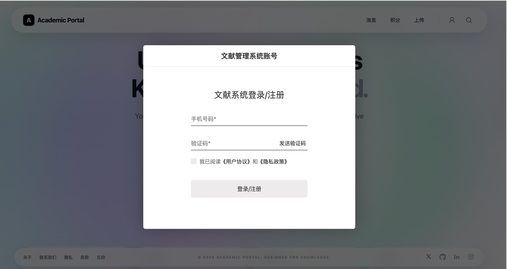
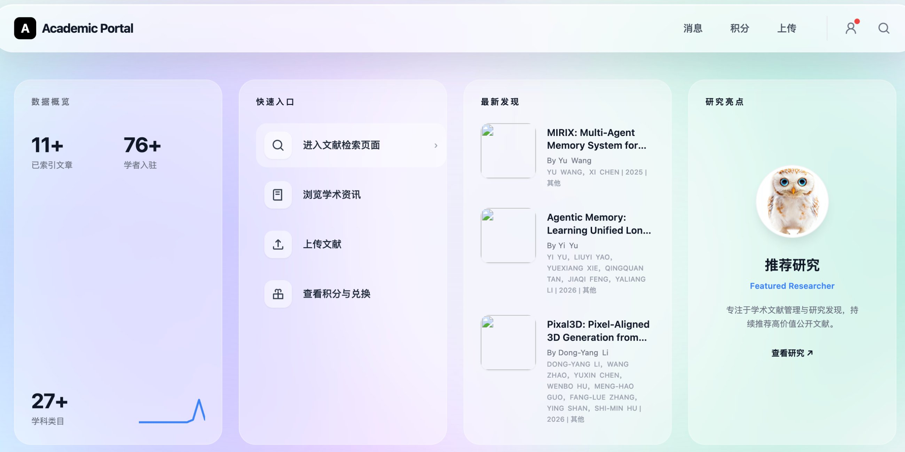
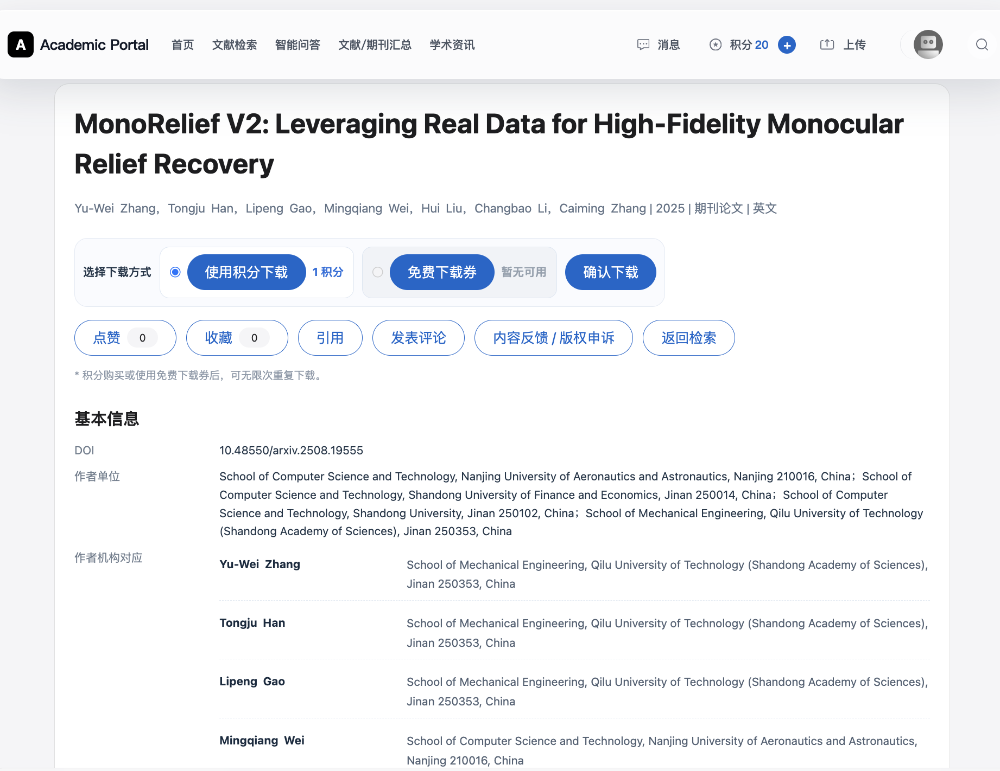
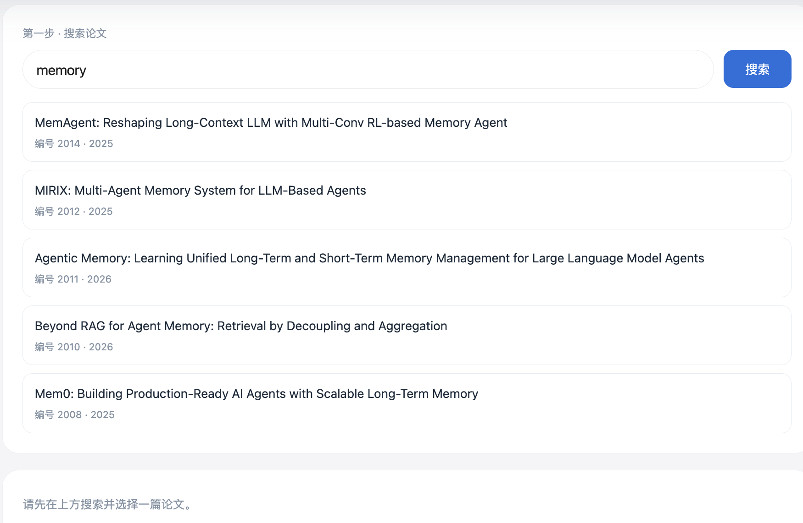
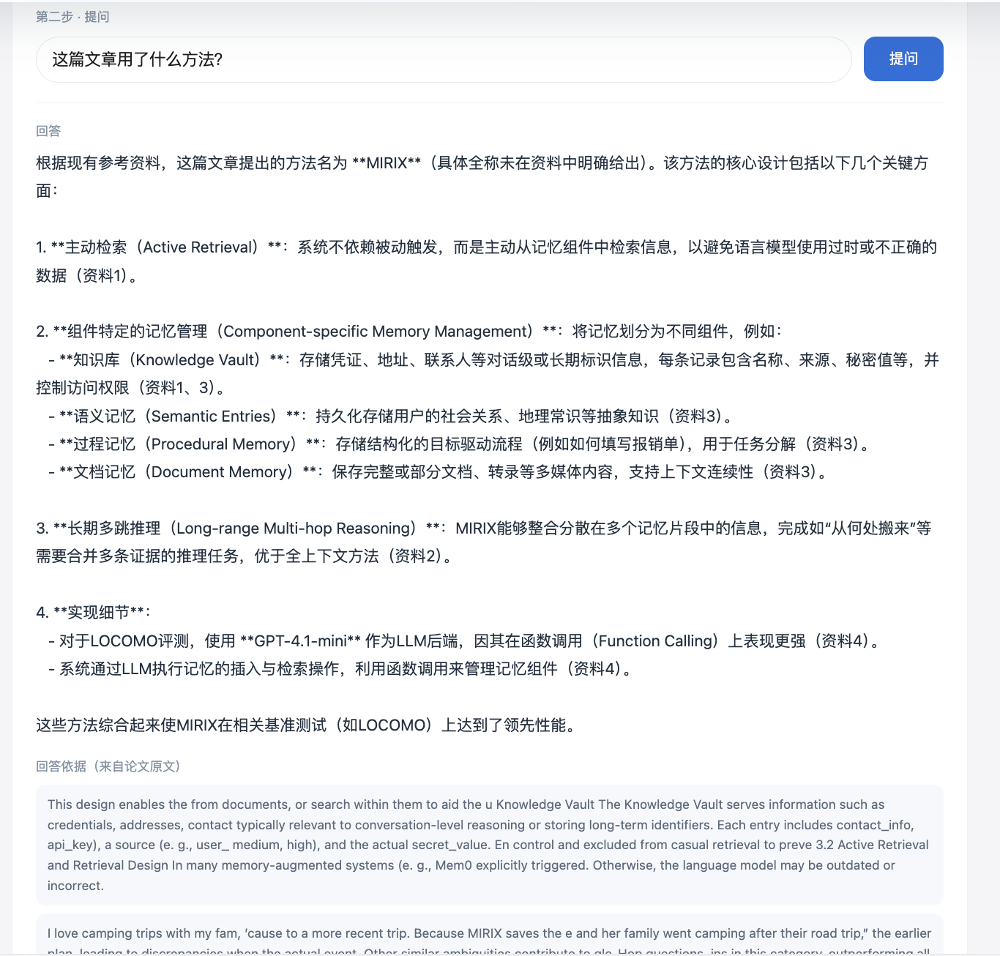
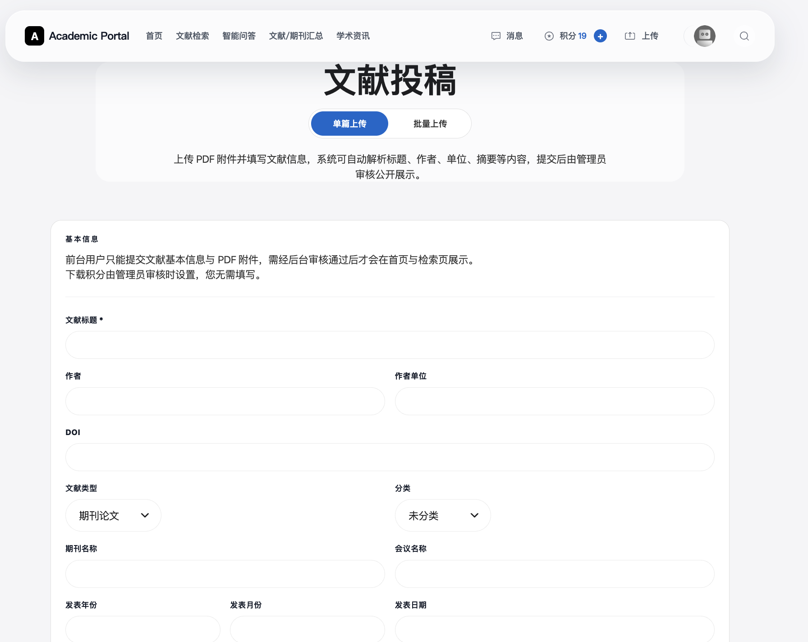
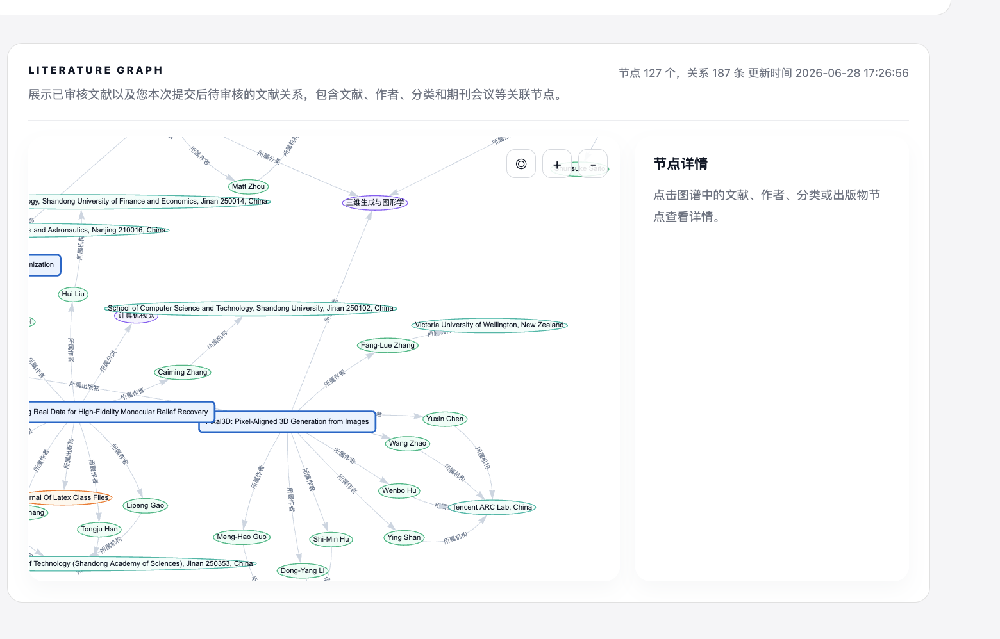
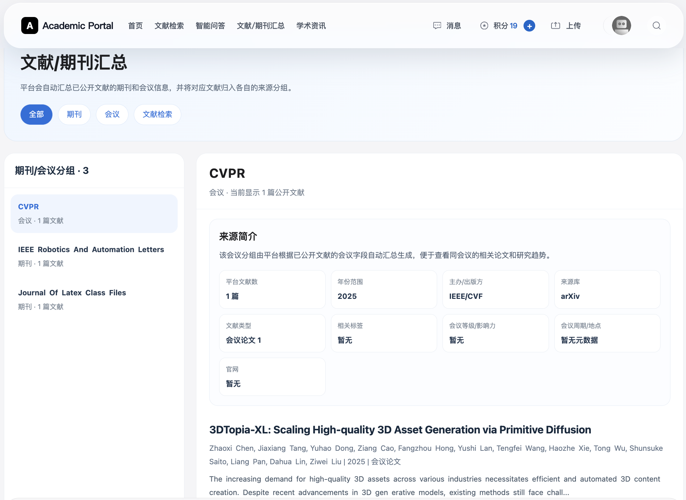
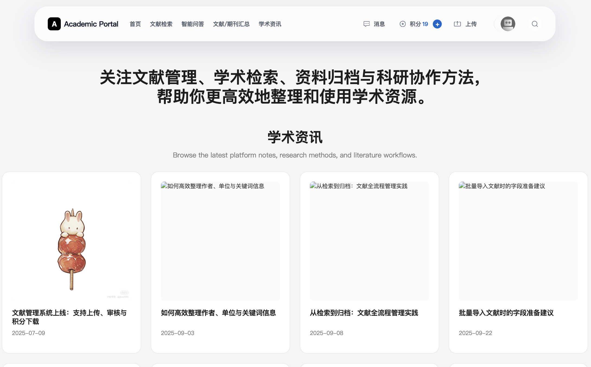
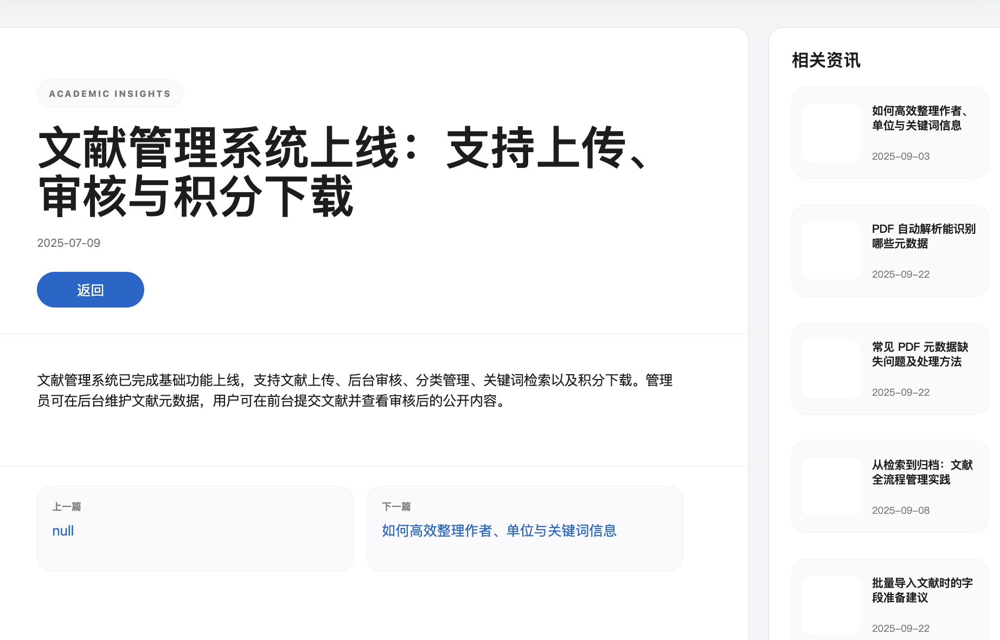

# 文献管理系统 项目文档

> 数据库课程设计 项目文档
> 小组成员：李粟阳、朱天铭、卢可、陈丽滟


## 目录

1. [系统需求分析](#1-系统需求分析)
2. [数据库概念模型设计](#2-数据库概念模型设计)
3. [数据库设计](#3-数据库设计)
4. [功能设计](#4-功能设计)
5. [模块划分](#5-模块划分)
6. [系统实现](#6-系统实现)
7. [代码文件说明](#7-代码文件说明)
8. [系统安装、使用与测试说明](#8-系统安装使用与测试说明)
9. [界面与操作说明（图文）](#9-界面与操作说明图文)

---

## 1. 系统需求分析

### 1.1 项目背景与目标

本系统面向学术文献管理场景，目标是实现文献的集中存储、规范管理、自动解析、快速检索
与可控下载。用户可上传文献，经管理员审核后公开展示；其他用户可通过多种条件检索文献，
并通过积分或下载权益获取 PDF。在基础业务之上，系统引入两项创新功能：基于 RAG 的
语义检索与智能问答、基于知识图谱的文献关系可视化，实现从"存储展示"到"智能服务"的升级。

### 1.2 用户角色

| 角色 | 职责 |
|---|---|
| 普通用户（科研人员） | 注册/登录，检索、下载、上传、收藏文献，查看积分与通知 |
| 系统管理员 | 审核投稿文献，维护分类/标签/附件/积分规则，批量导入导出，通知管理 |

### 1.3 功能需求

1. 用户管理：注册、登录、资料维护、登录记录。
2. 文献投稿：上传 PDF 并填写标题、作者、单位、DOI、关键词、摘要、期刊/会议等元数据。
3. 文献检索：按标题、作者、关键词、DOI、分类、年份等条件检索。
4. 智能检索与问答（RAG）：自然语言对文献内容进行语义检索与交互式问答。
5. 知识图谱可视化：以图谱展示文献、作者、机构、关键词的关联。
6. 文献审核：管理员审核投稿、设置审核状态与下载积分。
7. 自动解析：上传 PDF 自动提取标题、作者、机构、期刊/会议等元数据。
8. 分类与标签管理：维护学科分类与标签。
9. 文献收藏：收藏感兴趣文献，禁止重复收藏。
10. 积分下载：下载消耗积分或使用免费权益，并记录下载日志。
11. 批量导入导出：批量导入文献并记录批次、成功/失败数与错误明细，支持导出。
12. 通知消息：向用户推送审核结果、积分变化等通知并记录查看状态。

### 1.4 主要业务流程

```
投稿：用户上传 PDF → 自动解析元数据 → 提交审核 → 管理员审核
      → 通过则进入检索库并触发 RAG 索引 → 前台可检索/下载
下载：用户选择文献 → 校验积分/权益 → 扣分并记录下载日志 → 获取 PDF
问答：用户搜论文 → 选定 → 提问 → RAG 检索原文 + 大模型生成回答
```

### 1.5 非功能需求

- 一致性与可追溯：业务行为（下载、积分、审核、导入）以日志表留痕。
- 性能：高频检索字段建立索引；向量检索支撑语义查询。
- 安全：密码加密存储、权限分级（popedom）、软删除保留数据。
- 可维护：三层架构分离，RAG 作为独立微服务解耦。

---

## 2. 数据库概念模型设计

### 2.1 主要实体及属性

| 实体 | 主要属性 |
|---|---|
| 文献 Literature | 标题、副标题、DOI、关键词、摘要、来源类型、语种、发表年份、期刊/会议、卷期页、分类、审核状态、下载积分 |
| 作者 Author | 中/英文名、所属机构、ORCID、邮箱 |
| 机构 Institution | 中/英文名、规范名、别名、国家/省/市、上级机构 |
| 期刊 Journal / 会议 Conference | 名称、ISSN/简称、出版方、国家、网址、举办时间 |
| 分类 LiteratureCategory | 名称、上级分类（树形） |
| 标签 LiteratureTag | 名称 |
| 用户 user_list | 姓名、手机号、邮箱、头像、积分相关 |
| 管理员 admin | 用户名、密码、权限 |

### 2.2 实体间联系

- 用户 **1—N** 文献（一个用户可上传多篇）。
- 分类 **1—N** 文献；分类自身构成树（父子分类）。
- 文献 **1—N** 附件（一篇文献可有多个文件）。
- 文献 **M—N** 作者；文献 **M—N** 标签。
- 文献、作者、机构三者构成 **M—N—N** 复合关系（某文献中某作者隶属某机构）。
- 机构自身存在层级关系（上级机构）。

### 2.3 E-R 图

完整 E-R 图见仓库根目录 [`表结构ER (1).drawio`](表结构ER%20(1).drawio)。核心实体关系示意：

```
user_list ──1:N── Literature ──N:M── Author ──N:M── Institution
                      │  │  └──N:M── LiteratureTag
                      │  └──1:N── LiteratureFile
                      └──1:N── (下载/积分/收藏/评论/通知 等日志表)
LiteratureCategory ──1:N── Literature （分类自身为树）
```

---

## 3. 数据库设计

数据库采用 **Microsoft SQL Server**，库名 `manage_db_final`，共 **59 张表、29 个外键约束、
162 个索引**。建库脚本 [`网站源码/database/final_schema.sql`](网站源码/database/final_schema.sql)，
表结构文档 [`网站源码/database/TABLE_STRUCTURE.md`](网站源码/database/TABLE_STRUCTURE.md)。

### 3.1 关系模式（按职责分组）

| 类别 | 代表表 |
|---|---|
| 核心实体 | `Literature`、`Author`、`Institution`、`Journal`、`Conference`、`LiteratureCategory`、`LiteratureTag`、`user_list`、`admin` |
| 关联/映射（多对多） | `LiteratureAuthorMap`、`LiteratureTagMap`、`LiteratureAuthorInstitutionMap` |
| 附属信息 | `LiteratureFile`、`LiteratureVenueProfile`、`AuthorInstitutionHistory`、`InstitutionAlias` |
| 用户互动 | `LiteratureComment`、`LiteratureFavorite`、`LiteratureLike` |
| 日志/流水 | `LiteratureDownloadLog`、`LiteratureExportLog`、`integrateLog_list`、`NoticeLog_List`、`LiteratureImportBatch`、`LiteratureImportError` |
| 积分/支付 | `integrate_list`、`TopUpType_List`、`userpaylog_list`、`userpayloginfo_list` |
| 系统/配置 | `popedom`、`tbl_class`、`websiteinfo_list`、`SearchHot_List`、`model_list` |

### 3.2 核心表结构（节选关键字段）

**Literature（文献，主表，37 字段）**

| 字段 | 类型 | 说明 |
|---|---|---|
| id | int (PK) | 文献编号 |
| title / subtitle | nvarchar | 标题 / 副标题 |
| doi / keywords / abstract_text | nvarchar | DOI / 关键词 / 摘要 |
| source_type / language / publish_year | | 来源类型 / 语种 / 年份 |
| journal_id / conference_id | int (FK) | 期刊 / 会议 |
| category_id | int (FK) | 分类 → LiteratureCategory |
| userid | int (FK) | 上传者 → user_list |
| reviewed_by / review_time | | 审核人 → admin / 审核时间 |
| status | int | 审核/状态位（软删除与审核状态）|
| download_points | int | 下载所需积分 |

**Author（作者）**：id(PK)、name_cn、name_en、institution、orcid、email、status。

**user_list（用户）**：id(PK)、name、tel(唯一)、email、upload_pic_avatar、积分相关。

**LiteratureAuthorMap（文献-作者，多对多）**：id(PK)、literature_id(FK)、author_id(FK)、
author_order、is_corresponding。

**LiteratureFile（文献附件，一对多）**：id(PK)、literature_id(FK)、file_type、file_name、
file_path、file_size。

**LiteratureCategory（分类，树形）**：id(PK)、parent_id(FK 自引用)、name、name_en、orderid。

### 3.3 外键约束（全 29 个）

| 子表.字段 → 父表.字段 |
|---|
| Literature.userid → user_list.id |
| Literature.category_id → LiteratureCategory.id |
| Literature.import_batch_id → LiteratureImportBatch.id |
| Literature.reviewed_by → admin.id |
| LiteratureAuthorMap.literature_id → Literature.id |
| LiteratureAuthorMap.author_id → Author.id |
| LiteratureTagMap.literature_id → Literature.id |
| LiteratureTagMap.tag_id → LiteratureTag.id |
| LiteratureFile.literature_id → Literature.id |
| LiteratureFavorite.literature_id → Literature.id |
| LiteratureFavorite.userid → user_list.id |
| LiteratureDownloadLog.literature_id → Literature.id |
| LiteratureDownloadLog.user_id → user_list.id |
| LiteratureDownloadLog.literature_user_id → user_list.id |
| LiteratureExportLog.userid → user_list.id |
| LiteratureImportBatch.userid → user_list.id |
| LiteratureImportError.batch_id → LiteratureImportBatch.id |
| LiteratureCategory.parent_id → LiteratureCategory.id（自引用）|
| Institution.parent_id → Institution.id（自引用）|
| integrateLog_list.literature_id → Literature.id |
| integrateLog_list.user_id → user_list.id |
| integrateLog_list.type → integrateLogType_list.id |
| integrateExchangeLog_list.user_id → user_list.id |
| integrateExchangeLog_list.status → integratestatus_list.id |
| NoticeLog_List.userid → user_list.id |
| NoticeLog_List.type → NoticeLogType_List.id |
| NoticeLog_List.status → NoticeLogStatus_List.id |
| ServiceLog_List.status → ServiceLogStatus_List.id |
| ServiceLogInfo_List.ServiceLog_Id → ServiceLog_List.id |

### 3.4 完整性约束

- **实体完整性**：每表以自增标识列（IDENTITY）作主键。
- **参照完整性**：29 个外键约束维护跨表引用。
- **用户定义完整性**：唯一约束（如 `user_list.tel`）、默认值（`getdate()`、`status` 默认 1）、
  非空约束；以 `status` / `is_deleted` / 审核状态实现软删除与状态机，数据可追溯。

### 3.5 索引设计

共 162 个索引，覆盖主键、外键与高频检索字段。索引最密集的表为 `Literature`（21 个，
覆盖标题、年份、分类、审核状态等检索条件）、`LiteratureAuthorInstitutionMap`（13 个）、
`LiteratureComment`（11 个）等，以保障多条件检索与连接查询性能。

### 3.6 范式分析

关系模式满足 **第三范式（3NF）**：

- 每个独立实体单独建表，所有非主属性完全函数依赖于主键（满足 1NF、2NF）。
- 文献-作者、文献-标签等多对多关系拆分为独立中间表，消除冗余。
- 期刊、会议、机构、分类等可复用信息独立成表并以外键引用，消除传递依赖。
- 下载、积分、通知、导入等过程型业务以日志/流水表记录，业务数据与流水分离。

---

## 4. 功能设计

| 模块 | 功能要点 |
|---|---|
| 用户管理 | 注册、登录（验证码）、资料与头像维护、登录记录 |
| 文献投稿 | 上传 PDF、填写元数据、自动解析辅助、提交审核 |
| 文献审核 | 管理员审核、设置审核状态与下载积分、通过后公开 |
| 文献检索 | 标题/作者/关键词/DOI/分类/年份多条件检索、分页 |
| 智能问答(RAG) | 搜论文 → 选定 → 自然语言提问 → 检索原文 + 大模型生成回答 |
| 知识图谱 | 文献-作者-机构-关键词关系图谱可视化 |
| 分类标签管理 | 学科分类（树形）与标签维护 |
| 文献收藏 | 收藏/取消，唯一约束防重复 |
| 积分下载 | 积分/权益校验、扣分、下载日志记录 |
| 批量导入导出 | 批量导入并记录批次与错误明细，数据导出 |
| 通知消息 | 审核结果/积分变化通知，记录查看状态 |
| 文献/期刊汇总 | 期刊会议画像与汇总浏览 |

---

## 5. 模块划分

系统整体分为三大部分：主网站（业务主体）、RAG 智能问答服务（独立微服务）、知识图谱。

```
┌─────────────────────────── 主网站（ASP.NET WebForms）───────────────────────────┐
│  表示层 Web        前台页面 + 后台 admin + 用户中心 User + 接口 .ashx              │
│  业务逻辑层 BLL    BLLBase<T> 泛型业务封装                                          │
│  数据访问层 DAL    SQL Server 数据访问                                              │
│  实体层 Model      与数据库表对应的实体类                                            │
│  公共库 Common     工具、登录、文件、RAG 同步等                                      │
└───────────────┬───────────────────────────────────┬───────────────────────────┘
                │ HTTP(localhost)                    │ 读取
        ┌───────▼────────┐                   ┌───────▼────────┐
        │ RAG 微服务      │  检索+生成         │  SQL Server     │
        │ (Python/Flask) │◄──────────────────┤ manage_db_final │
        │ Chroma+DeepSeek│                   └────────────────┘
        └────────────────┘
                                   ┌────────────────┐
        知识图谱：LiteratureGraph.ashx → 前端渲染 / graph1.py → Neo4j
                                   └────────────────┘
```

---

## 6. 系统实现

### 6.1 技术栈

| 层 | 技术 |
|---|---|
| 数据库 | Microsoft SQL Server / SQL Server Express（manage_db_final）|
| 后端 | C# / .NET Framework 4.6+，Model / BLL / DAL 三层（`BLLBase<T>` + `DALCommon<T>` + `DBHelper`）|
| 前端 | ASP.NET WebForms + JavaScript（jQuery、Layui）|
| PDF 元数据解析 | Python 3.9+ 本机 HTTP 服务（`网站源码/app.py`，端口 5050）|
| RAG | Python + Flask + LangChain + Chroma + m3e 嵌入 + DeepSeek（`RAG/app.py`，端口 5051）|
| 知识图谱 | Neo4j |
| 可选组件 | Redis、腾讯云 COS、微信支付、短信服务 |

> 注意：系统包含**两个独立的 Python 服务**，职责不同、端口不同：
> `网站源码/app.py`（5050）负责**上传时的元数据解析**（提取标题/作者/机构/DOI/发表日期）；
> `RAG/app.py`（5051）负责**语义检索与智能问答**。二者互不依赖。

### 6.2 主网站实现

采用经典三层架构：`Model` 定义实体；`DAL`（`DALCommon<T>` + `DBHelper`）负责 SQL Server
数据访问；`BLL` 以泛型 `BLLBase<T>` 封装通用增删改查与业务逻辑；`Web` 为表示层，前台页面
（`index.aspx`、`LiteratureSearch.aspx`、`LiteratureInfo.aspx`、`LiteratureVenue.aspx`、
`LiteratureQA.aspx`）、后台 `admin/` 与用户中心 `User/`，并以 `.ashx` 处理器提供异步接口；
公共业务逻辑（登录、短信、积分、评论、上传解析等）集中在 `LiteratureManager.Common`。
模块间调用关系详见 [`网站源码/docs/core-dependency-map.md`](网站源码/docs/core-dependency-map.md)。

**PDF 元数据解析服务**：后台单篇上传与批量 PDF 导入会调用本机服务
`http://127.0.0.1:5050/upload`（`网站源码/app.py`），由其调用 `pdf_parser.py` 的
`extract_paper_info` 自动提取标题、作者、机构、DOI、发表日期等元数据，辅助填表。
此服务与下文 RAG 服务相互独立。

### 6.3 RAG 智能问答实现

RAG = 检索增强生成。实现要点：

1. **建索引**：`pdf_parser.py` 提取论文 PDF 全文（含扫描件 OCR 兜底、单词粘连修复），
   `rag_utils.py` 用 `RecursiveCharacterTextSplitter` 切块、m3e 模型向量化，存入 Chroma；
   每段绑定 `paper_id = Literature.id`，`backfill_index.py` 批量回填。
2. **检索 + 生成**：`/rag/ask` 按 `paper_id` 在 Chroma 中语义检索 top-k 原文段落，
   `llm_utils.py` 将段落与问题组织成提示词交给 DeepSeek 生成回答，返回答案与原文依据。
3. **与网站集成**：前端页面 `LiteratureQA.aspx` 调用同源中转接口 `Inc/RagApi.ashx`（C#），
   再由其在服务端转发到 Python 服务，规避跨域。上传/审核成功后可调 `/rag/index_paper`
   单篇增量建索引，使新文献即时可问答。

调用链路：

```
浏览器 → LiteratureQA.aspx → Inc/RagApi.ashx（服务端中转）
       → Python /rag/ask → SQL Server（取论文）+ Chroma（取原文）+ DeepSeek（生成）
```

### 6.4 知识图谱实现

`Inc/LiteratureGraph.ashx` 从 SQL Server 读取文献及其作者、机构、分类、期刊会议等关系，
输出节点/边 JSON，前端 `js/literature-graph.js` 渲染交互式图谱；`graph1.py` 可将关系数据
导入 Neo4j，支持多跳关系查询与科研合作网络挖掘。

---

## 7. 代码文件说明

```
db-project-2026/
├─ 网站源码/                 主网站（解决方案 web.sln）
│  ├─ Web/                   表示层
│  │  ├─ index.aspx                首页
│  │  ├─ LiteratureSearch.aspx     文献检索
│  │  ├─ LiteratureInfo.aspx       文献详情
│  │  ├─ LiteratureVenue.aspx      文献/期刊汇总
│  │  ├─ LiteratureQA.aspx         智能问答页面（RAG）
│  │  ├─ Inc/RagApi.ashx           RAG 中转接口
│  │  ├─ Inc/LiteratureGraph.ashx  知识图谱数据接口
│  │  ├─ js/literature-graph.js    知识图谱前端
│  │  ├─ admin/                    后台管理
│  │  └─ User/                     用户中心
│  ├─ Model / BLL / DAL            实体 / 业务逻辑 / 数据访问
│  ├─ LiteratureManager.Common     公共库（登录、短信、积分、评论、上传解析、RAG 同步等）
│  ├─ Common / COSSTS              通用工具 / 腾讯云 COS
│  ├─ app.py + pdf_parser.py       PDF 元数据解析服务（端口 5050，上传时调用）
│  ├─ database/                    建库脚本、表结构、外键/索引清单、数据库备份(.bak)
│  └─ docs/                        核心依赖图(core-dependency-map.md)、回归测试清单(test-checklist.md)
│
├─ RAG/                      RAG 智能问答后端（Python）
│  ├─ app.py                 Flask 接口服务（5051）：/rag/ask、/rag/search_paper、/rag/index_paper
│  ├─ rag_utils.py           切块 / 向量化 / 检索 / 问答主逻辑
│  ├─ llm_utils.py           DeepSeek 调用封装（生成）
│  ├─ db_utils.py            连 SQL Server，读 Literature / LiteratureFile
│  ├─ pdf_parser33.py          PDF 全文提取（OCR 兜底、单词粘连修复）
│  ├─ backfill_index.py      批量回填建索引
│  ├─ config.py              统一配置（从 .env 读取）
│  ├─ test_llm.py / test_db.py     大模型 / 数据库连通性自测
│  ├─ demo_rag.py / demo_rag_pdf.py 离线演示脚本
│  ├─ requirements.txt / .env.example
│  └─ chroma_db/             向量库（生成物）
│
├─ graph1.py                 知识图谱构建脚本（→ Neo4j）
├─ 表结构ER (1).drawio        数据库 ER 图
└─ README.md                 项目说明
```

---

## 8. 系统安装、使用与测试说明

### 8.1 环境要求

- Windows + Visual Studio + .NET Framework
- Microsoft SQL Server（含 SSMS）
- Python 3.x（运行 RAG 服务）
- DeepSeek API Key（智能问答的生成步骤需要）
- 可选：Neo4j（知识图谱深度查询）、Tesseract OCR（扫描件识别）

### 8.2 安装步骤

**第一步 · 数据库**

在 SQL Server 中还原 `网站源码/database/manage_db_full.bak`，或执行
`网站源码/database/final_schema.sql` 建库，库名 `manage_db_final`。

> 还原备份时若提示数据/日志文件被占用，在 SSMS 还原窗口的「文件」页勾选重新定位，
> 改成独立文件名（如 `manage_db_final.mdf` / `manage_db_final_log.ldf`）。

**第二步 · 主网站**

用 Visual Studio 打开 `网站源码/web.sln`，在 `Web/Web.config` 配置数据库连接
`SQLCONNECTIONSTRING` 与站点地址 `website_url`，重新生成（Rebuild）后运行。

正式部署用 IIS：新建应用程序池（.NET CLR v4.0、Integrated 管道）→ 新建网站，物理路径
指向 `网站源码/Web` → 绑定空闲端口（如 8081）→ 给站点目录与 ASP.NET 临时编译目录授予
应用程序池身份的读写权限 → 浏览器访问 `http://localhost:8081/` 验证。

**第三步 · PDF 元数据解析服务（上传功能需要）**

```bash
cd 网站源码
python app.py        # 默认监听 127.0.0.1:5050，供后台上传/批量导入解析元数据
```

**第四步 · RAG 服务（智能问答需要）**

```bash
cd RAG
pip install -r requirements.txt          # 首次会下载 m3e 模型，约几百 MB
cp .env.example .env                      # 填入 DeepSeek API Key、SQL Server 连接、PDF 目录
python backfill_index.py                  # 为已有文献建立向量索引（重建用 --rebuild）
python app.py                             # 启动问答服务（默认 5051 端口）
```

确保 `Web/Web.config` 中 `rag_service_url` 的端口与 `app.py` 一致（默认 `http://127.0.0.1:5051`）。

### 8.3 使用说明

- 普通用户：注册登录后，可检索、收藏、下载文献，上传投稿，使用「智能问答」。
- 管理员：在后台审核文献、设置下载积分、维护分类标签、批量导入导出、发送通知。
- 智能问答：导航栏「智能问答」→ 搜索论文标题 → 选定一篇 → 输入问题 → 查看回答与原文依据。

### 8.4 测试说明

| 测试项 | 方法 | 预期 |
|---|---|---|
| 数据库连通 | `cd RAG && python test_db.py` | 输出已审核文献数量与样例标题 |
| 大模型连通 | `python test_llm.py` | 输出一段由 DeepSeek 生成的回答 |
| RAG 离线演示 | `python demo_rag_pdf.py --all` | 对真实 PDF 建索引并交互问答 |
| 健康检查 | 浏览器访问 `http://localhost:5051/health` | 返回 `{"status":"ok"}` |
| 端到端问答 | 网站「智能问答」页提问 | 返回回答 + 原文依据 |
| 业务功能 | 上传 → 审核 → 检索 → 下载 | 流程贯通、日志正确记录 |

完整的业务回归测试用例（登录、上传、检索、下载、评论、积分等逐项勾选清单）见
[`网站源码/docs/test-checklist.md`](网站源码/docs/test-checklist.md)。

> 说明：若本机无 PDF 文件，回填脚本自动降级为「标题+摘要+关键词」索引，问答仍可用；
> `.env`（含 API Key）与 `chroma_db/` 等生成物不纳入版本管理。

---

## 9. 界面与操作说明（图文）

> 截图文件位于 `screenshots/` 目录。

### 9.1 登录 / 注册

点击页面右上角的“用户（小人）”图标，弹出登录/注册窗口；输入手机号，点“发送验证码”，
填入收到的验证码，勾选《用户协议》和《隐私政策》，点“登录/注册”即可（未注册手机号将自动注册）。



### 9.2 首页概览

登录后进入首页，可看到数据概览（已索引文章数、入驻学者数、学科类目数）、快速入口
（文献检索 / 学术资讯 / 上传文献 / 积分兑换）、最新发现与研究亮点。



### 9.3 文献检索

点击导航“文献检索”，在搜索框输入标题、作者、关键词或 DOI，可叠加“分类”、“年份”筛选，
点“开始检索”；左侧“热门分类”可快速筛选。结果支持勾选后“批量下载 PDF”。


### 9.4 文献下载

点开任意一篇文献进入详情页，在“选择下载方式”处选择“使用积分下载”或“免费下载券”，
点“确认下载”即可下载 PDF。积分购买或使用下载券后，可无限次重复下载。详情页还提供
点赞、收藏、引用、发表评论、内容反馈/版权申诉等操作。



### 9.5 智能问答（RAG）

点击导航“智能问答”。

第一步：搜索论文：输入论文标题关键词（如 `memory`），在结果列表中点选目标论文。



第二步：提问：输入自然语言问题（如"这篇文章用了什么方法？"），点“提问”。系统会基于
该论文内容生成回答，并在下方“回答依据”中给出检索到的原文段落，便于核对。



### 9.6 文献投稿（上传）

点击右上角“上传”进入“文献投稿”页，可选“单篇上传”或“批量上传”。上传 PDF 后系统
自动解析标题、作者、单位、摘要等信息，补全表单后提交；前台投稿需经管理员审核通过后才
在首页与检索页公开展示，下载积分由管理员在审核时设置。



### 9.7 知识图谱

投稿页中提供“Literature Graph”文献关系图谱，将已审核文献及本次提交的待审文献，与其
作者、机构、分类、期刊会议等节点的关联以图形展示（示例：节点 127 个、关系 187 条）。
点击图谱中的文献/作者/分类/出版物节点可查看详情。



### 9.8 文献 / 期刊汇总

点击导航“文献/期刊汇总”。平台会自动汇总已公开文献的期刊与会议信息，并将对应文献归入
各自来源分组。左侧为“期刊/会议分组”列表，右侧展示选中来源的“来源简介”（平台文献数、
年份范围、主办/出版方、来源库、文献类型等）及该来源下的文献列表。顶部可按“全部 / 期刊 /
会议”切换筛选。



### 9.9 学术资讯

点击导航“学术资讯”，浏览平台发布的资讯与方法类文章列表（如系统上线说明、文献整理与
批量导入建议等）。



点开任一篇进入资讯详情页，右侧提供“相关资”」推荐，底部有“上一篇 / 下一篇”导航。


